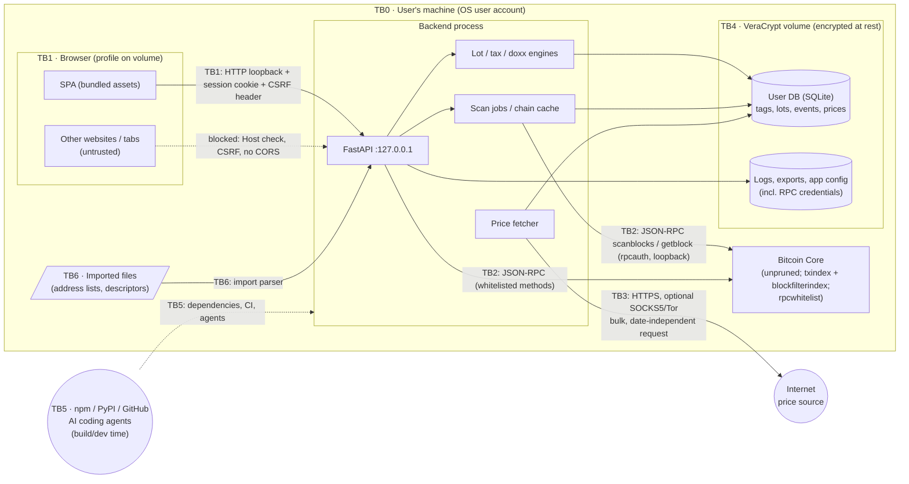

# Threat Model — Coin Accounting

> **Living document.** It describes what is *planned* and, over time, what is *implemented* and *verified*.
> Every change that touches a trust boundary, asset, data store, network flow, dependency or tax rule must update this file **in the same PR**. Reviewers reject PRs that don't.

| | |
|---|---|
| Version | 0.4 (design stage — no code yet) |
| Last updated | 2026-09-27 |
| Scope | v1: Bitcoin (Bitcoin Core) only, on Linux and macOS — see [`PLAN.md`](../PLAN.md) |
| Method | Data-flow diagram → trust boundaries → STRIDE per boundary, plus privacy (linkability/disclosure) and integrity-of-tax-output threats |

### Status legend
| Status | Meaning |
|---|---|
| **Planned** | Mitigation is designed but not built |
| **Implemented** | Code exists; link to it |
| **Verified** | An automated test proves the mitigation; link to the test |
| **Documented** | Procedural or documentation-only mitigation is written and linked. This is the highest status such rows can reach |
| **Accepted** | Risk knowingly not mitigated; rationale recorded in §9 |
| **N/A** | No longer applicable (keep the row; say why) |

A threat may only move to **Verified** when a test exists that fails if the mitigation is removed. Rows whose mitigation is (partly) procedural are marked † and can reach at most **Documented** for that part.

---

## 1. System overview

The app is a single-user tool running on the user's own machine (Linux or macOS). Its parts:
- **Backend:** a FastAPI process bound to `127.0.0.1`.
- **UI:** a React + Cytoscape.js single-page app served by the backend and opened in the user's browser.
- **Chain data:** comes only from the user's Bitcoin Core node over **loopback** JSON-RPC, as a dedicated, server-side-whitelisted RPC user. The app keeps **no chain index of its own**: Core's `txindex` and `blockfilterindex` (via `scanblocks`) answer chain queries, and the answers are cached in the user DB.
- **Sensitive user data:** stored in a SQLite database kept on a VeraCrypt volume.
- **Outbound internet:** the only allowed flow is a bulk, date-independent download of historical fiat prices, optionally via Tor/SOCKS5.

### 1.1 Data-flow diagram and trust boundaries

| ID | Boundary | Crosses between |
|---|---|---|
| TB0 | OS account | The user's session ↔ other OS users / remote attackers |
| TB1 | Browser ↔ backend | Our SPA, and any other web origin the browser loads, ↔ the loopback API |
| TB2 | Backend ↔ Bitcoin Core | Our process ↔ node JSON-RPC (loopback only) |
| TB3 | Backend ↔ Internet | Price fetcher ↔ external price/FX source (the **only** runtime outbound flow) |
| TB4 | Process ↔ disk | Encrypted volume (**everything the app writes**) vs plain disk (nothing the app writes; only OS or browser spill, see §5.4) |
| TB5 | Build/dev supply chain | Third-party packages, build tools, CI, AI coding agents ↔ our code and dev environment |
| TB6 | User-supplied files | Imported address lists / descriptors / CSVs ↔ parser |

---

## 2. Assets

| ID | Asset | Sensitivity | Where it lives |
|---|---|---|---|
| A1 | **Ownership map**: owned addresses/descriptors, address↔tax-account and ↔wallet-client mapping, entity tags (self, exchanges, employer, …) | **Critical** (full deanonymization of the user's holdings and counterparties) | User DB (TB4V) |
| A2 | **Doxx map**: which coins are linked to which identity-knowing entity | Critical | User DB |
| A3 | **Tax records**: lots, basis, identifications, disposals, income, exchange accounts | Critical (financial + identity) | User DB, exports |
| A4 | **Chain-data cache**: decoded txs, UTXOs, script histories and spender lookups for the scripts the user cares about | Critical (equivalent to A1) | User DB |
| A5 | **Report exports** (8949 CSV, income, summaries, audit trail) | Critical | Export dir (TB4V) |
| A6 | **Logs** | High if they contain A1–A4 values | TB4V |
| A7 | **Node RPC credentials** (dedicated `rpcauth` user) | Medium: the account is whitelisted to read-only methods, but it still grants query access | App config on TB4V; app memory |
| A8 | ~~Chain index~~ | *Removed in v0.4:* there is no app-side chain index. Cached chain data (decoded txs, script histories, spenders) reveals which scripts the user cares about, so it is part of **A4** | — |
| A9 | **Price history cache** | Public data; integrity-sensitive | User DB |
| A10 | **Correctness of tax output** | High: wrong figures mean legal/financial harm | Engines, rule sets, tests |
| A11 | **Fact of usage**: that this IP / person runs a BTC accounting tool | Medium | Network metadata |
| A12 | **Source code & build integrity** | High (a compromised build exfiltrates A1–A5) | Repo, CI, dependency tree |

## 3. Security & privacy objectives

1. **O1 — No data egress.** A1–A6 never leave the machine through the app. The only outbound connection carries no user-derived data. *(Protection against **malicious code inside the process** relies on supply-chain controls; see R-4.)*
2. **O2 — Local-only chain data.** All chain data comes from the user's own node over loopback. No block explorers, Electrum servers or third-party APIs.
3. **O3 — Encrypted at rest.** All sensitive data (A1–A6) lives only on the VeraCrypt volume. Nothing sensitive spills to plain disk.
4. **O4 — Loopback isolation.** Only the user, through our UI, can reach the API. Other web origins and other OS users cannot.
5. **O5 — Integrity of records and tax output.** Figures follow the supported federal rules for the relevant tax year. They are deterministic, reproducible, auditable, and traceable to their inputs.
6. **O6 — Honest privacy signal.** The doxx view models every link it can determine from the user's data (a lower bound) and never overstates privacy.
7. **O7 — Trustworthy build and dev process.** Dependencies, tooling and coding agents cannot silently add network access or exfiltrate user data.

## 4. Adversaries

| ID | Adversary | Capabilities | In scope? |
|---|---|---|---|
| AD1 | **Malicious website** visited in the same browser | JS in another origin; DNS rebinding; CSRF; timing | Yes |
| AD2 | **Other local OS user** / other process under another UID | Can connect to loopback ports; read world-readable files | Yes |
| AD3 | **Device thief / cold-disk attacker** (laptop stolen, disk imaged while the volume is dismounted) | Offline access to plain disk, swap, browser data outside the volume | Yes |
| AD4 | **Network observer** (ISP, Wi-Fi, state, price-source operator) | Sees outbound connections, DNS, TLS metadata, request timing | Yes |
| AD5 | **Compromised/malicious price source** or MITM | Serves wrong prices | Yes |
| AD6 | **Supply-chain attacker** (typosquat, hijacked maintainer, malicious GitHub Action, tampered release/`bitcoind` download) | Code execution at install/build/runtime | Yes |
| AD7 | **Adversarial on-chain data** (crafted tx/script/OP_RETURN content by any payer) | Controls bytes that our parser and UI render | Yes |
| AD8 | **Chain-analysis firm / exchange / identity-knowing counterparty** correlating the user's coins | Public blockchain + KYC or other identity data | Yes (as a *privacy* adversary the doxx model informs against) |
| AD9 | **The user themself** (mistakes, mis-tagging, wrong paths, accidental export, late identification) | Legitimate access | Yes (safety rails) |
| AD12 | **Cloud-backed AI coding agent** used during development | Reads files and terminal output on the dev machine and sends them to a remote model provider | Yes (as a dev-process exfiltration path) |
| AD10 | **Malware running as the same OS user**, root/kernel compromise, hardware implants | Full access while the volume is mounted | **No** (see §8) |
| AD11 | **Physical coercion** | — | No |

---

## 5. Threat register

Columns: **ID** · **STRIDE/P** (S spoofing, T tampering, R repudiation, I info disclosure, D denial of service, E elevation, P privacy/linkability) · **Threat** · **Mitigation (planned)** · **Status** · **Evidence** (code / test / doc link, filled when implemented). † = partly procedural.

### 5.1 TB1 — Browser ↔ backend

| ID | STRIDE/P | Threat | Mitigation | Status | Evidence |
|---|---|---|---|---|---|
| T-101 | I, T | **DNS rebinding**: an AD1 page rebinds its hostname to 127.0.0.1 and reads or modifies the API as a same-origin request | Strict `Host` header allowlist: exactly `127.0.0.1:<port>` (one canonical hostname, never `localhost`, to avoid cookie mismatches). Every other Host is rejected before routing | Planned | |
| T-102 | T | **CSRF**: an AD1 page sends state-changing requests to the API | Every non-GET request needs an `X-CSRF-Token` header matching a token that only our SPA can read (served in the bootstrap response). **This header check is the primary control.** Cookies are scoped to a host, not a port, so `SameSite` does not isolate us from other apps on 127.0.0.1. Only JSON bodies are accepted; **no CORS headers ever** | Planned | |
| T-103 | I, S | **Other local users (AD2)**, or other local web apps on 127.0.0.1, reach the API | Bind `127.0.0.1` only (never `0.0.0.0`); random port. Auth: a **one-time launch token** is exchanged once for an `HttpOnly; SameSite=Strict` session cookie, with a unique cookie name per launch; the token is invalidated immediately | Planned | |
| T-104 | T, E | **XSS via attacker-controlled chain data (AD7)**, e.g. OP_RETURN text or crafted labels rendered in the graph or tables | React escaping only (lint bans `dangerouslySetInnerHTML` and inline styles); Cytoscape labels as text. Strict CSP: `default-src 'self'; script-src 'self'; style-src 'self'; img-src 'self' data: blob:; connect-src 'self'; object-src 'none'; base-uri 'none'; form-action 'none'; frame-ancestors 'none'` | Planned | |
| T-105 | I | **Browser leaks sensitive data to plain disk (AD3)**: history, HTTP cache, autofill, session restore, crash reports, thumbnails | No sensitive values in URLs, including the launch token (T-110); opaque IDs; queries in POST bodies. `Cache-Control: no-store` on all API responses; autocomplete off. The launcher opens a **dedicated browser profile stored on the volume** (Chromium `--user-data-dir` / Firefox `-profile`) when a supported browser is found. Otherwise it shows a warning; the residual risk is R-5 | Planned † | |
| T-106 | I, P | **UI pulls third-party resources** (fonts, CDN, analytics), leaking usage (A11) or data | All assets bundled at build time; CSP `connect-src 'self'`; a CI test fails if the built bundle references external URLs | Planned | |
| T-107 | T | **Clickjacking**: an AD1 page frames the UI | `frame-ancestors 'none'` + `X-Frame-Options: DENY` | Planned | |
| T-108 | I | **Browser downloads of exports go to `~/Downloads`** (plain disk) | Exports are written server-side to an export directory on the volume by default; downloading through the browser needs an explicit confirmation that warns about the destination | Planned | |
| T-109 | I | **Clipboard and screen exposure**: copied addresses or txids reach clipboard managers or sync (plain disk, cloud); screenshots or screen sharing | Copy actions show a notice; clipboard sync and screen recording are covered in the user docs | Documented † | |
| T-110 | I | **Launch credential leaks** via browser history, session restore or referrer | The token travels in the URL **fragment** (never sent to servers or in the Referer), is single-use, and is removed with `history.replaceState` before rendering; `Referrer-Policy: no-referrer` | Planned | |

### 5.2 TB2 — Backend ↔ Bitcoin Core

| ID | STRIDE/P | Threat | Mitigation | Status | Evidence |
|---|---|---|---|---|---|
| T-201 | I | **RPC credential leakage** (A7) through logs, the DB, error pages or exports | A dedicated `rpcauth` user whose password is stored only in the app config on the volume; never logged or echoed; the redaction filter covers auth headers. The app does **not** read Core's cookie file, which is unrestricted | Planned | |
| T-202 | I, P | **Queries sent to a non-local node**: RPC has no TLS, so credentials and every lookup (A1) would cross the network in plaintext | **Loopback only; non-loopback RPC endpoints are refused, with no override.** For a node elsewhere, the docs cover an SSH tunnel (`ssh -L`) that terminates on loopback | Planned | |
| T-203 | E, T | **App (or code inside it) misuses the node**: wallet, broadcast or other state-changing RPCs (e.g. `sendrawtransaction`, or `importdescriptors` storing the user's addresses in a node wallet **outside** the volume) | **Server-side `rpcwhitelist`** for the app's rpcauth user, limited to read-only methods: `getblockchaininfo`, `getnetworkinfo`, `getindexinfo`, `getblockcount`, `getbestblockhash`, `getblockhash`, `getblockheader`, `getblock`, `getrawtransaction`, `gettxout`, `scanblocks`, `getchaintips`, `deriveaddresses`, `getdescriptorinfo`. A client-side allowlist adds defence in depth. **Canary at startup:** the app calls a harmless method that is *not* whitelisted (`uptime`) and refuses to run if it succeeds. REST (`rest=1`) is never used, and the docs recommend leaving it off | Planned | |
| T-204 | P | **Node logs reveal lookup activity** | With `debug=rpc`, Core logs method names and users but not parameters. The docs recommend not running with `debug=rpc`/`debug=http` | Documented † | |
| T-205 | D, T | **Adversarial tx data (AD7)** in Core's decoded output: huge blocks/txs exhaust memory, unusual scripts break processing, or crafted text reaches the UI (T-104) | No custom binary parser: Core decodes. Response size limits and streaming JSON decoding for large blocks; property/fuzz tests (Hypothesis) on script matching and scan-result processing; processing fails closed (no partial cache writes) | Planned | |
| T-206 | T | **Wrong network**: a testnet/signet/regtest node is used against a mainnet DB, or the reverse | Store `chain` in the user DB; refuse to start on mismatch | Planned | |
| T-207 | T | **Reorg leaves cached chain data stale or wrong** | Every cached row stores its source block hash and height. On each tip change, rows whose block hash no longer matches `getblockhash(height)` are invalidated and re-fetched, and derived events are surfaced for review. Tax events only become final after a configurable number of confirmations (default 6) | Planned | |
| T-208 | T | ~~Index prefix collisions~~ | *N/A since v0.4:* no app-side index; all lookups use full txids and Core's indexes. BIP30 duplicate coinbase txids are handled by Core's `txindex` | N/A | |
| T-209 | I, P | **Queries leave traces outside the volume**: the node or the app records which scripts or txs the user looked up | App side: all cached chain data lives in the user DB on the volume. Node side: no node wallet is used; Core doesn't persist RPC parameters or `scanblocks` descriptors. **M0 check:** after a regtest run, search the node's datadir (including `debug.log`) for the scanned descriptors and txids; any hit is a bug, or else documented and accepted | Planned | |
| T-210 | D, T | **Incomplete chain data**: a pruned node, or `txindex`/`blockfilterindex` missing or still syncing, silently omits history | Refuse to run unless `pruned == false` and `getindexinfo` reports both indexes synced to the tip. Every scan must report covering the full requested height range; a `getblock` failure is a hard error, never a skip | Planned | |
| T-211 | T | ~~Chain index tampered with on plain disk~~ | *N/A since v0.4:* the app writes nothing to plain disk. The integrity of the node's own indexes is the node's responsibility (trusted, §8), and the cache is covered by T-408 | N/A | |
| T-212 | D | **Long-running scans** tie up the node (Core runs one `scanblocks` at a time) or make the UI unresponsive | Scans run as queued background jobs, with progress via `scanblocks status` and cancellation via `scanblocks abort`; forward expansion scans in chunks from the output's height and stops at the first hit; results are cached | Planned | |

### 5.3 TB3 — Backend ↔ Internet (price data)

| ID | STRIDE/P | Threat | Mitigation | Status | Evidence |
|---|---|---|---|---|---|
| T-301 | P | **Request content reveals acquisition/sale dates, holdings or residency** | Only bulk, **date-independent** requests. The request set never depends on user records (events, addresses, tags); only the start of the incremental range depends on the public price cache. **All supported fiat pairs are always fetched**, so the chosen currency isn't revealed. A test asserts the requests are identical for different user DBs with the same price cache | Planned | |
| T-302 | P | **Network observer (AD4) learns that this IP runs a BTC accounting tool** (A11) | Optional SOCKS5 proxy (Tor) with remote DNS (`socks5h`); a common browser User-Agent (not a library or unique string); fetches only on manual trigger; the first run prompts the user to choose proxy or direct | Planned † | |
| T-303 | T | **Tampered or incorrect prices (AD5)**: MITM or compromised source → wrong basis/proceeds (A10) | TLS with certificate verification (no opt-out flag); sanity checks (gaps, non-positive values, day-over-day outlier threshold); store source, method and content hash per import; every price can be overridden by the user, and overrides are flagged in reports | Planned | |
| T-304 | D | **Price source disappears or changes format** | The local cache is authoritative once fetched; a CSV import fallback; parser errors fail loudly without partial overwrite | Planned | |
| T-305 | I | **Accidental unexpected outbound connection** (a dependency with telemetry or update checks, a coding mistake) | Only `rpc.py` (loopback) and `prices/` open connections, enforced by code review and structure. A test-time socket guard patches `socket.connect` **and** `getaddrinfo` and fails any test that opens a non-allowlisted connection or DNS lookup. **Not a security boundary** against malicious code in the process (R-4) | Planned | |

### 5.4 TB4 — Data at rest

| ID | STRIDE/P | Threat | Mitigation | Status | Evidence |
|---|---|---|---|---|---|
| T-401 | I | **User DB created on plain disk by mistake (AD9 → AD3)** | At startup, resolve the real path of the DB (following symlinks) and identify the block device it lives on. **Linux:** `stat().st_dev` → `/sys/dev/block/<maj>:<min>/dm/{name,uuid}`; accept `veracrypt*` names and `CRYPT-TCRYPT*` / `CRYPT-LUKS*` uuids. **macOS:** detection method to be designed in M0 (VeraCrypt mounts through macFUSE/FUSE-T); if it can't be done reliably, the user confirms the path explicitly and the confirmation is stored per path. Otherwise refuse to start unless `--allow-unencrypted-storage` is set, with a persistent warning. Warn on FAT/exFAT (no permission bits). DB and side files use mode 0600 with a restrictive umask | Planned | |
| T-402 | I | **SQLite side files and temp data spill** (WAL, journal, temp B-trees, sort files, HTTP download buffers) | Side files live next to the DB on the volume; `PRAGMA temp_store=MEMORY`; `TMPDIR`/`SQLITE_TMPDIR` for the process point to a directory on the volume | Planned | |
| T-403 | I | **Logs contain addresses/txids/amounts** (A6) | Logs are written only to the volume; a redaction filter masks addresses, txids, outpoints, descriptors, amounts and fiat values by default; a debug mode that disables redaction is explicit and writes only to the volume; tests assert that redaction works | Planned | |
| T-404 | I | **Swap, hibernation or core dumps** write memory with A1–A4 to plain disk | `RLIMIT_CORE=0`, plus `prctl(PR_SET_DUMPABLE, 0)` on Linux. Docs require encrypted swap and hibernation, or none (macOS encrypts swap by default) | Planned † | |
| T-405 | I | **Data remains accessible after the volume is dismounted** | The watchdog detects that the volume or DB path has disappeared and makes the backend exit immediately; the UI shows that it is disconnected. **Partial:** the OS page cache and freed memory may still hold data until overwritten. VeraCrypt refuses a normal dismount while files are open, so the documented v1 workflow is: quit the app, close its browser window, then dismount. An in-app lock is deferred (§10) | Planned | |
| T-406 | I | **User data accidentally committed to git or synced**, e.g. a data dir inside the repo checkout, or a volume container placed in cloud sync | The default data dir is outside the repo; `.gitignore` and agent-ignore files cover `*.sqlite*`, `data/`, `exports/`; docs cover backups and cloud sync of the container | Planned † | |
| T-407 | I | **Plaintext exports on plain disk** (see T-108) | The export dir defaults to the volume; the warning covers every alternative path | Planned | |
| T-408 | T, R | **Silent tampering or accidental edits of records** | Append-only change log for events, tags, identifications and overrides (what, when, old → new); `PRAGMA integrity_check` on startup; a documented backup procedure (copy while the volume is mounted) | Planned | |

### 5.5 Tax correctness & privacy signal (A10, O5, O6)

Tax-rule correctness is **in scope**. The supported federal rules are versioned by tax year and reference IRS forms, instructions and guidance. What is out of scope is personalized advice and scenarios explicitly listed as unsupported (§8).

| ID | STRIDE/P | Threat | Mitigation | Status | Evidence |
|---|---|---|---|---|---|
| T-501 | T | **Wrong tax figures from bugs** in lot flow, fees, holding period, identification or box selection | Pure, deterministic engine recomputed from events; rule sets per tax year with references; hand-worked expected values derived from IRS rules; mutation testing on `tax/`; coverage floor ≥95% on `tax/` | Planned | |
| T-502 | T | **Numeric errors** (float rounding, overflow) | Integer satoshis; `Decimal` for USD with explicit rounding rules; a lint rule bans `float` in `tax/` | Planned | |
| T-503 | R | **Reports can't be reproduced or audited later** | Each report embeds app version, rule-set version, settings, and a hash of the input events and price rows; the audit trail export links every figure to its events, identifications and txids | Planned | |
| T-504 | T | **Heuristic misattribution**: common-input clustering links wrong addresses (CoinJoin, PayJoin, batched exchange withdrawals) and produces wrong income or entity tags | Heuristics only *suggest*, never auto-apply; txs flagged `mixing` (auto-detected: many equal-value outputs; or set by the user) suppress co-spend clustering; every tag records its provenance | Planned | |
| T-505 | P | **False sense of privacy from unmodeled heuristics**: chain-analysis firms (AD8) link coins through amount/timing correlation, change detection, peel chains, dust, or off-chain data | UI wording is "known links", never "private" or "clean"; the docs list the modeled vs unmodeled heuristics; a persistent note appears in the sell-planner view | Planned † | |
| T-506 | T | **Unconfirmed or reorged txs** flow into tax records | Confirmation threshold (T-207); reorg-driven changes invalidate derived events and surface them for review; unconfirmed items block reports | Planned | |
| T-507 | T | **Unsupported situations silently mis-reported**: lost/stolen, forks/airdrops, state tax, anything outside the supported rules | The unsupported list is shown in the docs and on every report; the UI warns when data suggests one applies; settings that affect tax treatment are printed on every report | Planned † | |
| T-508 | T | **Late or invalid lot identification**: a Specific ID picked after the sale doesn't count; FIFO or the broker's standing order applies instead, and the figures diverge from the 1099-DA | Each identification stores `identified_at`. Picks after the sale time are flagged `late`, and the account's standing order or FIFO is applied. Each tax account records the method the broker has on file. From 2027, a warning says the ID must be given to the broker (Notice 2025-7 relief through 12/31/2026 per Notice 2026-20) | Planned | |
| T-509 | T | **Unknown or incorrect basis**: withdrawals with no recorded buys, the 1/1/2025 per-account transition (Rev. Proc. 2024-28) not reflected, a gift from a donor with unknown basis | `opening_allocation_2025` events per tax account; withdrawals move lots and never create them silently; unknown basis **blocks report generation** until the user resolves it explicitly (e.g. zero basis), and the resolution is recorded | Planned | |
| T-510 | T | **Wrong Form 8949 box**: e.g. digital assets reported in C/F for 2025+, box set per account instead of per disposal | Box chosen per disposal from (tax year, channel, 1099-DA received, basis reported); 2025+ uses G/H/I and J/K/L; on-chain disposals → I/L; the user can override, and the reason is recorded; tests per tax year | Planned | |
| T-511 | P | **Doxx under-claim from deterministic links not modeled**: address reuse, receipts from identity-knowing parties, and payees other than exchanges | Doxx applies to every entity with `knows_identity`. Modeled rules: paid-to, received-from (from confirmed events), address reuse, forward, and backward cluster (*inferred*). CoinJoin `mixing` txs downgrade forward propagation to *inferred*. Rules are recorded in an ADR and tested on hand-built graphs | Planned | |

### 5.6 TB5 — Supply chain & development process

| ID | STRIDE/P | Threat | Mitigation | Status | Evidence |
|---|---|---|---|---|---|
| T-601 | E, I | **Malicious or compromised package** (npm/PyPI typosquat, hijacked maintainer, freshly published malicious version). Because in-process egress is accepted (R-4), **this is the primary exfiltration path** | 7-day minimum release age (pnpm `minimumReleaseAge`, uv `exclude-newer`); Socket.dev scan **before** install/execution; lockfiles with integrity hashes; frozen installs in CI; minimal dependency policy with a justification in `docs/DEPENDENCIES.md` (details in `docs/ENGINEERING.md`) | Planned | |
| T-602 | E | **Install-time code execution** (postinstall / build scripts) | pnpm lifecycle scripts disabled (empty `onlyBuiltDependencies`, `strictDepBuilds`); Python wheels only (uv `no-build`), with exceptions reviewed by hand | Planned | |
| T-603 | E, T | **Compromised CI, GitHub Actions or test tooling downloads** | Actions pinned by full commit SHA; `permissions: contents: read` by default; no secrets required; branch protection on `main`. The regtest `bitcoind` is verified against SHA256SUMS and builder signatures; Playwright browser versions are pinned | Planned | |
| T-604 | I | **Runtime dependency adds network access** (telemetry, update checks) | The socket guard in tests (T-305); dependency review checks for network capability | Planned | |
| T-605 | T | **AI coding agent introduces insecure code, weak tests, or unvetted dependencies** | `AGENTS.md` binds agents to this document and `ENGINEERING.md`; human review of every PR; test-slop audits; an agent may not add a dependency without the vetting steps | Planned † | |
| T-606 | T | **Tampered release/source** as distributed to the user | Signed commits/tags (later: reproducible build + checksums for releases) | Planned | |
| T-607 | I | **Cloud-backed AI coding agents (AD12) read real user data** (DB, logs, exports, terminal output) and send it to a model provider | Agents never run while a volume with real data is mounted, and never get access to real data paths; development and E2E use regtest and synthetic data only; mainnet smoke tests are run by the human; agent-ignore files list the data paths; log redaction is on by default in dev | Documented † | |

### 5.7 TB6 — User-supplied files

| ID | STRIDE/P | Threat | Mitigation | Status | Evidence |
|---|---|---|---|---|---|
| T-701 | D, T | **Malformed or huge import files** (address lists, descriptors, future exchange CSVs) | Size/row limits; strict address validation (checksum, network); descriptors validated via `getdescriptorinfo` with a gap-limit cap; reject rather than guess; the import preview must be confirmed | Planned | |
| T-702 | T | **CSV/formula injection in exports**: a label or chain-derived text starting with `= + - @` executes when the file is opened in a spreadsheet | Type-aware export: numeric columns are written as numbers, so negative gains stay intact; free-text columns (labels, descriptions, notes) have leading `= + - @`, tab and CR neutralised; unit test | Planned | |

---

## 6. Allowed network flows (exhaustive)

**Runtime:**

| Flow | From | To | Content | Notes |
|---|---|---|---|---|
| F1 | Browser | Backend `127.0.0.1:<port>` | UI/API | Session cookie + CSRF header |
| F2 | Backend | Bitcoin Core JSON-RPC on **loopback only** | Whitelisted read-only chain queries | T-202, T-203 |
| F3 | Backend (`prices/` only) | Configured price/FX hosts, optionally via SOCKS5 | Bulk historical price/FX download | Manual trigger, date-independent (T-301) |

**Any other runtime flow is a bug.** New flows need an ADR and an update to this table.

**Build/dev time only** (never at runtime): package registries (npm, PyPI), Socket.dev, GitHub/CI, the `bitcoind` release download for regtest, and Playwright browser downloads. Each is covered by §5.6.

## 7. Verification plan (how threats become *Verified*)

- **Network (T-106, T-301, T-305, T-604):** the socket guard runs across the whole test suite. The E2E run performs the whole flow against regtest, from descriptor import through the 8949 export, and asserts that no unexpected connections or DNS lookups happened. A bundle scan checks for external URLs. A test checks that price requests are the same regardless of the user DB.
- **HTTP hardening (T-101–T-110):** integration tests send a forged Host, a missing or wrong CSRF token, a cross-origin request, and a reused launch token, and check the CSP, cache and referrer headers.
- **Node (T-202, T-203, T-206):** the regtest node is configured with and without `rpcwhitelist`; a non-loopback endpoint is refused; a pruned regtest node is refused; a wrong-chain DB is refused.
- **Chain access (T-205, T-207, T-209, T-210, T-212):** property/fuzz tests on scan-result processing; a regtest reorg (`invalidateblock` in the test harness) invalidates the affected cache rows; the node is refused when an index is missing, still syncing, or pruned; scans are aborted and cover the full range; the node-datadir trace check.
- **Storage (T-401–T-408):**
  - the DB is refused on a non-encrypted path, on Linux and macOS
  - side files and temp files are asserted to live on the volume path
  - file modes are checked
  - the log redaction corpus is checked
  - core dump settings are checked
  - the dismount watchdog makes the backend exit
  - change-log entries are recorded for edits
- **Tax (T-501–T-503, T-506, T-508–T-510):**
  - a hand-worked scenario suite per tax year, covering gifts, late identification, the 2025 allocation, withdrawals and fee roles
  - mutation testing
  - a determinism test (same inputs → byte-identical report)
  - box selection per year
- **Doxx (T-504, T-511):** hand-built graphs cover every rule, including the mixing exception.
- **Imports/exports (T-701, T-702):** malformed inputs are rejected; the formula-escaping and numeric-column tests pass.
- **Supply chain (T-601–T-603):** CI checks for the lockfile, cooldown config, disabled scripts, SHA-pinned actions, verified `bitcoind` downloads, and the Socket report.

## 8. Assumptions & out of scope

- **In scope for protection, but not app-enforced:** VeraCrypt is correctly configured by the user (strong passphrase, volume dismounted when not in use).
- **Trusted:**
  - the user's Bitcoin Core node, for consensus-valid chain data
  - the OS, kernel, browser engine and hardware (AD10)
- **Out of scope:**
  - malware running as the same OS user, or root, while the volume is mounted (it can read everything the app can)
  - physical coercion (AD11)
  - privacy of the Bitcoin Core node's own P2P behaviour; the app never broadcasts
  - **personalized tax advice** and the unsupported scenarios (lost/stolen coins, forks/airdrops, state taxes). Correctness of the supported federal rules *is* in scope (§5.5)

## 9. Accepted risks

| ID | Risk | Rationale |
|---|---|---|
| R-1 | While the volume is mounted, a same-user process can read all data | Mitigating it needs OS-level sandboxing beyond v1 scope; documented |
| R-2 | The price source operator sees one bulk download per refresh from the user's IP (if Tor is not used) | Content reveals nothing user-specific; Tor is offered |
| R-3 | The doxx model is a lower bound on what adversaries know (T-505) | No local tool can model proprietary chain analysis or off-chain data; mitigated by honest UI wording |
| R-4 | **In-process egress:** malicious code running inside the backend (e.g. a compromised dependency) could send user data to the internet. Nothing at the OS level blocks it | Decided 2026-09-27: OS-level sandboxing (bwrap/nftables on Linux, sandbox-exec/pf on macOS) adds cross-platform complexity and compatibility risk. Supply-chain controls (T-601–T-604) are the primary defence; the test-time socket guard catches accidental egress only. To be revisited if the dependency count grows or a sandbox becomes portable |
| R-5 | The browser may still write data outside the volume (crash reports, OS-level caches) when a supported browser can't be launched with a profile on the volume | Best effort with warnings; documented |

## 10. Open questions

1. ~~Non-Linux VeraCrypt detection (macOS/Windows) for T-401: do we support these platforms in v1?~~ **Resolved (2026-09-27):** v1 supports Linux and macOS; Windows is not planned. The macOS detection method is designed in M0 (T-401).
2. ~~**In-app "lock"** so the volume can be dismounted cleanly without killing the app.~~ **Resolved (2026-09-27): deferred to a future version.** For v1 the documented workflow is to quit the app and close its browser window, then dismount (T-405). The backend should still treat "no DB open" as a clean state where cheap, so a lock is easy to add later.
3. ~~Should a second price source be added for cross-checking (T-303)?~~ **Resolved (2026-09-27): deferred to a future version.** v1 relies on TLS, sanity checks, content hashes and user overrides (T-303). A second source would add one more outbound flow (§6), so it needs an ADR.
4. **Minimum Bitcoin Core version** (T-203, PLAN §1): decided in the M0 ADR.

## 11. Changelog

| Date | Version | Change |
|---|---|---|
| 2026-09-26 | 0.1 | Initial design-stage threat model (all mitigations *Planned*) |
| 2026-09-27 | 0.2 | Node access is JSON-RPC only; REST (`rest=1`) is no longer used (T-203, F2, DFD) |
| 2026-09-27 | 0.3 | Incorporates the Fable 5.1 + Codex (gpt-5.6-sol) reviews and the user's decisions: loopback-only node with rpcauth + `rpcwhitelist` canary (T-201–T-203); pruned-node, deep-reorg and index-integrity threats (T-207, T-210, T-211); one-time fragment launch token, CSRF header as the primary control, stricter CSP, browser profile on volume, clipboard (T-101–T-110); per-platform VeraCrypt detection (T-401); tax correctness brought into scope with new threats T-508–T-511; AI-agent data exfiltration (T-607, AD12); type-aware CSV escaping (T-702); in-process egress accepted (R-4); new `Documented` status; Linux + macOS scope |
| 2026-09-27 | 0.3.1 | In-app lock deferred to a future version; v1 dismount workflow documented (T-405, §10) |
| 2026-09-27 | 0.3.2 | Second price source for cross-checking deferred to a future version (T-303, §10) |
| 2026-09-27 | 0.4 | No app-side chain index: chain data comes from Core's `txindex` + `blockfilterindex` via `scanblocks` and is cached in the user DB. Nothing the app writes lives on plain disk. A8, T-208, T-211 retired; T-205, T-207, T-209, T-210 rewritten; T-212 added (long scans); whitelist adds `gettxout`, `scanblocks`; Rust/crates removed from supply chain |
