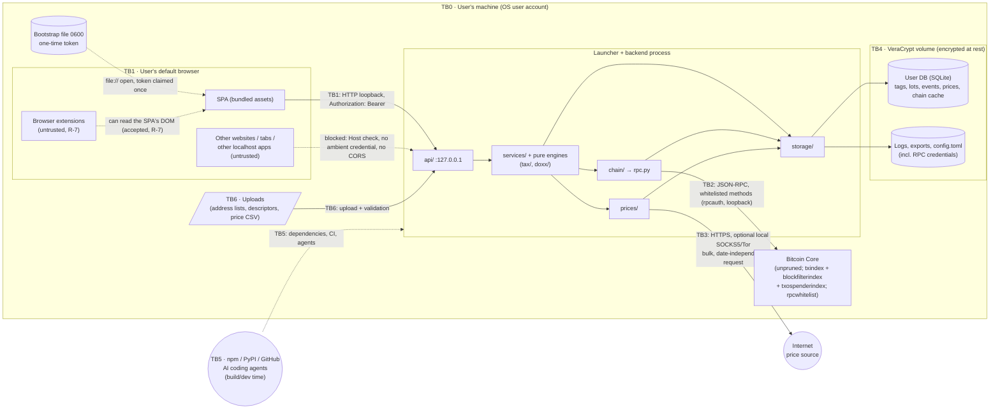

# Threat Model — Coin Accounting

> **Living document.** It describes what is *planned* and, over time, what is *implemented* and *verified*.
> Every change that touches a trust boundary, asset, data store, network flow, dependency or tax rule must update this file **in the same PR**. Reviewers reject PRs that don't. The exception is cruise mode ([ADR 0030](adr/0030-cruise-mode.md)): a `/cruise` run's slices leave these updates to the run's milestone-closing PR.

| | |
|---|---|
| Version | 0.10 (M3 done; M2 done; M1 done except the mainnet perf check; M0.2's signature checks still open, #15) |
| Last updated | 2026-10-08 |
| Scope | v1: Bitcoin (Bitcoin Core) only, on Linux and macOS — see [`PLAN.md`](../PLAN.md) |
| Focus | Protecting the app and the user's data once it's built. The agent-process risks (AI agents, reviews, merging: T-605, R-9, R-11, R-12) are accepted by the owner (ADR 0031) and don't add steps to planned work. The supply-chain mitigations (T-601–T-604, T-606, T-608) still apply in full, and dependency approval stays with the owner |
| Method | Data-flow diagram → trust boundaries → STRIDE per boundary, plus privacy (linkability/disclosure) and integrity-of-tax-output threats |

### Status legend
| Status | Meaning |
|---|---|
| **Planned** | Mitigation is designed but not built |
| **Implemented** | Code exists; link to it |
| **Verified** | An automated test proves the mitigation; link to the test |
| **Documented** | Procedural or documentation-only mitigation is written and linked. This is the highest status such rows can reach |
| **Accepted** | Risk knowingly not mitigated; rationale recorded in §9 |
| **N/A** | No longer applicable (keep the row; say why) |

A threat may only move to **Verified** when a test exists that fails if the mitigation is removed. Rows whose mitigation is (partly) procedural are marked † and can reach at most **Documented** for that part.

---

## 1. System overview

The app is a single-user tool running on the user's own machine (Linux or macOS). Its parts:
- **Launcher + backend:** one process. The launcher applies the process hardening and starts a FastAPI server bound to `127.0.0.1` (architecture §3).
- **UI:** a React + Cytoscape.js single-page app served by the backend and opened in the user's default browser through a one-time bootstrap file (architecture §4).
- **Chain data:** comes only from the user's Bitcoin Core node over **loopback** JSON-RPC, as a dedicated, server-side-whitelisted RPC user. The app keeps **no chain index of its own**: Core's `txindex`, `blockfilterindex` (via `scanblocks`/`getdescriptoractivity`) and `txospenderindex` (via `gettxspendingprevout`) answer chain queries, and the answers are cached in the user DB.
- **Sensitive user data:** stored in a SQLite database kept on a VeraCrypt volume.
- **Outbound internet:** the only allowed flow is a bulk, date-independent download of historical fiat prices, optionally via Tor/SOCKS5.

### 1.1 Data-flow diagram and trust boundaries

| ID | Boundary | Crosses between |
|---|---|---|
| TB0 | OS account | The user's session ↔ other OS users / remote attackers |
| TB1 | Browser ↔ backend | Our SPA, and any other web origin the browser loads, ↔ the loopback API |
| TB2 | Backend ↔ Bitcoin Core | Our process ↔ node JSON-RPC (loopback only) |
| TB3 | Backend ↔ Internet | Price fetcher ↔ external price/FX source (the **only** runtime outbound flow) |
| TB4 | Process ↔ disk | Encrypted volume (**everything the app writes**) vs plain disk (nothing the app writes; only OS or browser spill, see §5.4) |
| TB5 | Build/dev supply chain | Third-party packages, build tools, CI, AI coding agents ↔ our code and dev environment |
| TB6 | User-supplied files | Imported address lists / descriptors / CSVs ↔ parser |

---

## 2. Assets

| ID | Asset | Sensitivity | Where it lives |
|---|---|---|---|
| A1 | **Ownership map**: owned addresses/descriptors, address↔tax-account and ↔wallet-client mapping, entity tags (self, exchanges, employer, …) | **Critical** (full deanonymization of the user's holdings and counterparties) | User DB (TB4V) |
| A2 | **Doxx map**: which coins are linked to which identity-knowing entity | Critical | User DB |
| A3 | **Tax records**: lots, basis, identifications, disposals, income, exchange accounts | Critical (financial + identity) | User DB, exports |
| A4 | **Chain-data cache**: decoded txs, UTXOs, script histories and spender lookups for the scripts the user cares about | Critical (equivalent to A1) | User DB |
| A5 | **Report exports** (8949 CSV, income, summaries, audit trail) | Critical | Export dir (TB4V) |
| A6 | **Logs** | High if they contain A1–A4 values | TB4V |
| A7 | **Node RPC credentials** (dedicated `rpcauth` user) | Medium: the account is whitelisted to read-only methods, but it still grants query access | App config on TB4V; app memory |
| A8 | ~~Chain index~~ | *Removed in v0.4:* there is no app-side chain index. Cached chain data (decoded txs, script histories, spenders) reveals which scripts the user cares about, so it is part of **A4** | — |
| A9 | **Price history cache** | Public data; integrity-sensitive | User DB |
| A10 | **Correctness of tax output** | High: wrong figures mean legal/financial harm | Engines, rule sets, tests |
| A11 | **Fact of usage**: that this IP / person runs a BTC accounting tool | Medium | Network metadata |
| A12 | **Source code & build integrity** | High (a compromised build exfiltrates A1–A5) | Repo, CI, dependency tree |

## 3. Security & privacy objectives

1. **O1 — No data egress.** A1–A6 never leave the machine through the app. The only outbound connection carries no user-derived data. *(Protection against **malicious code inside the process** relies on supply-chain controls; see R-4.)*
2. **O2 — Local-only chain data.** All chain data comes from the user's own node over loopback. No block explorers, Electrum servers or third-party APIs.
3. **O3 — Encrypted at rest.** All sensitive data (A1–A6) lives only on the VeraCrypt volume. Nothing sensitive spills to plain disk.
4. **O4 — Loopback isolation.** Only the user, through our UI, can reach the API. Other web origins and other OS users cannot.
5. **O5 — Integrity of records and tax output.** Figures follow the supported federal rules for the relevant tax year. They are deterministic, reproducible, auditable, and traceable to their inputs.
6. **O6 — Honest privacy signal.** The doxx view models every link it can determine from the user's data (a lower bound) and never overstates privacy.
7. **O7 — Trustworthy build and dev process.** Dependencies, tooling and coding agents cannot silently add network access or exfiltrate user data.

## 4. Adversaries

| ID | Adversary | Capabilities | In scope? |
|---|---|---|---|
| AD1 | **Malicious website** visited in the same browser | JS in another origin; DNS rebinding; CSRF; timing | Yes |
| AD2 | **Other local OS user** / other process under another UID | Can connect to loopback ports; read world-readable files | Yes |
| AD3 | **Device thief / cold-disk attacker** (laptop stolen, disk imaged while the volume is dismounted) | Offline access to plain disk, swap, browser data outside the volume | Yes |
| AD4 | **Network observer** (ISP, Wi-Fi, state, price-source operator) | Sees outbound connections, DNS, TLS metadata, request timing | Yes |
| AD5 | **Compromised/malicious price source** or MITM | Serves wrong prices | Yes |
| AD6 | **Supply-chain attacker** (typosquat, hijacked maintainer, malicious GitHub Action, tampered release/`bitcoind` download) | Code execution at install/build/runtime | Yes |
| AD7 | **Adversarial on-chain data** (crafted tx/script/OP_RETURN content by any payer) | Controls bytes that Core decodes and our result processing and UI handle | Yes |
| AD8 | **Chain-analysis firm / exchange / identity-knowing counterparty** correlating the user's coins | Public blockchain + KYC or other identity data | Yes (as a *privacy* adversary the doxx model informs against) |
| AD9 | **The user themself** (mistakes, mis-tagging, wrong paths, accidental export, late identification) | Legitimate access | Yes (safety rails) |
| AD12 | **Cloud-backed AI coding agent** used during development | Reads files and terminal output on the dev machine and sends them to a remote model provider | Yes (as a dev-process exfiltration path) |
| AD10 | **Malware running as the same OS user**, root/kernel compromise, hardware implants | Full access while the volume is mounted | **No** (see §8) |
| AD11 | **Physical coercion** | — | No |

---

## 5. Threat register

Columns: **ID** · **STRIDE/P** (S spoofing, T tampering, R repudiation, I info disclosure, D denial of service, E elevation, P privacy/linkability) · **Threat** · **Mitigation (planned)** · **Status** · **Evidence** (code / test / doc link, filled when implemented). † = partly procedural.

### 5.1 TB1 — Browser ↔ backend

| ID | STRIDE/P | Threat | Mitigation | Status | Evidence |
|---|---|---|---|---|---|
| T-101 | I, T | **DNS rebinding**: an AD1 page rebinds its hostname to 127.0.0.1 and reads or modifies the API as a same-origin request | Strict `Host` header allowlist: exactly `127.0.0.1:<port>` (one canonical hostname, never `localhost`, so the SPA origin, and with it the `sessionStorage` session, is always the same). Every other Host is rejected before routing | Verified | `coinacct/api/security.py`: the Host allowlist is exactly `127.0.0.1:<port>` and every other Host, `localhost` included, is refused before routing. Tests `unit/api/test_app.py` `test_any_other_host_is_refused_before_routing_t101`, `test_a_missing_or_doubled_host_is_refused_t101`; on regtest, over a real socket, `integration/launcher/test_launcher_regtest.py` `test_a_second_claim_and_a_wrong_host_are_refused_t101_t110` |
| T-102 | T | **CSRF**: an AD1 page, or another app on `127.0.0.1`, sends state-changing requests to the API | **No ambient credentials:** no cookies. Every request needs `Authorization: Bearer <session>`, and the session token is held in `sessionStorage`, which is scoped to the full origin including the port, so other pages can't read it or attach it. Only JSON bodies are accepted; **no CORS headers ever** (architecture §4) | Implemented | Server side, with tests in `unit/api/test_app.py`: every API route except the session exchange (which takes the one-time bootstrap token, T-110) needs `Authorization: Bearer <session>` (`test_the_api_needs_the_session_as_a_bearer_token`, `test_no_session_works_before_the_claim`, on `/api/status` and `/api/quit`); JSON bodies only (`test_api_bodies_must_be_json_t102`); no CORS headers on any response or preflight (`test_a_cors_preflight_gets_no_cors_headers_t102`, `test_every_response_has_the_security_headers`). No response sets a cookie: the claim, a refused claim, status and quit (`test_no_response_sets_a_cookie_t102`), and every response in `test_every_response_has_the_security_headers`. Frontend side: the SPA keeps the session in `sessionStorage` and sends it only as a bearer header (the E2E run's status call needs the header; no test checks that it is the only way the session is sent) (`frontend/src/api/client.ts`); the E2E run checks the stored session against the production build (`e2e/tests/start-and-quit.spec.ts`) |
| T-103 | I, S | **Other local users (AD2)**, or other web apps on `127.0.0.1`, reach the API or steal the session | Bind `127.0.0.1` only (never `0.0.0.0`); random port. **Bootstrap:** the launcher writes a one-time token (60 s TTL, single use) into a mode-0600 file (Linux: `$XDG_RUNTIME_DIR`; macOS: the data directory), and opens that *file* in the browser. So the token never appears in any process's argv (`/proc/<pid>/cmdline`, `ps` are readable by other users). The SPA exchanges it once for a session token that lives until the backend exits. Cookies are not used, because they are shared by every port on the host | Implemented | `launcher.loopback_socket` binds `127.0.0.1` on a port the OS picks, and uvicorn serves only that socket (`unit/launcher/test_serve.py` `test_the_loopback_socket_is_bound_to_127_0_0_1_and_not_yet_listening_t103`, `test_the_server_gets_a_listening_loopback_socket_t103`; on regtest, `integration/launcher/test_launcher_regtest.py` `test_the_server_listens_on_loopback_only_t103` checks the only listener is `127.0.0.1:<port>`, skipped where `ss` is missing). The token never appears in argv: `serve` hands the browser opener the bootstrap file's path only (`test_the_browser_is_opened_with_the_file_path_only_once_the_server_runs`); the real opener, `launcher.open_in_browser`, passes the browser only the file's `file://` URI (`test_the_real_opener_passes_only_the_file_uri_t103`). No cookies (T-102). The SPA exchanges the token for a session kept in `sessionStorage` (`frontend/src/api/client.ts`), driven end to end from the launch file in the E2E run (`e2e/tests/start-and-quit.spec.ts`) |
| T-104 | T, E | **XSS via attacker-controlled chain data (AD7)**, e.g. OP_RETURN text or crafted labels rendered in the graph or tables | React escaping only (lint bans `dangerouslySetInnerHTML` and inline styles); Cytoscape labels as text. Strict CSP: `default-src 'self'; script-src 'self'; style-src 'self'; img-src 'self' data: blob:; connect-src 'self'; object-src 'none'; base-uri 'none'; form-action 'none'; frame-ancestors 'none'` | Implemented (partly) | The strict CSP is sent on every response (`coinacct/api/security.py`; `unit/api/test_app.py` `test_the_csp_is_the_strict_one_t104`, which pins the exact string to this row's text, `test_every_response_has_the_security_headers`, and `test_the_page_and_script_follow_the_csp_t104` for the placeholder page). The SPA renders all text through React (`frontend/src/main.tsx`), and the E2E run fails on any CSP violation against the production bundle (`e2e/tests/start-and-quit.spec.ts`). The graph (M3, PR #223; ADR 0037): Cytoscape draws only text labels (`data(label)`, the one data mapping), from a stylesheet of constants (`frontend/src/graph/style.ts`); element data carries only the id, the edge ends and the label. `e2e/tests/graph-style.spec.ts` fails if a style is a function, if any style but `label` reads data, if a URL-valued property names anything but a constant `/assets/` file, or if `Graph.tsx` drops `style: STYLESHEET`, calls `.style(`, names `background-image` or sets an inline `style={...}` (its blind spots are pending, below). `e2e/tests/graph.spec.ts` drives the graph against regtest and asserts that every image request is the bundle's own `/assets/` file, that there is no CSP violation and no `<style>` element: Cytoscape's own inline `<style>` is suppressed by the marker its renderer checks for, with its one rule in `app.css`, and the CSP is unchanged. Pending: the lint bans (#157); the stylesheet test's blind spots (`.css(`, element-JSON `style`) and an E2E with URL- or markup-shaped chain data (#227) |
| T-105 | I | **Browser leaks sensitive data to plain disk (AD3)**: history, HTTP cache, autofill, session restore, crash reports, thumbnails | App-side, browser-independent controls: no sensitive values in URLs, including the launch token (T-110); opaque IDs; queries in POST bodies; `Cache-Control: no-store` on all API responses; autocomplete off on sensitive fields. v1 opens the user's **default browser** and does **not** manage a dedicated profile. Whatever the browser still writes is accepted as **R-5** (user decision, 2026-09-27) | Implemented (partly) (app-side) / Accepted (browser-side) | App side: `Cache-Control: no-store` on every response, refused ones included (`coinacct/api/security.py`; `unit/api/test_app.py` `test_every_response_has_the_security_headers`); the launch token appears only in the URL fragment, is single-use with a 60 s TTL, and the page removes it with `history.replaceState` (T-110); whatever the browser records before that is browser-side (R-5). Frontend: every query that names a script or a txid is a POST body, never a URL: address events (`/api/addresses/events`), the graph (`/api/graph/tx`, `/api/graph/spender`) and the tag routes (`/api/tags/*`); the only GET parameter is an opaque account id (`backend/coinacct/api/app.py`; `frontend/src/api/client.ts`). Sensitive inputs set `autocomplete="off"`: the import form (`frontend/src/views/Imports.tsx`) and the graph's txid and label fields (`frontend/src/views/Graph.tsx`). The SPA has no client-side routes. Pending: a test that every sensitive input has autocomplete off |
| T-106 | I, P | **UI pulls third-party resources** (fonts, CDN, analytics), leaking usage (A11) or data | All assets bundled at build time; CSP `connect-src 'self'`; a CI test fails if the built bundle references external URLs | Implemented (partly) | CSP `connect-src 'self'` on every response (`unit/api/test_app.py` `test_the_csp_is_the_strict_one_t104`, `test_every_response_has_the_security_headers`), and no docs or schema pages (`test_there_are_no_docs_or_schema_pages_t106`). The frontend is bundled at build time, with no assets inlined as `data:` URLs (`frontend/vite.config.ts` `assetsInlineLimit: 0`) and served from memory, only its own `/assets/` (ADR 0034; `unit/api/test_app.py` `test_only_the_bundles_own_assets_are_served`, `unit/launcher/test_serve.py` `test_the_built_frontend_is_what_the_app_serves`). The E2E run requires every script to be a `/assets/*.js` path served with status 200, and fails on any CSP violation, which is what rules out another origin (`e2e/tests/start-and-quit.spec.ts`). Pending: the CI check that the built bundle references no external URL, and an E2E check that every request stays on the app's origin (#157) |
| T-107 | T | **Clickjacking**: an AD1 page frames the UI | `frame-ancestors 'none'` + `X-Frame-Options: DENY` | Verified | `frame-ancestors 'none'` in the CSP and `X-Frame-Options: DENY` on every response, including refused ones (`coinacct/api/security.py`; `unit/api/test_app.py` `test_every_response_has_the_security_headers`, `test_the_csp_is_the_strict_one_t104`) |
| T-108 | I | **Browser downloads of exports go to `~/Downloads`** (plain disk) | Exports are written server-side only to `<data>/exports/` on the volume. A browser download is the only other destination: it needs an explicit confirmation that warns about the destination, and uses a POST with the bearer header that returns a blob (never a GET link that another localhost app could trigger). The browser, not the app, writes the downloaded file (R-5) | Planned | |
| T-109 | I | **Clipboard and screen exposure**: copied addresses or txids reach clipboard managers or sync (plain disk, cloud); screenshots or screen sharing | Copy actions show a notice; clipboard sync and screen recording are covered in the user docs | Documented † | |
| T-110 | I | **Launch credential leaks** via process arguments, browser history, session restore or referrer | The token comes from the bootstrap file, not argv. It travels in the URL **fragment** (never sent to servers or in the Referer), is single-use with a 60 s TTL, and is removed with `history.replaceState` before rendering. `Referrer-Policy: no-referrer`. A second claim is refused, logged, and shows "Session already claimed. Restart the app." The bootstrap file is deleted on claim or expiry | Implemented (partly) | Launcher side: `launcher.write_bootstrap_file` writes a 0600 HTML file (`O_EXCL`, `O_NOFOLLOW`) on Linux in `$XDG_RUNTIME_DIR` when it is the user's own 0700 directory, and otherwise (always on macOS) in `<data>`; the token (32 random bytes) appears only in the URL fragment; `no-referrer`; no script. Tests `unit/launcher/test_launcher.py` (`*_t110`). Server side (`coinacct/api/session.py`): the token is exchanged once for a session, a second claim is refused with "Session already claimed. Restart the app." and the reuse is logged, and it expires after 60 s (`unit/api/test_app.py` `test_a_second_claim_is_refused_and_logged_t110`, `test_an_expired_token_is_refused_t110`); the placeholder page calls `history.replaceState` to remove the fragment (a string check; its order isn't tested). The launcher deletes the bootstrap file on claim, on expiry and at shutdown, and when start-up fails after writing it (`unit/launcher/test_serve.py` `test_claiming_the_session_removes_the_launch_file_t110`, `test_the_launch_file_is_removed_when_the_token_expires_t110`, `test_the_launch_file_is_private_announced_and_removed_on_quit_t110`, `test_the_launch_file_is_removed_when_start_up_fails_after_writing_it`); on regtest, a second claim is refused (`test_a_second_claim_and_a_wrong_host_are_refused_t101_t110`). Frontend side: the SPA takes the token from the address with `history.replaceState` before the first render, removing any `#bootstrap` fragment, and claims the session once (`frontend/src/api/client.ts` `takeBootstrapToken`, called at module load in `frontend/src/main.tsx`); a refused claim shows the server's message. The E2E run checks that the address has no fragment once the app is ready (`e2e/tests/start-and-quit.spec.ts`). Pending: a test of the already-claimed message in the browser (#157) |
| T-111 | I | **Browser extensions** in the user's default profile, with access to all sites, can read the SPA's pages (ownership map, doxx map, tax data) and send them anywhere | Not preventable by the app. The docs recommend a **private window or a clean profile with extensions disabled**; Chromium incognito and Firefox private windows disable most extensions by default. Accepted as **R-7** | Accepted † | |

### 5.2 TB2 — Backend ↔ Bitcoin Core

| ID | STRIDE/P | Threat | Mitigation | Status | Evidence |
|---|---|---|---|---|---|
| T-201 | I | **RPC credential leakage** (A7) through logs, the DB, error pages or exports | A dedicated `rpcauth` user whose password is stored only in the app config on the volume; never logged or echoed; the redaction filter covers auth headers. The app does **not** read Core's cookie file, which is unrestricted | Implemented | `coinacct/domain/secret.py` (`Secret` never formats its value), `config.py` and `rpc.py`: errors never carry the password or call parameters, and a node error's text (which Core uses to quote the offending parameter, checked on regtest 31.1) stays out of `str`/`repr`, in `RpcCallError.node_message` only. Tests `test_secret.py`, `unit/config/test_config.py`, `unit/rpc/test_rpc.py` (`*_t201_t403`, `test_a_node_errors_text_is_kept_apart_from_its_string_form_t403`). The redacting log handler is installed for the app's logging, and uvicorn's records propagate to it (configured, not yet tested end to end; see T-403); it masks authorization values (T-403; `test_redact.py`, `launcher/test_launcher.py` `*_t403`), and a bad config stops start-up without echoing the password (`test_a_missing_or_bad_config_stops_start_up_without_echoing_the_password_t201`). M1: an offline reason from the start-up catch-up names only the error's class, never the node's message (`services/chain_sync.at_startup`; `unit/services/test_chain_sync.py` `test_a_node_error_during_the_start_up_catch_up_means_offline_mode`), and a failed chain job is recorded and logged by its class only (the one exception, a start-up `DbError`, carries the app's own message, which never holds chain data) (`services/jobs`; `unit/services/test_jobs.py` `test_a_failed_job_is_recorded_by_class_only_and_the_worker_goes_on`) |
| T-202 | I, P | **Queries sent to a non-local node**: RPC has no TLS, so credentials and every lookup (A1) would cross the network in plaintext | **Loopback only; non-loopback RPC endpoints are refused, with no override.** For a node elsewhere, the docs cover an SSH tunnel (`ssh -L`) that terminates on loopback | Implemented (partly) | Refused twice, with no override: `config.py` accepts only a literal loopback IP (names, even `localhost`, are refused) and `RpcClient` refuses any other endpoint. Tests `test_non_loopback_*_t202`, `test_host_names_are_refused_even_localhost_t202`; removing either check fails them. The launcher passes the configured endpoint to `RpcClient` through `api/runtime.build`, and the app starts against a regtest node that way (`integration/launcher/test_launcher_regtest.py` `test_the_app_starts_online_serves_the_session_and_quits_cleanly`). Pending: the user docs on an SSH tunnel (`ssh -L`) that terminates on loopback |
| T-203 | E, T | **App (or code inside it) misuses the node**: wallet, broadcast or other state-changing RPCs (e.g. `sendrawtransaction`, or `importdescriptors` storing the user's addresses in a node wallet **outside** the volume) | **Server-side `rpcwhitelist`** for the app's rpcauth user, limited to read-only methods: `getblockchaininfo`, `getnetworkinfo`, `getindexinfo`, `getblockcount`, `getbestblockhash`, `getblockhash`, `getblockheader`, `getblock`, `getrawtransaction`, `gettxout`, `gettxspendingprevout`, `scanblocks`, `getdescriptoractivity`, `getchaintips`, `deriveaddresses`, `getdescriptorinfo`. A client-side allowlist adds defence in depth. **Canary at startup:** the app calls a harmless method that is *not* whitelisted (`uptime`) and, if it succeeds, disables all chain RPC and starts in offline mode (ADR 0004, architecture §3). REST (`rest=1`) is never used, and the docs recommend leaving it off | Implemented (partly) | Client allowlist and canary in `coinacct/rpc.py` (`ALLOWED_METHODS`, `canary_refused`: only HTTP 403 counts as refused), checked at startup by `coinacct/chain/node_checks.py`. Unit tests `unit/rpc/test_rpc.py` (`*_t203`); on regtest 31.1 (`integration/chain/test_node_checks_regtest.py`): the whitelisted node refuses the canary and a wallet method even with the client allowlist bypassed, a node without `rpcwhitelist` fails the canary, and a whitelist missing a needed method is reported. A failed canary or any other node check means offline mode, not a failed start, except that with `--allow-unencrypted-storage` a check that leaves the chain unknown refuses start-up (T-401) (`unit/services/test_startup.py` `test_a_missing_whitelist_means_offline_t203`; `unit/launcher/test_serve.py` `test_offline_mode_still_serves`; on regtest, `test_a_node_failing_a_check_means_offline_mode_not_a_failed_start`). In offline mode no job worker or tip poller is started, so nothing calls the node after the checks (`api/runtime.build`; `unit/launcher/test_serve.py` `test_offline_mode_starts_no_chain_jobs`), and a start-up catch-up that fails after the checks also means offline mode (`unit/services/test_startup.py` `test_a_catch_up_that_fails_after_the_checks_means_offline_mode_not_a_failed_start`). Every method the M1 chain code calls is on both lists. The SPA shows the offline message with its reasons (`frontend/src/main.tsx`; by code, no test drives the offline state in the browser yet, #157). Offline, the API's import service has no node client, so a descriptor preview or import is refused before anything is sent (`unit/services/test_imports.py` and `unit/api/test_imports_api.py` `test_offline_a_descriptor_is_refused_before_anything_is_sent_t203`; `test_the_service_has_a_node_client_only_online_t203`), and the import view disables the descriptor option (`frontend/src/views/Imports.tsx`; no browser test yet, #157). Pending: chain actions disabled in the UI while offline, once the UI has chain actions (#157); the user docs' advice to leave REST off |
| T-204 | P | **Node logs reveal lookup activity** | With `debug=rpc`, Core logs method names and users but not parameters. The docs recommend not running with `debug=rpc`/`debug=http` | Documented † | |
| T-205 | D, T | **Adversarial or oversized chain data (AD7)**: huge blocks/txs or **very busy scripts** (e.g. a tagged exchange hot wallet with 100k+ blocks of activity) exhaust memory, time or disk; unusual scripts break processing; crafted text reaches the UI (T-104) | No custom binary parser: Core decodes. Response size limits and streaming JSON decoding; `getdescriptoractivity` calls capped at a few hundred blocks; a per-script activity budget (candidate count from `scanblocks` first; above a threshold, warn and ask); clustering never auto-expands busy scripts; property/fuzz tests on result processing; fails closed (no partial cache writes) | Implemented (partly) | No binary parser: `chain/txs.parse_tx` checks Core's decoded (verbosity 2) reply field by field and refuses anything else, as do the spender, scan and mempool parsers (`unit/chain/test_txs.py` `test_a_reply_of_the_wrong_shape_is_malformed_t205`, `unit/chain/test_spenders.py` `test_a_reply_of_the_wrong_shape_is_malformed_t205`, `unit/chain/test_scans.py` `test_a_malformed_receive_is_refused_t205`, `test_a_malformed_spend_is_refused_t205`, `unit/chain/test_mempool.py` `test_a_malformed_mempool_event_is_refused_t205`). `RpcClient` caps a reply at 64 MiB (`unit/rpc/test_rpc.py` `test_a_reply_over_the_size_cap_is_refused_t205`). Bounded calls: `getdescriptoractivity` is called for at most `ACTIVITY_BLOCKS` (200) blocks at a time, the tip window included (`chain/scans`; `unit/chain/test_scans.py` `test_activity_is_read_in_bounded_calls_t205`, `test_the_tip_window_is_read_in_bounded_calls_t205`); a prevout fill fetches at most `MAX_PARENTS` parents (`unit/chain/test_txs.py` `test_fill_prevouts_has_a_parent_budget_t205`), a spender lookup takes at most `MAX_OUTPUTS` outputs (`unit/chain/test_spenders.py` `test_a_call_has_an_output_budget_t205`), and a mempool pass returns at most `MAX_PENDING` events per subject (`unit/chain/test_mempool.py` `test_a_busy_scripts_mempool_is_bounded_t205`). Per-subject activity budget: the candidate blocks `scanblocks` reports are counted with the subject's coverage, and a range that would take the total past the budget is refused before any of its blocks is read; retrying doesn't reset the count (`ActivityBudgetError`; `unit/chain/test_scans.py` `test_a_busy_script_stops_at_its_budget_before_reading_blocks_t205`, `test_the_budget_counts_the_subjects_whole_history_across_calls_t205`). The sync reports such a subject as over budget and leaves the catch-up unfinished (`unit/services/test_chain_sync.py` `test_a_subject_over_its_budget_is_reported_for_the_user_t205`), and a busy script over the mempool limit hides only its own pass (`test_a_busy_subject_over_the_mempool_limit_hides_only_its_own_pass_t205`). Fails closed: each range's activity and coverage are committed together or not at all (`unit/chain/test_scans.py` `test_a_failure_in_a_later_range_keeps_the_earlier_ones`). Descriptor windows grow only on confirmed use, so a third party can't grow one with mempool transactions: growth reads only stored activity, and mempool results are never stored (`services/discovery.py`; `unit/services/test_discovery.py` `test_unconfirmed_use_never_grows_a_window_t205`; `unit/chain/test_mempool.py` `test_only_the_mempool_is_asked_and_nothing_is_stored_t207`). A window grows by at most 1,000 indexes at once and never past index 10,000 by itself (`test_the_wanted_window_end`, `test_the_gap_limit_follows_the_last_used_index`, `test_a_full_window_is_reported`; ADR 0036). Imported addresses are scanned in at most 16 subjects per start height (`services/imports.py`). Pending: the mainnet perf check (the human's), which sets the range size, the window size and the activity budget (today the range size and the budget are the planned defaults: 50,000 blocks, and 1,000 candidate blocks per subject); asking the user about an over-budget subject (the UI); clustering never auto-expanding busy scripts (M4); property/fuzz tests on result processing (§7); streaming JSON decoding (today the client caps a reply's size, then decodes it whole); the activity budget per address bucket rather than per script (#188); a held over-budget subject that a same-tip sync can bypass (#190); confirmed third-party use can still grow a window up to the cap, and one transaction paying successive window edges can drive several growth steps (#202); paging the history views (#198); a node budget and paging for large transactions in the graph (#225); a tag from the graph rescans its whole address bucket from height 0 (#209) |
| T-206 | T | **Wrong network**: a testnet/signet/regtest node is used against a mainnet DB, or the reverse | Store `chain` in the user DB; on a mismatch, disable chain RPC and start in offline mode (ADR 0004) | Verified | `node_checks.evaluate` reports a chain that differs from the data directory's (`unit/chain/test_node_checks.py` `test_a_chain_other_than_the_data_directorys_is_refused_t206`), and start-up then runs in offline mode (`unit/services/test_startup.py` `test_a_node_on_another_chain_than_the_data_directory_means_offline_t206`). The chain is stored in the user DB (`storage/chain_state`, the `chain_state` table): recorded on a data directory's first start that passes every node check, and never changed or removed afterwards, which triggers enforce too (`unit/storage/test_db.py` `test_the_chain_is_recorded_once_and_never_changes_t206`, `test_the_schema_keeps_the_recorded_chain_t206`; `unit/services/test_startup.py` `test_a_new_data_directory_records_the_nodes_chain_once_every_check_passes_t206`, `test_a_node_on_another_chain_than_the_recorded_one_means_offline_t206`). The launcher opens the DB before the node checks and passes it to them (`unit/launcher/test_serve.py` `test_the_user_db_is_open_for_the_node_checks_and_closed_at_shutdown_t206`, `test_the_first_start_records_the_chain_and_a_later_node_on_another_chain_is_offline_t206`). Offline mode starts no chain jobs (`test_offline_mode_starts_no_chain_jobs`) |
| T-207 | T | **Reorgs or new blocks leave cached chain data stale or incomplete**: rows from orphaned blocks, **"nothing found" results and scanned ranges** that no longer reflect the active chain, reorgs that happened while the app was closed, stale mempool results | Every block-backed row stores its block hash and height; each script's coverage stores its range and stop-block hash; negative answers are **snapshots** tagged with the tip hash. A persisted last-seen tip: on startup and every tip change, find the fork point (walk `getblockheader` while `confirmations == -1`), invalidate every row, coverage range and snapshot above it **at any depth**, then extend coverage to the new tip. Mempool results are kept separately and rebuilt on every refresh. Tax events become final only after a configurable number of confirmations (default 6) | Implemented (partly) | Block-backed rows (`tx_cache`, `activity`, `spender`) store their block hash and height, each subject's coverage stores its range and stop-block hash, and "unspent" is a snapshot tagged with its tip (`storage/chain_cache`, migration `m0002_chain_cache`). Every write names the tip it was computed against and is refused if that tip moved or the row lies above it (`unit/storage/test_chain_cache.py` `test_a_write_against_a_tip_that_moved_is_refused_t207`, `test_no_row_may_lie_above_the_tip_or_at_its_height_from_another_block_t207`). `chain/reorg.catch_up` runs at start-up (`services/chain_sync.at_startup`) and on every tip change (the tip poller queues `chain_sync.sync`, `services/jobs`; `unit/services/test_jobs.py` `test_a_tip_change_queues_one_sync_and_an_unchanged_tip_none_t207`). It walks `getblockheader` back from the persisted reference tip while `confirmations == -1` and removes every row, snapshot and stretch of coverage above the fork, at any depth, in one transaction (`unit/chain/test_reorg.py` `test_the_walk_finds_a_fork_at_any_depth_t207`, `test_a_reorg_invalidates_above_the_fork_and_records_the_new_tip_t207`, `test_a_branch_switch_during_the_walk_records_nothing_t207`; `unit/storage/test_chain_cache.py` `test_a_reorg_removes_everything_above_the_fork_at_any_depth_t207`). The last-seen tip moves only once every subject's coverage reaches the new tip (`unit/services/test_chain_sync.py` `test_a_sync_extends_every_subject_then_moves_the_last_seen_tip_t207`); an unfinished catch-up is walked back from its target (`unit/chain/test_reorg.py` `test_an_unfinished_catch_up_is_walked_back_from_its_target_t207`). On regtest 31.1, a reorg while the app was away, an unknown recorded tip and a reorg between syncs are handled (`integration/chain/test_reorg_regtest.py` `test_a_reorg_while_the_app_was_away_invalidates_above_the_fork_t207`, `test_a_recorded_tip_the_node_doesnt_know_invalidates_everything_t207`; `integration/services/test_chain_sync_regtest.py` `test_start_up_then_syncs_follow_the_chain_through_a_reorg_t207`). A scan never appends to coverage a reorg has left behind (`unit/chain/test_scans.py` `test_a_retry_never_appends_to_coverage_a_reorg_has_left_behind_t207`, `test_a_branch_switch_below_the_anchor_during_a_range_commits_nothing_t207`). Mempool results are never stored and are rebuilt at the cache's tip on every sync (`chain/mempool`; `unit/chain/test_mempool.py` `test_only_the_mempool_is_asked_and_nothing_is_stored_t207`, `test_a_pass_on_another_tip_than_the_caches_is_stale_t207`; `unit/services/test_chain_sync.py` `test_the_mempool_pass_is_rebuilt_before_the_tip_moves_t207`; on regtest, `integration/chain/test_mempool_regtest.py` `test_a_replaced_transaction_is_gone_and_its_replacement_shows_t207`). What a reorg removed goes to the review queue (T-506). The history views count only what the last finished sync covered, never activity above it (`services/history.py`; `unit/services/test_history.py` `test_events_above_the_last_finished_sync_are_left_out`, `test_nothing_counts_before_a_sync_has_finished`), and a grown window is scanned before it counts (`unit/services/test_jobs.py` `test_a_grown_window_is_scanned_at_the_next_poll`; on regtest, `integration/services/test_discovery_regtest.py` `test_the_window_grows_past_the_first_gap_to_the_wallets_used_addresses`). Pending: tax events final only after the confirmation threshold (default 6), with the events (M6); the history view's calls read separate snapshots (#200); a cancelled growth that can leave a tip counted as done (#190) |
| T-208 | T | ~~Index prefix collisions~~ → **BIP30 duplicate txids** | Prefix collisions are *N/A since v0.4* (no app-side index). **BIP30:** Core's `txindex` keeps only the later of each duplicate coinbase txid, so the app keys cached txs by (txid, block hash) and always fetches with the block hash from the activity event. Duplicate outpoints are resolved chronologically. The earlier outputs are unspendable | Implemented (partly) | Cached transactions are keyed by (txid, block hash), and both copies of a duplicate txid are kept (`storage/chain_cache`; `unit/storage/test_chain_cache.py` `test_both_copies_of_a_duplicate_txid_are_kept_by_block_t208`); activity events are keyed by their block too. `chain/txs.fetch_tx` passes the block hash to `getrawtransaction` (`unit/chain/test_txs.py` `test_a_confirmed_transaction_is_fetched_with_its_block_and_decoded_exactly`; on regtest 31.1, `integration/chain/test_txs_regtest.py` `test_a_coinbase_is_fetched_by_its_block`). The earlier copies of mainnet's two duplicate coinbases are answered unspendable by block hash, without asking the node (`chain/spenders.BIP30_OVERWRITTEN`; `unit/chain/test_spenders.py` `test_the_earlier_bip30_duplicate_coinbase_is_unspendable_t208`). Spender and snapshot rows are keyed by outpoint only, not by block (`storage/migrations/m0002_chain_cache`). A parent fetched for an unconfirmed transaction's prevouts is fetched without a block hash, and `txindex` resolves it to the later, spendable copy. The history views count a duplicate coinbase outpoint once, the later (`unit/services/test_history.py` `test_a_duplicate_coinbase_outpoint_counts_once_the_later_t208`). The graph (M3, PR #205) asks for a transaction with the block hash it knows (an output's own transaction once loaded, a spender's block), and answers the earlier copy of a duplicate coinbase unspendable before any spender or snapshot row (keyed by outpoint only) is read (the test's name says "any cache", but the cached transaction row itself is read first, and that is what it seeds; `services/graph`; `unit/services/test_graph.py` `test_the_earlier_bip30_duplicate_coinbase_is_unspendable_before_any_cache_is_read_t208`). A transaction asked for by txid alone resolves through `txindex` to the later copy: the view opened by a typed txid, and backward expansion from an input, whose parent's block the UI doesn't know. For an input that is right, since only the later copy's outputs can be spent; for a typed txid of a duplicate coinbase, the view shows only the later copy. The earlier copies' outputs are unspendable and carry no history to follow, so this has no tax or privacy effect; opening an earlier copy by its block hash is pending (below). Pending: opening the earlier copy of a duplicate coinbase in the graph (by its block hash); duplicate outpoints resolved chronologically, in the history views (#198) and the lot engine (M6) |
| T-209 | I, P | **Queries leave traces outside the volume**: the node or the app records which scripts or txs the user looked up, or that the tool is in use | App side: all cached chain data lives in the user DB on the volume. Node side: no node wallet is used, and Core doesn't persist RPC parameters or scan descriptors. `debug=rpc` would log method, user and request `id`, so the app uses counter `id`s. **Known trace:** the startup canary's refused call writes an unconditional warning to `debug.log` naming the RPC user. The docs recommend a generic username (fact-of-usage leak, A11). **M0 check:** after a regtest run, search the node's datadir for the scanned descriptors and txids; the only expected hit is that canary line | Implemented (partly) | Counter request ids in `coinacct/rpc.py` (`test_request_ids_are_a_plain_counter_t209`). **M0 check done** on regtest 31.1 (`test_lookups_and_scans_leave_no_trace_in_the_node_datadir_except_the_canary_line_t209`), with default logging and again with `-debug=rpc -debug=http`. A descriptor built from a BIP32 test-vector key is scanned with `scanblocks` and `getdescriptoractivity`, finding a block mined to one of its addresses, and a txid is looked up with `getrawtransaction`. Afterwards no file in the node's datadir contains the key, the derived addresses, the scanned txid or the looked-up txid as text. `debug.log` holds the expected `RPC User ro-client not allowed to call method uptime` line. M1: the chain cache (transactions, activity, spenders, coverage, snapshots, the in-flight scan marker and the review queue) lives only in the user DB, `<data>/db.sqlite`, a private file on the verified device (`storage/chain_cache`, `storage/db`; `unit/storage/test_db.py` `test_the_db_is_a_private_file_under_the_data_directory_t401`), and mempool results are never stored (`unit/chain/test_mempool.py` `test_only_the_mempool_is_asked_and_nothing_is_stored_t207`). The M0 check calls the node directly, not through the M1 scan code, which uses the same methods. Not covered: binary encodings (e.g. raw script bytes in a file) |
| T-210 | D, T | **Incomplete chain data**: a pruned node, a missing or lagging index, or **`scanblocks` silently skipping filter ranges it can't read**. Core returns `completed: true` and `to_height == stop` anyway, so neither signals the gap | Startup: unpruned; `txindex`, `blockfilterindex`, `txospenderindex` each `synced` with `best_block_height == getblockcount()`. **Scan protocol** (PLAN §1): stop height ≤ the filter index height and ≤ tip − 100; bounded ranges; after each range, the index height and `getblockhash(stop)` are re-checked, else discard and retry; the newest ~100 blocks are only ever read via `getdescriptoractivity`, which errors rather than skips; "Block is not in main chain" triggers a rescan; any other failure is a hard error. Forward expansion uses `txospenderindex` (no filters, waits for index sync, errors loudly). **Residual:** read errors or corruption inside the node's filter index are still skipped silently. Covered by trusting the node's indexes (§8); reported upstream | Implemented (partly) | Startup part: `node_checks` requires an unpruned node and the three indexes each `synced` with `best_block_height == getblockcount()`, retried briefly (unit tests `unit/chain/test_node_checks.py`, `*_t210`; on regtest 31.1, a node missing each index fails the check; at start-up that means offline mode). Scan protocol (`chain/scans`): the stop height S is at most the filter index's height and at most the tip minus 100 (`unit/chain/test_scans.py` `test_the_stop_height_stays_below_the_filter_index_and_the_tip_window_t210`); ranges are bounded (`test_a_scan_range_is_bounded`), and each is committed with its coverage, which must continue without a gap (`unit/storage/test_chain_cache.py` `test_coverage_grows_without_gaps_t210`). After each range, the filter index's height and `getblockhash(S)` are checked again, against the same S for every range, or the range is discarded (`unit/chain/test_scans.py` `test_a_chain_that_moved_during_a_range_discards_it_t210`, `test_a_filter_index_that_fell_behind_during_a_range_discards_it_t210`, `test_every_range_is_guarded_by_the_same_stop_block_t210`) and retried by the sync (`unit/services/test_chain_sync.py` `test_a_stale_range_is_retried_a_few_times`). The blocks above S go only to `getdescriptoractivity`, and a filter index more than 100 blocks behind is waited for, never read block by block (`unit/chain/test_scans.py` `test_a_scan_covers_every_block_once_with_the_tip_window_read_directly_t210`, `test_a_filter_index_far_behind_is_waited_for_not_read_directly_t210`). Only a block that left the active chain means a rescan; any other error is a hard error (`test_a_block_that_left_the_chain_means_rescan_anything_else_is_hard`, `test_only_a_missing_block_is_stale_t210`). A subject that can't be extended leaves the catch-up unfinished, and the next poll queues the sync again (`unit/services/test_chain_sync.py` `test_a_subject_that_must_wait_leaves_the_catch_up_unfinished_t210`; `unit/services/test_jobs.py` `test_an_unfinished_sync_is_queued_again_on_the_next_poll_t210`). On regtest 31.1, a scan across several ranges and the tip window finds every receive and spend (`integration/chain/test_scans_regtest.py` `test_a_scan_finds_every_receive_and_spend_across_ranges_and_the_tip_window_t210`). Forward expansion (`chain/spenders`) always passes `mempool_only: false`, so a node without `txospenderindex` errors rather than answering "unspent" (`integration/chain/test_spenders_regtest.py` `test_a_node_without_txospenderindex_fails_loudly_never_reads_unspent_t210`). A range that fails its guard three times leaves its subject waiting for the next sync instead of failing the job (architecture 0.2.6 §8.2, ADR 0035, which the owner accepts before this change merges). The history views say how far each address is scanned, mark a UTXO whose address isn't scanned through the last sync as possibly spent, and never show an unscanned address's empty history as settled (`services/history.py`; `unit/services/test_history.py` `test_an_address_is_scanned_to_its_subjects_coverage`, `test_a_utxo_is_complete_once_its_address_is_scanned_to_as_of`; on regtest, `integration/services/test_history_regtest.py` `test_an_imported_address_shows_its_utxos_and_balance_after_a_sync`; E2E `e2e/tests/holdings.spec.ts`). Pending: telling the user why a subject keeps waiting (job status, architecture §3); a renamed subject's scripts reading "not scanned yet" until the rescan (#198); the mainnet perf check (the human's), which sets the range size (today the planned 50,000 blocks); property/fuzz tests on scan-result processing (§7) |
| T-211 | T | ~~Chain index tampered with on plain disk~~ | *N/A since v0.4:* the app writes nothing to plain disk. The node's indexes are trusted (§8). The chain cache on the volume is recomputable and is kept consistent by T-207/T-210 | N/A | |
| T-212 | D | **Long-running or orphaned scans**: Core runs one `scanblocks` at a time **for all RPC users**, a scan keeps running after a client disconnect or crash, and `status`/`abort` can't tell whose scan it is | Scans are queued background jobs over bounded ranges, with `status`/`abort` on a second connection. "Scan already in progress" means *queue busy* and is retried with backoff. At startup and after any client error, the app checks `status` and aborts a scan it left running. Client timeouts are long but finite. Forward expansion doesn't use scans at all (`txospenderindex`) | Implemented (partly) | Scans run as jobs on the one job worker, one at a time (`services/jobs.JobWorker`; `unit/services/test_jobs.py` `test_jobs_run_one_at_a_time_in_order`), over bounded ranges (T-210). An in-flight marker is written in the user DB just before each `scanblocks` call and cleared once the node has answered; a transport error or timeout keeps it, and while it is set no new scan starts (`chain/scans`; `unit/chain/test_scans.py` `test_each_scan_call_runs_inside_the_in_flight_marker_t212`, `test_a_node_error_clears_the_marker_a_lost_connection_keeps_it_t212`, `test_a_marker_left_by_a_lost_call_blocks_new_scans_until_recovery_t212`). `scans.recover` checks `scanblocks status` and aborts a running scan only when the marker is set (`unit/chain/test_scans.py` `test_recovery_aborts_a_scan_the_app_left_running_t212`). It runs at start-up, at the start of every sync (so after a client error, at the next sync), and when a marker is found during one (`unit/services/test_chain_sync.py` `test_start_up_recovers_then_catches_up_t212`, `test_a_scan_left_running_is_recovered_before_the_sync_t212`, `test_a_marker_set_meanwhile_is_recovered_and_the_range_retried_t212`). The RPC client opens a new connection for each call. "Scan already in progress" is `ScanBusyError` (`unit/chain/test_scans.py` `test_a_busy_scan_queue_is_its_own_error_t212`): the subject waits, and the tip poller queues the sync again 30 s later. At shutdown the chain jobs are stopped after the server and before the DB closes: every job is cancelled, and a running sync starts no further range, because the cancel is checked after the marker is set and right before each `scanblocks`. The node's scan is aborted if the marker is set, on a second client whose call is bounded to 1 s, and the marker is read again after the worker's join (`unit/services/test_jobs.py` `test_shutdown_aborts_the_nodes_scan_only_when_ours_may_be_running_t212`, `test_shutdown_aborts_a_running_scan_and_no_scan_starts_after_it_t212`, `test_a_range_started_as_the_cancel_was_set_is_aborted_after_the_join_t212`, `test_a_hung_abort_doesnt_hold_up_the_shutdown_step_t405`, `test_a_node_gone_at_shutdown_is_logged_and_the_marker_kept_for_the_next_start_t212`; `unit/services/test_chain_sync.py` `test_a_cancel_between_two_ranges_starts_no_further_range_t212`; `unit/launcher/test_serve.py` `test_the_chain_jobs_start_online_and_stop_after_the_server_before_the_db_closes`). A failed sync is queued again at the next poll, and a subject over its budget alone waits for the next tip (`test_a_sync_that_raises_is_queued_again_at_the_same_tip`, `test_a_subject_over_its_budget_alone_waits_for_the_next_tip_t205`). The client timeout is 120 s (`rpc.DEFAULT_TIMEOUT`). Forward expansion uses `gettxspendingprevout`, not scans (`chain/spenders`). Pending: backoff for a busy scan queue or a subject that keeps waiting (today the sync is queued again at every 30 s poll, with no growing backoff); the mainnet perf check (the human's), which shows whether 120 s fits a range; property/fuzz tests on scan-result processing (§7) |

### 5.3 TB3 — Backend ↔ Internet (price data)

| ID | STRIDE/P | Threat | Mitigation | Status | Evidence |
|---|---|---|---|---|---|
| T-301 | P | **Request content reveals acquisition/sale dates, holdings or residency** | Only bulk, **date-independent** requests. The request set never depends on user records (events, addresses, tags); only the start of the incremental range depends on the public price cache. **All supported fiat pairs are always fetched**, so the chosen currency isn't revealed. A test asserts the requests are identical for different user DBs with the same price cache | Planned | |
| T-302 | P | **Network observer (AD4) learns that this IP runs a BTC accounting tool** (A11) | Optional SOCKS5 proxy (Tor) with remote DNS (`socks5h`); a common browser User-Agent (not a library or unique string); fetches only on manual trigger; the first run prompts the user to choose proxy or direct | Planned † | |
| T-303 | T | **Tampered or incorrect prices (AD5)**: MITM or compromised source → wrong basis/proceeds (A10) | TLS with certificate verification (no opt-out flag); sanity checks (gaps, non-positive values, day-over-day outlier threshold); store source, method and content hash per import; every price can be overridden by the user, and overrides are flagged in reports | Planned | |
| T-304 | D | **Price source disappears or changes format** | The local cache is authoritative once fetched; a CSV import fallback; parser errors fail loudly without partial overwrite | Planned | |
| T-305 | I | **Accidental unexpected outbound connection** (a dependency with telemetry or update checks, a coding mistake) | Only `rpc.py` (loopback) and `prices/` open connections, enforced by code review and structure. A test-time socket guard patches `socket.connect` **and** `getaddrinfo` and fails any test that opens a non-allowlisted connection or DNS lookup. **Not a security boundary** against malicious code in the process (R-4) | Implemented (partly) | Socket guard `backend/tests/socket_guard.py`, installed by `pytest_configure` (tryfirst) in `backend/tests/conftest.py` before test modules are collected, and removed by `pytest_unconfigure` (trylast). `connect`, `connect_ex`, `sendto`, `sendmsg`, `getaddrinfo` and the legacy resolver calls fail for anything but loopback. Every block is also **recorded**, so a test still fails when the code under test swallows the error (`except Exception`), and blocks outside any test fail the session. Tests `backend/tests/unit/test_socket_guard.py` and `test_socket_guard_at_import.py`. Not covered: code that runs before `pytest_configure` (interpreter, coverage and `-p` plugin start-up). Runtime structure (only `rpc.py`, `prices/` and the launcher's server bind use the network) is checked by `scripts/check_architecture.py`. Pending: CI doesn't run `make test` yet (#44) |

### 5.4 TB4 — Data at rest

| ID | STRIDE/P | Threat | Mitigation | Status | Evidence |
|---|---|---|---|---|---|
| T-401 | I | **User DB created on plain disk by mistake (AD9 → AD3)** | At startup, resolve the real path of the DB (following symlinks) and identify the block device it lives on. **Linux:** `stat().st_dev` → `/sys/dev/block/<maj>:<min>/dm/{name,uuid}`; accept `veracrypt*` names and `CRYPT-TCRYPT*` / `CRYPT-LUKS*` uuids. **macOS:** detection method to be designed in M0 (VeraCrypt mounts through macFUSE/FUSE-T); if it can't be done reliably, the user confirms the path explicitly and the confirmation is stored per path. Otherwise refuse to start. `--allow-unencrypted-storage` is accepted **only for regtest, signet and testnet** (development and CI), never on mainnet. The data directory is passed with `--data-dir` or `COINACCT_DATA_DIR` each time and is never saved on plain disk. Warn on FAT/exFAT (no permission bits). DB and side files use mode 0600 with a restrictive umask | Implemented (partly) | `coinacct/storage/volume.py`: Linux detection exactly as listed here (sysfs `dm/name` `veracrypt*`, `dm/uuid` `CRYPT-TCRYPT*`/`CRYPT-LUKS*`; anything else, including tmpfs and devices without device-mapper, is unencrypted), and the filesystem type from `/proc/self/mountinfo` for the FAT/exFAT warning. **macOS uses the documented fallback** (owner decision, 2026-10-02: no detection method for now): an explicit confirmation (`--confirm-encrypted-volume`) stored in `<data>`, tied to the directory's real path, device and inode, mode 0600, never followed through a link. `coinacct/storage/datadir.py`: no default data dir; everything under `<data>` must be on the classified device (subdirectories, `DataDir.path()` through the nearest existing part, `config.toml` through `fstat`, and `clear_tmp`, which never crosses into another filesystem); the directory must be owned by the user with no group/other access; `storage_refusal` allows `--allow-unencrypted-storage` only on regtest/signet/testnet (an unknown chain counts as mainnet). `launcher.prepare` refuses an unencrypted directory without the flag, and with it marks start-up as needing a test chain (enforced at start-up once the node's chain is known: `services/startup`; `unit/services/test_startup.py` `*_t401`, including mainnet and an unknown chain). Tests `backend/tests/unit/storage/`, `unit/launcher/` (`*_t401`), mutation-checked. Start-up refuses unencrypted storage before anything is served (`unit/launcher/test_serve.py` `test_a_storage_refusal_stops_start_up_before_anything_is_served_t401`; on regtest, `test_unencrypted_storage_with_an_unreachable_node_is_refused_t401`). The user DB (`storage/db.open_db`, M1): `<data>/db.sqlite`, created with mode 0600 without following a link, a regular file owned by the user on the verified device, checked again after SQLite has opened it (same inode), with its WAL, shared-memory and journal files held to the same rules (`unit/storage/test_db.py` `test_the_db_is_a_private_file_under_the_data_directory_t401`, `test_a_linked_db_is_refused_t401`, `test_a_db_readable_by_others_is_refused_t401`, `test_a_db_swapped_after_the_checks_is_refused_t401`, `test_the_path_is_checked_again_before_wal_is_switched_on_t401`, `test_a_linked_side_file_is_refused_t402`). The data directory's chain is recorded in the DB (T-206) and decides the storage policy (`unit/services/test_startup.py` `test_the_recorded_chain_decides_the_storage_policy_t401`). An existing mainnet DB on plain disk is refused, read without following a link; when its chain row is only in an un-checkpointed WAL, the peek doesn't see it, and the refusal comes after `open_db` (#175) (`unit/launcher/test_serve.py` `test_an_existing_mainnet_db_on_plain_disk_is_refused_before_anything_writes_to_it_t401`, `test_a_first_start_on_plain_disk_for_a_refused_chain_is_refused_and_records_nothing_t401`; `unit/storage/test_db.py` `test_peeking_at_the_recorded_chain_writes_nothing_and_never_follows_a_link_t401`). A DB path that is a link is refused, which is stricter than the mitigation's "following symlinks". Pending: a test that the FAT/exFAT warning is logged (only the flag is tested); the peek's un-checkpointed WAL and "can't tell" cases (#175); the macOS follow-ups #111 and #112 |
| T-402 | I | **SQLite side files and temp data spill** (WAL, journal, temp B-trees, sort files, HTTP download buffers) | Side files live next to the DB on the volume; `PRAGMA temp_store=MEMORY`; `TMPDIR`/`SQLITE_TMPDIR` for the process point to a directory on the volume | Verified | `launcher.use_temp_dir` points `TMPDIR`, `SQLITE_TMPDIR` and `tempfile.tempdir` at `<data>/tmp` (0700), which is cleared at start without following links (`test_temp_files_go_to_the_volume_and_tmp_is_cleared_t402`, `test_clearing_tmp_removes_links_without_following_them`). The user DB runs with `temp_store=MEMORY`, and a SQLite built to ignore it is refused. Its WAL and shared-memory files sit next to it on the verified device with its mode, and a side file that is a link or readable by others is refused (`storage/db`; `unit/storage/test_db.py` `test_the_settings_keep_temp_data_in_memory_and_use_wal_t402`, `test_a_sqlite_that_ignores_temp_store_is_refused_t402`, `test_a_linked_side_file_is_refused_t402`, `test_a_side_file_readable_by_others_is_refused`) |
| T-403 | I | **Logs contain addresses/txids/amounts** (A6) | Logs are written only to the volume; a redaction filter masks addresses, txids, outpoints, descriptors, amounts and fiat values by default; a debug mode that disables redaction is explicit and writes only to the volume; uvicorn, framework and library loggers, `sys.excepthook` and `threading.excepthook` all go through the redacting handler, and the access log is off; tests assert that redaction works | Implemented (partly) | `coinacct/domain/redact.py` masks, best effort and erring towards too much: HTTP credentials and the bootstrap token; extended and WIF keys; descriptor key origins; bech32 and base58 addresses; hex of 40+ digits (txids, hashes, pubkeys, HASH160s, scripts); any number with a BTC/sat/fiat unit or code, whatever its size; fiat with a currency sign; decimal and exponent amounts; long and digit-grouped integers; values joined by commas (compact JSON, CSV) as separate pieces. Its patterns run in linear time (tested on adversarial inputs). Known residue is listed in #114 and #115. `storage/logfile.py` writes `<data>/logs/coinacct.log` (a regular 0600 file on the verified device, never through a link) and redacts each record's message, traceback and stack (not the ISO 8601 UTC timestamp); a record that fails to format or write is reported to stderr as a fixed line, never through logging's default error path, which prints the raw record. `launcher.install_logging` routes the root logger, `logging.lastResort`, warnings, `sys.excepthook` and `threading.excepthook` through it. Tests `test_redact.py`, `storage/test_logfile.py`, `launcher/test_launcher.py` (`*_t403`). uvicorn runs with `log_config=None`, so its loggers propagate to the redacting handler (configured; no test sends a uvicorn record through it yet), and with the access log off (`launcher.uvicorn_config`; `unit/launcher/test_serve.py` `test_uvicorn_runs_without_proxy_headers_server_header_access_log_or_websockets`); on regtest the launch token isn't in the log (`test_the_log_is_written_to_the_data_volume`). Chain jobs, the tip poller and the mempool pass log a failure by its exception's class only (the one exception, a start-up `DbError`, carries the app's own message, which never holds chain data), since node replies and errors can name the user's scripts (`services/jobs`, `services/chain_sync`; `unit/services/test_jobs.py` `test_a_failed_job_is_recorded_by_class_only_and_the_worker_goes_on`, `unit/services/test_chain_sync.py` `test_a_failed_mempool_pass_never_holds_up_confirmed_progress`). Pending: explicit debug mode |
| T-404 | I | **Swap, hibernation or core dumps** write memory with A1–A4 to plain disk | `RLIMIT_CORE=0`, plus `prctl(PR_SET_DUMPABLE, 0)` on Linux. Docs require encrypted swap and hibernation, or none (macOS encrypts swap by default) | Implemented † | `launcher.harden`: `RLIMIT_CORE=0`, `prctl(PR_SET_DUMPABLE, 0)` on Linux, umask 077; fails closed. Test `test_hardening_disables_core_dumps_and_dumpability_and_sets_a_private_umask_t404` runs it in a child process and reads the limits back. The swap and hibernation part stays documentation (†) |
| T-405 | I | **Data remains accessible after the volume is dismounted** | The watchdog detects that the volume or DB path has disappeared and makes the backend exit immediately; the UI shows that it is disconnected. **Partial:** the OS page cache and freed memory may still hold data until overwritten. VeraCrypt refuses a normal dismount while files are open, so the documented v1 workflow is: quit the app (its browser tab shows it is disconnected), then dismount. An in-app lock is deferred (§10) | Implemented (partly) | `coinacct/storage/watchdog.py`: every 2 s, the verified data directory must still be the same path, device and inode; otherwise it calls the shutdown callback once and stops (tests `unit/storage/test_watchdog.py`, `*_t405`; removing the identity check or the callback fails them). The launcher wires it to the app's shutdown: a lost volume, during or after the node checks, stops the server and runs the shutdown steps, and a stalled request can't keep the app running (`unit/launcher/test_serve.py` `*_t405`; on regtest, `test_sigterm_shuts_down_cleanly_t405` and `test_a_stalled_request_cant_keep_the_app_running_after_shutdown_t405` cover the shutdown path, not a lost volume end to end). Pending: watching the DB path itself (M2; today the data directory's identity is watched), and the UI's disconnected state (#157) |
| T-406 | I | **User data accidentally committed to git or synced**, e.g. a data dir inside the repo checkout, or a volume container placed in cloud sync | There is no default data dir: it is passed with `--data-dir`/`COINACCT_DATA_DIR` each time (architecture §6). `storage/` refuses a data dir inside a git working tree. `.gitignore` and agent-ignore files cover `*.sqlite*`, `data/`, `exports/`. The docs cover backups and cloud sync of the container | Implemented (partly) | `open_data_dir` refuses a data directory inside a git working tree, recognised as git does (a `.git` directory with `HEAD`, or a `gitdir:` file); test `test_a_directory_inside_a_git_working_tree_is_refused_t406`. The ignore files and docs parts are unchanged |
| T-407 | I | **Plaintext exports on plain disk** (see T-108) | The export dir defaults to the volume; the warning covers every alternative path | Planned | |
| T-408 | T, R | **Silent tampering or accidental edits of records** | Append-only change log for events, tags, identifications and overrides (what, when, old → new); `PRAGMA integrity_check` on startup; a documented backup procedure (copy while the volume is mounted) | Implemented (partly) | `PRAGMA integrity_check` runs on every open of the user DB, and anything but `ok` refuses it; a file SQLite can't read is reported as damaged (`storage/db`; `unit/storage/test_db.py` `test_a_db_that_opens_but_fails_its_integrity_check_is_refused_t408`, `test_a_damaged_db_is_refused_t408`, `test_a_negative_schema_version_is_refused_t408`). The app's connection runs in SQLite's defensive mode (`test_the_apps_connection_refuses_sql_that_could_corrupt_the_file_t408`). A DB that can't be used stops start-up before the node checks (`unit/launcher/test_serve.py` `test_a_user_db_that_cant_be_used_stops_start_up_before_the_node_checks_t408`). A damaged chain-cache row is refused when it is read (`unit/storage/test_chain_cache.py` `test_a_damaged_cache_row_is_refused_t408`). A `DbError` during the start-up catch-up means offline mode with the error's own message, which names the remedy (`unit/services/test_chain_sync.py` `test_a_damaged_cache_at_start_up_names_the_remedy_t408`); start-up doesn't read cached rows, so a row that is well-formed SQL but damaged data is found only when it is used. The change log (M3; PRs #207, #214, #217, #219, #221): every tag edit from the graph or an address import (an address's owner, account, label, text and wallet apps; a transaction's mixing flag) is written with its `change_log` row in one transaction, with before and after, and a no-op isn't logged. An address an import adds is recorded by the import itself, not in the change log; its first log row is its first later edit (`storage/tags`, `storage/change_log`; `unit/storage/test_tags.py` `test_a_new_address_is_added_and_logged_t408`, `test_retagging_logs_before_and_after_and_a_no_op_logs_nothing_t408`, `test_a_reimport_that_adds_a_wallet_client_is_logged_once_t408`). The schema refuses any update, delete or replacement of a logged row (`migrations/m0006_tags`, `m0007`, `m0008`, `m0009`; `test_the_change_log_is_append_only_t408`, `test_no_change_log_id_is_below_1_so_appends_keep_working_t408`), and a DB holding a change-log id below 1, which only an edit outside the app can write, is refused at the m0009 upgrade (`test_a_db_with_an_id_below_1_from_before_m0008_is_refused_at_the_upgrade_t408`, `test_a_db_from_schema_7_upgrades_and_keeps_appending_t408`). The triggers stop edits made through SQL on a connection that has them; edits made outside the app otherwise go undetected (no tamper evidence). Pending: the change log for events, identifications and overrides (with those records, M6); tamper evidence for the change log (a hash chain, checked on open); a descriptor re-import that adds wallet apps, which isn't logged yet (#222); naming the remedy when a hand-edited log is refused (#220); the documented backup procedure |

### 5.5 Tax correctness & privacy signal (A10, O5, O6)

Tax-rule correctness is **in scope**. The supported federal rules are versioned by tax year and reference IRS forms, instructions and guidance. What is out of scope is personalized advice and scenarios explicitly listed as unsupported (§8).

| ID | STRIDE/P | Threat | Mitigation | Status | Evidence |
|---|---|---|---|---|---|
| T-501 | T | **Wrong tax figures from bugs** in lot flow, fees, holding period, identification or box selection | Pure, deterministic engine recomputed from events; rule sets per tax year with references; hand-worked expected values derived from IRS rules; mutation testing on `tax/`; coverage floor ≥95% on `tax/` | Planned | |
| T-502 | T | **Numeric errors** (float rounding, overflow) | Integer satoshis; `Decimal` for USD with explicit rounding rules; a lint rule bans `float` in `tax/` | Implemented (partly) | Chain amounts: the RPC client decodes numbers as `Decimal`, never `float` (`unit/rpc/test_rpc.py` `test_fractional_numbers_decode_as_decimal_never_float_t502`), and `domain/chain.btc_to_sats` converts them to integer satoshis exactly, whatever the ambient `Decimal` context, refusing a fraction of a satoshi or an amount outside 0 to 21M BTC (`unit/test_domain_chain.py` `test_btc_converts_to_exact_satoshis_t502`, `test_a_fraction_of_a_satoshi_or_an_out_of_range_amount_is_refused_t502`, `test_the_conversion_ignores_the_ambient_decimal_context_t502`). A transaction whose outputs or spent outputs total more than 21M BTC, or whose fee is negative, is malformed (`unit/chain/test_txs.py` `test_outputs_totalling_more_than_all_bitcoin_are_malformed_t502`, `test_spent_outputs_totalling_more_than_all_bitcoin_are_malformed_t502`, `test_a_negative_fee_is_malformed_t502`), and so is such a cached copy (`unit/storage/test_chain_cache.py` `test_a_damaged_cache_row_is_refused_t408`). The architecture check bans floats and true division in `tax/` (`scripts/check_architecture.py`; `scripts/tests/test_check_architecture.py` `test_floats_banned_in_tax`). Pending: `Decimal` with explicit rounding rules for USD (M5, M6) |
| T-503 | R | **Reports can't be reproduced or audited later** | Each report embeds app version, rule-set version, settings, and a hash of the input events and price rows; the audit trail export links every figure to its events, identifications and txids | Planned | |
| T-504 | T | **Heuristic misattribution**: common-input clustering links wrong addresses (CoinJoin, PayJoin, batched exchange withdrawals) and produces wrong income or entity tags | Heuristics only *suggest*, never auto-apply; txs flagged `mixing` (auto-detected: many equal-value outputs; or set by the user) suppress co-spend clustering; every tag records its provenance | Planned | Groundwork (M3): an address records how it first entered the user DB (`source`: `manual` for a tag from the graph, `import`, `descriptor`; `discovery` is reserved), and a transaction's mixing flag records who set it (`source` `user`; `auto` is reserved for M4's detection). Both are stored. An address tagged from the graph and every mixing flag are logged from the start; an imported or descriptor address is logged only when a later edit changes it (`storage/tags`; `unit/storage/test_tags.py` `test_a_new_address_is_added_and_logged_t408`, `test_the_mixing_flag_is_set_cleared_and_logged`, `test_a_reimport_that_adds_a_wallet_client_is_logged_once_t408`), and the graph returns the flag (`unit/services/test_graph.py` `test_a_transaction_carries_the_users_mixing_flag`). Not yet provenance per tag: a later retag keeps the address's first `source`, and the change log has no origin per change, so a user's edit and an import's look alike (#229). Pending: per-change provenance (#229); the heuristics themselves (M4): suggestions that are never auto-applied, auto-detected mixing, and co-spend clustering that skips mixing transactions |
| T-505 | P | **False sense of privacy from unmodeled heuristics**: chain-analysis firms (AD8) link coins through amount/timing correlation, change detection, peel chains, dust, or off-chain data | UI wording is "known links", never "private" or "clean"; the docs list the modeled vs unmodeled heuristics; a persistent note appears in the sell-planner view | Planned † | |
| T-506 | T | **Unconfirmed or reorged txs** flow into tax records | Confirmation threshold (T-207); reorg-driven changes invalidate derived events and surface them for review; unconfirmed items block reports | Implemented (partly) | Reorgs: `invalidate_above` records every txid whose cached rows it deleted in the user DB's review queue, in the same transaction, and the txid stays there until the events built on it are flagged; every sync reports the whole queue (`storage/chain_cache.pending_review`, migration `m0004_review_queue`, `services/chain_sync`; `unit/services/test_chain_sync.py` `test_a_reorg_is_kept_for_review_until_flagged_t207`, `test_a_reorg_survives_a_sync_that_fails_after_it_t207`, `test_a_reorg_found_at_start_up_is_kept_for_review_t207`). Unconfirmed activity comes only from the mempool pass, which is never stored and must be at the cache's tip, so a transaction isn't counted both unconfirmed and confirmed (`chain/mempool`; `unit/chain/test_mempool.py` `test_a_pass_on_another_tip_than_the_caches_is_stale_t207`). Pending: the confirmation threshold (T-207); flagging the events built on queued txids, and unconfirmed items blocking reports, once events and reports exist (M6, M7) |
| T-507 | T | **Unsupported situations silently mis-reported**: lost/stolen, forks/airdrops, state tax, anything outside the supported rules | The unsupported list is shown in the docs and on every report; the UI warns when data suggests one applies; settings that affect tax treatment are printed on every report | Planned † | |
| T-508 | T | **Late or unclear lot identification**, for exchange sales, exchange withdrawals and self-custody spends. A choice made after the sale or transfer may not count: the IRS may apply the account's standing order, or FIFO if there is none, and the figures then differ from the user's (Treas. Reg. §1.1012-1(j)) | Each exchange lot choice stores `identified_at`. Accounts can use their standing method automatically (ADR 0021), which is never late. A manual choice made late is flagged **only if its lots differ** from the standing method's (or FIFO's). **Warn only** (user decision, 2026-09-27): the warning shows the result under the standing order or FIFO, and the flag appears in the audit trail and on the report, but the user's choice is kept. Self-custody: the spent UTXO is the identification (a stated tax position, ADR 0008), and inside a UTXO that holds several lots, fragments leave oldest first unless the wallet has a recorded method (user decision, 2026-09-28). From 2027, a reminder says exchange choices must be given to the broker (Notice 2025-7 relief through 12/31/2026 per Notice 2026-20) | Planned | |
| T-509 | T | **Unknown or incorrect basis**: withdrawals with no recorded buys, the 1/1/2025 per-account transition (Rev. Proc. 2024-28) not reflected, a gift from a donor with unknown basis | `opening_allocation_2025` events per tax account; withdrawals move lots and never create them silently; unknown basis **blocks report generation** until the user resolves it explicitly (e.g. zero basis), and the resolution is recorded | Planned | |
| T-510 | T | **Wrong Form 8949 box**: e.g. digital assets reported in C/F for 2025+, box set per account instead of per disposal | Box chosen per disposal from (tax year, channel, 1099-DA received, basis reported); 2025+ uses G/H/I and J/K/L; on-chain disposals → I/L; the user can override, and the reason is recorded; tests per tax year | Planned | |
| T-511 | P | **Doxx under-claim from deterministic links not modeled**: address reuse, receipts from identity-knowing parties, and payees other than exchanges | Doxx applies to every entity with `knows_identity`. Modeled rules: paid-to, received-from (from confirmed events), address reuse, forward, and backward cluster (*inferred*). CoinJoin `mixing` txs downgrade forward propagation to *inferred*. Rules are recorded in an ADR and tested on hand-built graphs | Planned | |

### 5.6 TB5 — Supply chain & development process

| ID | STRIDE/P | Threat | Mitigation | Status | Evidence |
|---|---|---|---|---|---|
| T-601 | E, I | **Malicious or compromised package** (npm/PyPI typosquat, hijacked maintainer, freshly published malicious version, lockfile poisoning). Because in-process egress is accepted (R-4), **this is the primary exfiltration path** | Packages are **resolved, vetted and approved before anything is installed** (ENGINEERING §2.4); `make bootstrap` installs only dependency files and install-affecting config (`.pnpmfile.*`, `.npmrc`, `uv.toml`, `pnpm-workspace.yaml`) merged to `main`, and `toolchain.py install` only pins merged to `main` (checked against `refs/remotes/origin/main`, ignored files included), unless the human passes `DEPS_APPROVED=1` on the make command line (an inherited environment variable doesn't count, but an inherited `MAKEFLAGS` would). Agents never set it: AGENTS.md says so for every agent, and the refusal messages tell agents to stop and ask; only Claude Code also has a technical block (the guard hook). The gate checks the current branch, so it guards against accidental unmerged changes, not a malicious branch (ENGINEERING §2.4). CI is the one other place that passes it (T-608, §5.6.1). 7-day cooldowns (pnpm `minimumReleaseAge` strict, uv relative `exclude-newer`). Every install goes through Socket Firewall via `make` targets, with no fallback. A **lockfile policy check** enforces registry-only sources, hashes and package age on every entry, including transitive ones. Exotic sources are blocked. Monthly batched updates; weekly clean-cache re-scan; `make audit` (`osv-scanner`, ADR 0027; a committed `osv-scanner.toml` is rejected and never loaded) on every PR, once its CI step lands. Details in `docs/ENGINEERING.md` §2 | Planned | |
| T-602 | E | **Install-time or load-time code execution**: dependency build scripts, our own lifecycle scripts, `.pnpmfile` hooks, sdist builds, `.pth` files in wheels, package managers auto-installing or auto-downloading | pnpm `allowBuilds: {}` + `strictDepBuilds`; no lifecycle scripts, `.pnpmfile` or `configDependencies` in our repo (CI check); uv `no-build` with no exceptions and `package = false`, and `make propose-py` passes `--no-build` on the command line; pnpm `ignorePnpmfile: true`, and `make propose-*` refuse unapproved install config; `.pth` allowlist check (uv's `_virtualenv.pth` and, per ADR 0025, coverage's `a1_coverage.pth`, each pinned by content); `verifyDepsBeforeRun: error`, `pmOnFail: error`, `UV_NO_SYNC`, `python-downloads = "never"` | Planned | |
| T-603 | E, T | **Compromised CI, GitHub Actions or toolchain/test downloads** | Actions pinned by full SHA and checked with `zizmor`/`actionlint`; `contents: read`, read-only default token, `persist-credentials: false`, no secrets, no dependency caches; fork PRs need approval. Toolchain and test binaries (`sfw`, pnpm, uv, Node, Python, `bitcoind`, Playwright browsers, actionlint, zizmor, osv-scanner) are each verified per ENGINEERING §2.3; zizmor's online audits catch impostor-commit pins (ADR 0026). **`sfw` itself has no published checksums**, so its committed hash is trust-on-first-use. Limit: the installed-tree digest is recorded in `.toolchain/…/.installed.json` at install time, so it detects accidental or partial changes, not a local attacker who rewrites the files and the marker together (that attacker can equally edit the scripts; R-6) | Implemented (partly) | Implemented: toolchain hash verification, and re-verification of every installed file (Python bytecode included) of sfw, pnpm, uv, Node and Python before each install (`scripts/toolchain.py`, `scripts/toolchain.lock`; tests in `scripts/tests/test_check_adrs_and_toolchain.py`) and the SHA-pinned `actions/checkout` with `contents: read` and `persist-credentials: false` (`.github/workflows/ci.yml`). Implemented by PR #82: pinned actionlint and zizmor (`make lint-tools`, verified before each `make lint-workflows`), and `scripts/check_repo_files.py` rejecting linter config and zizmor ignore comments. The E2E browser (Chrome for Testing headless shell) is pinned by SHA-256, trust-on-first-use against Playwright's CDN (PR #153, ADR 0033); the E2E target verifies the installed tree, sets `PLAYWRIGHT_SKIP_BROWSER_DOWNLOAD=1` and passes its path, and Playwright launches it through `executablePath`, failing if the path is unset (`Makefile` `e2e`, `e2e/playwright.config.ts`; run in CI's `tests` job, PR #154). Pending: running actionlint and zizmor in CI (#94), and the Node `.asc` and `bitcoind` builder-signature checks (#15) |
| T-604 | I | **Runtime dependency adds network access** (telemetry, update checks) | The socket guard in tests (T-305); dependency review checks for network capability | Implemented (partly) | Backend: the test-time socket guard (T-305; `backend/tests/socket_guard.py`, installed by `backend/tests/conftest.py`) fails any backend test that makes a non-loopback connection, datagram or name lookup through the Python socket and resolver APIs it patches; native code and subprocesses are outside it (ENGINEERING §3). Dependency review: the register records each package's network capability (`docs/DEPENDENCIES.md`, ENGINEERING §2.4). `cytoscape` (PR #204) can load images named in URL-valued styles; the CSP's `img-src` confines that today (T-104). In the browser (M3, PR #223): the graph's stylesheet is built from constants, with its test, and the E2E image check (T-104, ADR 0037). The installed code Vite bundles, and the built bundle that ships (`frontend/dist/assets/*.js`), were searched for the patterns listed in `docs/DEPENDENCIES.md`; among them, in `cytoscape` 3.33.1 the only hits are its style-image loader, which the CSP and the constant stylesheet confine, and one unreachable `Function('return this')()`; `@dagrejs/dagre` 1.1.5 and `@dagrejs/graphlib` 2.2.4 have none; in the built bundle every other hit is the app's own same-origin `fetch` calls or react-dom's attribute handling for elements the views don't render. Pending: T-106's bundle-URL scan and same-origin E2E check, which cover every runtime dependency (#157) |
| T-605 | T | **AI coding agent introduces insecure code, weak tests or unvetted dependencies, or merges its own PRs** | `AGENTS.md` binds agents to this document; the install-command guard catches **accidental or habitual** unwrapped installs only (ADR 0022; deliberate evasion is R-8) and `ENGINEERING.md`; human review of every PR, focused by the review panel's **tripwire** flags (a mechanical scan plus an Opus check for malicious patterns, on the exact commit handed over; ADR 0020); test-slop audits; agents may propose but never approve dependencies. **Only the human merges**: this is procedural, since agents use the owner's GitHub credentials (user decision, 2026-09-27). **In cruise mode with autopilot** (ADR 0030, ADR 0031), the agent starts the panel itself, and a PR may merge only through `main`'s copy of the mechanical gate `scripts/cruise_merge.py`, at the cruise profile's hand-off (a clean round, or the fixes made after round 2), after an Opus tripwire check on the full change with no flag of Medium or above. The gate checks the mode, the stop file, an owner-only, non-draft PR at the reviewed SHA, the panel's `review-panel` commit status, green CI and no blocking tripwire flag, and it uses a separate repository-scoped token (R-11). It merges every such PR, security-critical modules and the tax, doxx and chain engines included, except dependency, lock and install-config files, ADRs and the architecture baseline, and the agents' own controls (scripts, CI, the Makefile, the mode files; agent instructions, skills and tool configuration in any directory; the test socket guard and every `conftest.py`), which stay with the owner (R-12). | Documented † (hook implemented) | [`AGENTS.md`](../AGENTS.md), [ADR 0018](adr/0018-repository-governance.md), [ADR 0020](adr/0020-review-panel.md), [ADR 0030](adr/0030-cruise-mode.md), [ADR 0031](adr/0031-autopilot.md); cruise gate `scripts/cruise_merge.py` (tests in `scripts/tests/test_cruise_merge.py`); tripwire `scripts/tripwire.py` (tests in `scripts/tests/test_tripwire.py`); banned-command hook `scripts/agent_guard.py` via `.claude/settings.json` (Claude Code only), tests in `scripts/tests/test_guards.py` |
| T-606 | T | **Tampered release/source** as distributed to the user | Commit signing is **not** required (user decision, 2026-09-27: agents would need the owner's key). GitHub signs merge commits. If releases are published for other users, release tags will be signed, and a reproducible build with checksums will be considered | Accepted (for now) | |
| T-607 | I | **Cloud-backed AI coding agents (AD12) read real user data** (DB, logs, exports, terminal output) and send it to a model provider | Agents never run while a volume with real data is mounted, and never get access to real data paths; development and E2E use regtest and synthetic data only; mainnet smoke tests are run by the human; agent-ignore files list the data paths; log redaction is on by default in dev. **Claude Code hook** (`scripts/agent_guard.py`): blocks every tool call while a VeraCrypt volume appears to be mounted. Limits: detection matches `veracrypt` in the device-mapper names and mount table, so a volume opened under another mapper name is missed, and an agent could edit the hook itself while no volume is mounted (#13). Other agents rely on the AGENTS.md check | Implemented † (Claude Code hook) | `scripts/agent_guard.py` via `.claude/settings.json`; test `test_blocks_everything_when_veracrypt_is_mounted` (detection itself untested: #22) |
| T-608 | E, I | **A new dependency runs before it is approved**, because it must be installed to be tested, and it must be tested to be approved (the approval chicken-and-egg, §5.6.1) | Unapproved dependencies are installed **only in CI**, never on a developer machine: `ci.yml` passes `DEPS_APPROVED=1` on the make command line (not keyed on `CI`/`GITHUB_ACTIONS`, which anyone can set). CI runners are GitHub-hosted and fresh per job, the installing jobs use only the `pull_request` trigger, and runners hold no secrets and have a read-only token (T-603); Socket reports on the PR; the human approves before merge; locally, only merged dependencies install (T-601) | Implemented † | Decision: user, 2026-09-28 ([#44](https://github.com/kristovatlas/coin-accounting/issues/44)). `.github/workflows/ci.yml` job `tests`: `if: github.event_name == 'pull_request'`; `make toolchain bootstrap test-tools DEPS_APPROVED=1` on the command line; GitHub-hosted `ubuntu-latest`/`macos-latest`; workflow `permissions: contents: read`; `persist-credentials: false`; no cache step. Then `make test` (socket guard, coverage floors) and `make lint` |

### 5.6.1 The approval chicken-and-egg (a lesson for other projects too)

This applies to almost any project that vets its dependencies.

**The problem.** A new dependency should not run before someone has approved it. But the best evidence for approving it (do the tests pass? does the audit find anything?) comes from installing and running it. Installing a package can itself run the package's code: install scripts, build steps, and every import when the tests start. So "install it to check it" already means "run code nobody has approved yet". Where that happens decides how much harm a malicious package can do.

**The usual mistakes:**
- **Test it on your own machine.** The package runs next to your SSH keys, browser sessions, tokens and, here, possibly real financial data (R-6). This is exactly the attack a malicious package is built for.
- **Refuse to install anything unapproved, anywhere.** Then nothing can be tested before approval. People approve blind, or work around the rule under deadline pressure, and a control that is routinely bypassed protects nothing.
- **Relax the rule "when running in CI" by checking an environment variable** such as `CI=true`. Anything can set that variable, including an agent or a script on a developer machine, so the exception leaks everywhere.

**Our answer: split where unapproved code may run.**
- **Developer machines, where the valuable things are:** only dependencies already merged to `main` are installed. The human can override this for one command (`DEPS_APPROVED=1` on the make command line) after approving. Agents must not: in Claude Code a hook blocks it, and for other agents it is a written rule in AGENTS.md (T-601).
- **CI, a throwaway machine with nothing worth stealing:** unapproved dependencies are installed and tested there. CI passes `DEPS_APPROVED=1` explicitly in its workflow file, where every change to it is visible in review. It never infers approval from an environment variable (T-608).
- **CI is only safe for this while it holds nothing of value:**
  - no secrets
  - a read-only token (`contents: read`, `persist-credentials: false`)
  - no shared dependency cache that a later, trusted run would reuse
  - no publishing or deploying from pull-request jobs
  - GitHub-hosted runners only, which are fresh for every job. A self-hosted or long-lived runner would let a malicious package stay behind and tamper with later runs
  - only the `pull_request` trigger for jobs that install unapproved dependencies. Triggers such as `pull_request_target` or `workflow_run` run with the main repository's secrets and a token that can write

  If any of this changes, this decision must be revisited. A malicious package would then have something to steal, or a way to poison later builds (T-603).
- **Other checks** narrow the gap without closing it:
  - the 7-day cooldown and Socket's report on the PR (T-601)
  - no install scripts (T-602)
  - the human's approval before merge

**What remains.** A malicious package can still run in CI and see the repository's source code, which is public here anyway. The design limits the damage to "a wasted CI run". It does not prevent the run.

### 5.7 TB6 — User-supplied files

| ID | STRIDE/P | Threat | Mitigation | Status | Evidence |
|---|---|---|---|---|---|
| T-701 | D, T | **Malformed or huge import files** (address lists, descriptors, future exchange CSVs) | Size/row limits; strict address validation (checksum, network); descriptors validated via `getdescriptorinfo` with a gap-limit cap; reject rather than guess; the import preview must be confirmed | Implemented (partly) | Size and line limits: a request body is at most 64 KiB (`api/security.py`), an upload at most 10,000 lines (`services/imports.py`; `unit/services/test_imports.py` `test_an_upload_too_large_or_too_long_is_refused_t701`). Strict addresses, checksum and network (`domain/addresses.py`; `unit/test_domain_addresses.py` `test_bip350_invalid_segwit_addresses_are_refused_t701`, `test_a_base58_address_with_a_wrong_checksum_is_refused_t701`, `test_an_address_of_another_chain_is_refused_t701`; on regtest, `integration/domain/test_addresses_regtest.py` `test_each_address_type_gives_the_nodes_script_t701`); a line that isn't an address is reported by number, never guessed. Descriptors go through `getdescriptorinfo` (`chain/descriptors.py`, which also bounds each derivation at 1,000 indexes), with the gap limit capped at 1,000 (`services/imports.py` `MAX_GAP_LIMIT`; `unit/services/test_imports.py` `test_the_gap_limit_is_bounded`; on regtest, `integration/services/test_imports_regtest.py` `test_a_wallets_public_descriptor_derives_the_wallets_own_addresses_t701`). The SPA imports only a previewed upload: it sends exactly the text it previewed, and any edit withdraws the preview (E2E `e2e/tests/import-addresses.spec.ts`). The server re-parses every import and doesn't require a preview (see Pending). Pending: exchange CSVs (a later milestone); a server-side preview requirement (today any authenticated client can import without one, so the confirmation is the SPA's); a descriptor conflict shown as importable (#196); the body limit is below the upload's own (#194) |
| T-702 | T | **CSV/formula injection in exports**: a label or chain-derived text starting with `= + - @` executes when the file is opened in a spreadsheet | Type-aware export: numeric columns are written as numbers, so negative gains stay intact; free-text columns (labels, descriptions, notes) have leading `= + - @`, tab and CR neutralised; unit test | Planned | |
| T-703 | I | **Private keys in imported descriptors**: an xprv/WIF descriptor would be sent to the node over RPC (`scanblocks`, `getdescriptoractivity` and `deriveaddresses` all accept private material), could reach logs or error paths, and would be stored in the DB | Import rejects any descriptor or key containing private material, before it is stored, sent or logged, and tells the user how to export the public form. The redaction filter also masks xprv/WIF patterns. Unit and E2E tests cover it | Verified | `domain/keys.py` refuses private material anywhere in an upload, before anything is stored, sent or logged, and says how to export the public form (`unit/test_domain_keys.py` `test_private_key_material_is_refused_t703`). A descriptor with a private key never reaches the node (`unit/chain/test_descriptors.py` `test_describe_refuses_a_private_key_before_anything_is_sent_t703`; `unit/services/test_imports.py` `test_a_private_key_in_a_descriptor_never_reaches_the_node_t703`, `test_a_private_key_anywhere_refuses_the_whole_upload_t703`), and one the node reports as private is refused too (`test_a_descriptor_the_node_says_is_private_is_refused_t703`, `unit/chain/test_descriptors.py` `test_only_a_plain_false_private_key_flag_passes_t703`). The DB refuses private material whoever writes it (`unit/storage/test_accounts.py` `test_no_private_key_reaches_the_db_whoever_calls_t703`), and so does tagging from the graph, in a label or an address text (`unit/storage/test_tags.py` `test_a_private_key_in_a_tag_never_reaches_the_db_t703`; `unit/services/test_tags.py` `test_a_private_key_as_address_text_gets_the_key_refusal_t703`; `unit/api/test_tags_api.py` `test_a_private_key_in_a_tag_is_refused_without_echo_t703`). The API refuses it without repeating it (`unit/api/test_imports_api.py` `test_a_private_key_is_refused_and_never_repeated_t703`), and so does the SPA (E2E `e2e/tests/import-addresses.spec.ts`). The redaction filter masks WIF keys and full-length extended keys, public or private (`unit/test_redact.py` `test_chain_identifiers_and_amounts_are_masked_t403`, with mainnet and testnet extended private keys; removing the private branch of the pattern fails it). Follow-ups (#184): BIP39 phrases and mini keys; a truncated or malformed key, which `domain/keys` refuses but the redaction filter doesn't mask; aligning the two layers' patterns |

---

## 6. Allowed network flows (exhaustive)

**Runtime:**

| Flow | From | To | Content | Notes |
|---|---|---|---|---|
| F1 | Browser | Backend `127.0.0.1:<port>` | UI/API | Bearer session from the bootstrap file; no cookies |
| F2 | Backend | Bitcoin Core JSON-RPC on **loopback only** | Whitelisted read-only chain queries | T-202, T-203 |
| F3 | Backend (`prices/` only) | Configured price/FX hosts, optionally via SOCKS5 | Bulk historical price/FX download | Manual trigger, date-independent (T-301) |

**Any other runtime flow is a bug.** New flows need an ADR and an update to this table.

**Build/dev time only** (never at runtime): package registries (npm, PyPI), **Socket Firewall** (sfw-free sends the names and versions of packages being installed to Socket), the Socket GitHub App, GitHub/CI, **OSV** (`make audit` sends the lockfiles' package names and versions to `api.osv.dev`; ADR 0027), toolchain and test downloads (`sfw`, pnpm, uv, Node.js, Python, `bitcoind`, Playwright browsers, actionlint, zizmor, osv-scanner), zizmor's online audits (`make lint-workflows` → GitHub API, sending the action names and refs our workflows use, with a no-permission token; ADR 0026), and **ntfy.sh** notifications from agent sessions (`/cruise` and the review panel). They send a short message to a topic kept outside the repository, carrying a PR or issue number and what's needed, but no code, findings or secrets. Topics aren't authenticated, so anyone who learns one can read or forge notifications (ADR 0030). Each is covered by §5.6 and ENGINEERING §2.

## 7. Verification plan (how threats become *Verified*)

- **Network (T-106, T-301, T-305, T-604):** the socket guard runs across the whole test suite. The E2E run performs the whole flow against regtest, from descriptor import through the 8949 export, and asserts that no unexpected connections or DNS lookups happened. A bundle scan checks for external URLs. A test checks that price requests are the same regardless of the user DB.
- **HTTP hardening (T-101–T-110):** integration tests send a forged Host, a missing or wrong bearer session token, a cross-origin request, and a reused or expired bootstrap token, and check the CSP, cache and referrer headers.
- **Node (T-202, T-203, T-206):** the regtest node is configured with and without `rpcwhitelist`; a non-loopback endpoint is refused; a pruned regtest node, or a node on another chain than the data directory's, means offline mode (ADR 0004). With `--allow-unencrypted-storage`, an unknown chain or mainnet refuses start-up (T-401).
- **Chain access (T-205, T-207, T-209, T-210, T-212):** property/fuzz tests on scan-result processing; a regtest reorg (`invalidateblock` in the test harness) invalidates the affected cache rows; a missing or still-syncing index, or a pruned node, means offline mode (ADR 0004); scans are aborted and cover the full range; the node-datadir trace check.
- **Storage (T-401–T-408):**
  - the DB is refused on a non-encrypted path, on Linux and macOS
  - side files and temp files are asserted to live on the volume path
  - file modes are checked
  - the log redaction corpus is checked
  - core dump settings are checked
  - the dismount watchdog makes the backend exit
  - change-log entries are recorded for edits
- **Tax (T-501–T-503, T-506, T-508–T-510):**
  - a hand-worked scenario suite per tax year, covering gifts, late identification, the 2025 allocation, withdrawals and fee roles
  - mutation testing
  - a determinism test (same inputs → byte-identical report)
  - box selection per year
- **Doxx (T-504, T-511):** hand-built graphs cover every rule, including the mixing exception.
- **Imports/exports (T-701, T-702):** malformed inputs are rejected; the formula-escaping and numeric-column tests pass.
- **Supply chain (T-601–T-603):** CI checks for the lockfile, cooldown config, disabled scripts, SHA-pinned actions, verified `bitcoind` downloads, and the Socket report.

## 8. Assumptions & out of scope

- **In scope for protection, but not app-enforced:** VeraCrypt is correctly configured by the user (strong passphrase, volume dismounted when not in use).
- **Trusted:**
  - the user's Bitcoin Core node, for consensus-valid chain data, **and its indexes** (`txindex`, `blockfilterindex`, `txospenderindex`). These are not consensus-validated. Filter-index corruption would show up as silently skipped ranges (T-210 residual)
  - the OS, kernel, browser engine and hardware (AD10)
- **Out of scope:**
  - malware running as the same OS user, or root, while the volume is mounted (it can read everything the app can)
  - physical coercion (AD11)
  - privacy of the Bitcoin Core node's own P2P behaviour; the app never broadcasts
  - **personalized tax advice** and the unsupported scenarios (lost/stolen coins, forks/airdrops, state taxes). Correctness of the supported federal rules *is* in scope (§5.5)

## 9. Accepted risks

| ID | Risk | Rationale |
|---|---|---|
| R-1 | While the volume is mounted, a same-user process can read all data | Mitigating it needs OS-level sandboxing beyond v1 scope; documented |
| R-2 | The price source operator sees one bulk download per refresh from the user's IP (if Tor is not used) | Content reveals nothing user-specific; Tor is offered |
| R-3 | The doxx model is a lower bound on what adversaries know (T-505) | No local tool can model proprietary chain analysis or off-chain data; mitigated by honest UI wording |
| R-4 | **In-process egress:** malicious code running inside the backend (e.g. a compromised dependency) could send user data to the internet. Nothing at the OS level blocks it | Decided 2026-09-27: OS-level sandboxing (bwrap/nftables on Linux, sandbox-exec/pf on macOS) adds cross-platform complexity and compatibility risk. Supply-chain controls (T-601–T-604) are the primary defence; the test-time socket guard catches accidental egress only. To be revisited if the dependency count grows or a sandbox becomes portable |
| R-5 | **Browser-side disk leakage:** the user's own browser may keep app content on plain disk despite `no-store` (session restore, crash reports, OS-level caches, history of the loopback URL) | User decision, 2026-09-27: v1 doesn't manage a browser profile. Launching specific browsers with a profile on the volume, or packaging a desktop shell (Electron, Tauri, pywebview), added complexity and supply-chain surface. The docs mention private windows as an optional precaution. To be revisited in a future version, via an ADR |
| R-6 | **Dev work and real data on the same machine:** an AI agent or a compromised dev tool can leave code in the working tree (venv, `node_modules`, built bundle, git hooks, Makefile). That code runs later when the user starts the app against real data | User decision, 2026-09-27: no technical dev/live separation. The user docs warn against doing development work, or running AI coding agents, on a machine where real financial data is used. Related: T-607 |
| R-7 | **Browser extensions can read the app's pages** (T-111) | This follows from the decision to use the user's default browser (R-5): a managed profile or desktop shell would have had no extensions. It is mitigated by docs advice (private window or clean profile). To be revisited together with R-5 |
| R-8 | **Deliberate evasion of the install-command guard** by an agent or a compromised dev tool (exported variables, `eval`, commands in script files, planted makefiles, unlisted launchers; list in #29) | User decision, 2026-09-28 (ADR 0022): the guard is hygiene against accidental installs. A command-text matcher can't stop a determined agent. Covered by human PR review, the no-real-data rule (T-607) and Socket Firewall on the actual installs (T-601) |
| R-9 | **AI review panel** (ADR 0020, ADR 0023): reviewers can read local files, and their reports are posted publicly; the panel runs the owner's PR code locally (tests, `make check`), as in normal development (R-6); a PR could be written to steer the AI reviewers and the Opus tripwire; the tripwire is a heuristic a deliberate author can evade, and its commit status is advisory; the orchestrator holds the owner's credentials, so "never merges" is procedural | User decisions, 2026-09-28 (ADR 0020) and 2026-09-29 (ADR 0023): AI agents are not sandboxed, because that is a very hard engineering programme; findings that an agent could be steered, or that a rule is only an instruction, are accepted here rather than fixed. **Assumptions:** the owner is the only one who can push (the owner-only commit check uses email-derived logins); the owner never keeps real data, or mounts VeraCrypt, on the machine where agents and reviewers run, so the panel has no data-volume checks (R-6, T-607 still apply to other agents). Limited by: the human still merges every PR outside cruise mode (inside it, R-11 as narrowed by R-12 applies), pointed at the tripwire flags (the mechanical scan runs from `main`'s copy with a fixed git configuration, and flags deletions as well as additions); reviewers can't write (read-only tools, Codex read-only sandbox); the mechanical secret scan (`scripts/secret_scan.py`) on everything posted; owner-only PRs and commits; symlinks and submodules are banned from the tree (`scripts/check_repo_files.py`, CI). Merge only the SHA named in the hand-off |
| R-10 | **Another local OS user impersonates the node** (AD2): while `bitcoind` isn't running, another account on the same machine can listen on the configured loopback RPC port. The app would then send it the read-only RPC user's credentials and, later, the descriptors and outpoints it looks up. The listener can answer the startup checks convincingly (T-202, T-203, #107) | User decision, 2026-10-02: the app is meant for a single-user machine, like the one holding the encrypted volume; other local accounts are outside the supported setup. The docs say so, and suggest an RPC port below 1024 on Linux, which only root can bind. A Linux socket-owner check was considered and not taken (#107) |
| R-12 | **Autopilot** (ADR 0031). Code in the security-critical modules and the tax, doxx and chain engines, with its tests and golden files, tool configuration and the living binding documents, merges after AI review and green CI only, with no human look. A defect both review models and CI miss, or a change written to steer them, reaches `main`. The mechanical tripwire no longer blocks on content or risky paths; only the Opus tripwire (a Medium-or-above flag) sends such a PR to the owner | Owner decision, 2026-10-05: planned work must not wait on the owner. **Limited by:** the gate refuses dependency manifests, lockfiles and install configuration in any directory (kept in step with the Makefile's approval targets by a test), ADRs and `docs/architecture.md`, and the agents' own controls: `scripts/`, `.github/`, the `Makefile`, the mode files, agent instructions, skills and tool configuration in any directory (`.claude/`, `.codex/`, `*agents*.md`, `*claude*.md`, `SKILL.md`, `.mcp.json`), the test socket guard with what switches it on (`socket_guard.py`, `backend/tests/__init__.py`, every `conftest.py`, `pytest.toml`/`pytest.ini`), the settings of CI's other checks wherever they could override `pyproject.toml` (`ruff.toml`, `mypy.ini`, `.coveragerc`, `eslint.config.*`, `vitest.config.*`), other agents' and editors' configuration (`*gemini*.md`, `.vscode/`, `.windsurf/`, `.devcontainer/`, …), `vite.config.*` and `mutation-exclusions.md`, vendored or minified third-party code, deleting or renaming a file in the `tax/`, `doxx/` or `chain/` engines (the 95 % floor is keyed on those names), Socket's `socket.yml`, the regtest harness (`e2e/harness/`: the pinned-bitcoind check and the node's P2P isolation), type stubs (`*.pyi`), and any new top-level file or Python module that could stand in for a test tool. The gate also refuses a PR labelled `autopilot-blocked`, which the panel adds on a Critical finding, a committed secret or real data in any round, and accepts the `review-panel` status only from the owner's account. It needs the panel's `review-panel` commit status on the exact SHA, which the panel sets only after a clean round and an Opus tripwire below Medium (and again after a refresh with `main`, once CI and both tripwires pass), never after a Critical finding, a committed secret or real data in any round; the owner's token could set it too, so it stops unreviewed merges, not a determined agent (R-9). Still the owner's: a Critical finding, a committed secret or real data, an ADR-level question, and tripwire flags other than path, content, removed-line and deleted-file flags (symlinks, submodules, executable bits, unparsable changes, new kinds). A change to `ENGINEERING.md` or this file that weakens a control needs an ADR (AGENTS.md): the Opus tripwire looks for one and sends any such flag to the owner, but the gate can't tell, so a weakening both models miss is part of this risk. So are, resting on the review alone: a `strict` flag or a test filter in build configuration (`tsconfig.json`, `playwright.config.*`); in-file suppressions (`# mypy: ignore-errors`, `@ts-nocheck`, a test that undoes the socket guard), which the tripwire now flags; tax logic placed outside the floored `tax/` directory; and new scope in `PLAN.md`, which the Opus tripwire flags for the owner. CI's tests, lint, coverage floors and repository checks run on every PR. Every merge is listed in the run's tracking issue, or in the standing "Autopilot merges" issue, and can be reverted; `PROCESS_MODE` = `standard` restores the standard process |
| R-11 | **Cruise mode** (ADR 0030; **narrowed by autopilot, R-12 and ADR 0031**: where the two differ, R-12 describes the current gate, and the path, branch, tool-configuration and dynamic-code limits below are historical). PRs outside the blocked paths can reach `main` with no human look. A PR written to steer the AI reviewers and the Opus tripwire, while avoiding every blocking tripwire pattern, could merge; that includes deleting ordinary logic, since only removed test, assertion and guard lines block. The lighter panel (fewer reviewers, 2 rounds, a narrower P1) will miss some bugs the standard process would catch. Threat-model evidence lags the code until the run's milestone-closing PR. The merge token is one more credential on the development machine: with Contents write it could push to an unprotected `main`, which is why branch protection is required | User decision, 2026-10-02: about 5–10× the throughput is worth it. **Limited by:** these always go to the human: the tripwire's risky paths (agent instructions, CI, scripts, dependencies, test config, the harness, security-critical modules, binding documents), `tax/`, `doxx/` and `chain/`, the cruise-mode files, binary files, and every tripwire flag except the two noisy content labels. So do a Critical security finding (or a committed secret or real user data) after round 2, and any Opus tripwire flag of Medium or above. Functional and High security P1s left after round 2 are fixed without another review round (user decision, 2026-10-03), and that is part of this risk. The gate is `main`'s copy. It reads the mode from a verified-current `main`. It checks it is `main`'s own copy. It needs a `main` protected for administrators too, with PRs, the checks and up-to-date branches required, plus a head containing `main`, no tool configuration, no unscanned file types (`.md`/`.csv` get only a blob check), a `cruise/` branch, and no dynamic-code names in files that can run code. That scan is a **best-effort tripwire** (owner decision, 2026-10-04): it catches common direct forms, and deliberate evasion (aliases spread over lines, indirection the regex can't see, monkeypatching from another module, protocol-relative URLs) is an accepted part of this risk, and green repository and test checks on both platforms (CI must run the tests first, #44). It pins the reviewed SHA, and re-checks `main` and the stop file just before merging. The token is repository-scoped, with no admin or workflow rights, and revocable. A local stop file and `PROCESS_MODE` = `standard` turn it off. Every merge is listed in the run's tracking issue, so it can be reverted |
| R-13 | **Native frontend build tools** (ADR 0032; the owner accepted it on 2026-10-06, and PR #149 put its accepted status on `main`). The prebuilt `rolldown`, `lightningcss` and `fsevents` binaries aren't reviewed beyond their lockfile hashes and Socket's report. A compromised one could change the shipped bundle, which runs in the user's browser with the session token (T-104, T-106), or act with the developer's and CI's privileges at build time. The reproducible-build comparison can't detect it, since both builds use the same binaries | The owner accepted ADR 0032 on 2026-10-06 (on `main` since #149). Limited by the 7-day cooldown, the lockfile policy check, Socket review and owner approval of every lockfile change (T-601, T-604), no install scripts (`allowBuilds: {}` with `strictDepBuilds`), and the CSP (T-104) |
| R-14 | **The E2E browser** (ADR 0033; the owner accepted it on 2026-10-07, and this PR, #158, puts its accepted status on `main`). The pinned Chrome for Testing headless shell is a large native binary trusted on first use: its code isn't reviewed beyond its hash, which was cross-checked against Google's copy at pin time. A compromised build could act with the privileges of whoever runs the E2E tests (`make e2e`, M0.3 H4 part 2). On the developer's machine that includes the owner's GitHub credentials (and, in cruise mode, the merge token); in CI, a job with no secrets. It never ships with the app and the app never starts it | Accepted by the owner, who accepted ADR 0033 on 2026-10-07. Limited by the hash pin and its cross-check, installation only after the owner approves the pin (ENGINEERING §2.4), Playwright's downloader never running, and no real data where tests run (R-6, R-9) |

## 10. Open questions

1. ~~Non-Linux VeraCrypt detection (macOS/Windows) for T-401: do we support these platforms in v1?~~ **Resolved (2026-09-27):** v1 supports Linux and macOS; Windows is not planned. The macOS detection method is designed in M0 (T-401).
2. ~~**In-app "lock"** so the volume can be dismounted cleanly without killing the app.~~ **Resolved (2026-09-27): deferred to a future version.** For v1 the documented workflow is to quit the app and close its browser window, then dismount (T-405). The backend should still treat "no DB open" as a clean state where cheap, so a lock is easy to add later.
3. ~~Should a second price source be added for cross-checking (T-303)?~~ **Resolved (2026-09-27): deferred to a future version.** v1 relies on TLS, sanity checks, content hashes and user overrides (T-303). A second source would add one more outbound flow (§6), so it needs an ADR.
4. ~~**Minimum Bitcoin Core version**~~ **Resolved (2026-09-27): ≥ 31.0**, for `txospenderindex` (raised from 29.0 after the PR #4 reviews). **Raised to ≥ 31.1 on 2026-10-02** (ADR 0029), the pinned and tested version.

## 11. Changelog

| Date | Version | Change |
|---|---|---|
| 2026-09-26 | 0.1 | Initial design-stage threat model (all mitigations *Planned*) |
| 2026-09-27 | 0.2 | Node access is JSON-RPC only; REST (`rest=1`) is no longer used (T-203, F2, DFD) |
| 2026-09-27 | 0.3 | Incorporates the Fable 5.1 + Codex (gpt-5.6-sol) reviews and the user's decisions: loopback-only node with rpcauth + `rpcwhitelist` canary (T-201–T-203); pruned-node, deep-reorg and index-integrity threats (T-207, T-210, T-211); one-time fragment launch token, CSRF header as the primary control, stricter CSP, browser profile on volume, clipboard (T-101–T-110); per-platform VeraCrypt detection (T-401); tax correctness brought into scope with new threats T-508–T-511; AI-agent data exfiltration (T-607, AD12); type-aware CSV escaping (T-702); in-process egress accepted (R-4); new `Documented` status; Linux + macOS scope |
| 2026-09-27 | 0.3.1 | In-app lock deferred to a future version; v1 dismount workflow documented (T-405, §10) |
| 2026-09-27 | 0.3.2 | Second price source for cross-checking deferred to a future version (T-303, §10) |
| 2026-09-27 | 0.4 | No app-side chain index: chain data comes from Core's `txindex` + `blockfilterindex` via `scanblocks` and is cached in the user DB. Nothing the app writes lives on plain disk. A8, T-208, T-211 retired; T-205, T-207, T-209, T-210 rewritten; T-212 added (long scans); whitelist adds `gettxout`, `scanblocks`; Rust/crates removed from supply chain |
| 2026-09-27 | 0.4.1 | After source-level research on BIP158 and Core's `scanblocks`: silent-skip guard added to T-210; whitelist adds `getdescriptoractivity`, `gettxspendingprevout`; minimum Core version ≥ 29.0 agreed (§10.4) |
| 2026-09-27 | 0.4.2 | PR #4 review fixes (Opus 5.5, Codex): the `scanblocks` silent-skip guard is replaced by a scan protocol (the `to_height` postcheck was ineffective); Core ≥ 31.0 with `txospenderindex` for spender lookups; fork-point reorg handling covers negative results and coverage (T-207); BIP30 keyed by block (T-208); canary `debug.log` trace (T-209); busy-script budgets (T-205); orphaned scans (T-212); private keys in descriptors (new T-703); node indexes named as trusted (§8) |
| 2026-09-27 | 0.5 | Supply-chain rows updated for ENGINEERING v0.2 (PR #3): vet-before-install, lockfile policy check, load-time execution paths (T-601–T-603); only-human-merges is procedural (T-605); commit signing dropped (T-606, Accepted); sfw telemetry and toolchain downloads added to build-time flows (§6); R-6 dev work and real data on the same machine accepted |
| 2026-09-27 | 0.5.1 | No managed browser profile in v1: T-105 is split into app-side controls (Planned) and browser-side leakage (Accepted, R-5 widened) |
| 2026-09-27 | 0.6 | Architecture review fixes (PR #5): DFD matches architecture §1 (launcher, services → chain → rpc, pure engines, no API→node edge); bootstrap-file launch and cookie-less bearer session (T-102, T-103, T-110); download via POST blob (T-108); browser extensions (new T-111, R-7); unencrypted storage only off mainnet, data dir never saved (T-401); redaction covers uvicorn and exception hooks (T-403) |
| 2026-09-27 | 0.6.1 | T-508: a late lot identification is warned about and recorded, not overridden, and doesn't block reports (user decision) |
| 2026-09-27 | 0.6.2 | PR #6 review fixes: T-508 covers exchange withdrawals and self-custody (standing order before FIFO; merged UTXOs oldest-first); T-406 no default data dir; T-605 evidence = AGENTS.md + ADR 0018; §7 tests use the bearer session |
| 2026-09-28 | 0.7 | M0.1: first implemented mitigations: toolchain hash verification and a SHA-pinned CI action (T-603, partly); the Claude Code guard hook (T-605, T-607) |
| 2026-09-28 | 0.7.1 | PR #7 review round 1: T-603/T-607 rows restored with their mitigations (the 0.7 edit had dropped them) and the hook's limits stated; the Socket Firewall path hardened (no make overrides, the pinned binary is hash-verified, strict guard for make, `uv run` and other implicit installs banned, `UV_NO_SYNC` for agents) |
| 2026-09-28 | 0.7.2 | PR #7 review round 2: installer detection tokenizes commands and uses per-tool subcommand allowlists; the make guard sees through wrappers, `VAR=` prefixes and `cd`; sfw, pnpm and uv are verified before every install with a non-overridable verifier (T-601, T-603) |
| 2026-09-28 | 0.7.3 | The install-command guard is hygiene against accidental installs (ADR 0022); deliberate evasion accepted as R-8. The 0.7.2 wording "sees through wrappers" means common wrappers only. pnpm now comes from the npm registry tarball (sha512 integrity) |
| 2026-09-28 | 0.7.4 | PR #7 review round 4: `bootstrap` refuses unmerged dependency changes unless the human approves (T-601); toolchain verification covers every installed file, including pnpm's code and Node, and a moved checkout (T-603) |
| 2026-09-28 | 0.7.5 | PR #7 review round 5: the approval gate also covers toolchain pins (`make toolchain`/`test-tools`) and install-affecting config, and accepts approval only from the make command line (T-601, T-603); the pinned Python is verified before installs, bytecode included (T-603) |
| 2026-09-28 | 0.7.6 | T-608 and §5.6.1: the approval chicken-and-egg explained in plain language; unapproved dependencies run only in CI, which passes approval explicitly (user decision, #44) |
| 2026-09-28 | 0.7.7 | PR #7 review round 6: approval gate hardened (full ref, ignored files, installer checks its own pins, propose-time config gate, `--no-build`, `ignorePnpmfile`) (T-601, T-602); limits stated: `MAKEFLAGS`, untrusted branches, marker-stored digest (T-603) |
| 2026-09-28 | 0.7.8 | PR #7 review round 7: `DEPS_APPROVED` for agents is a written rule outside Claude Code (T-601, §5.6.1); §5.6.1/T-608 add the GitHub-hosted-runner and `pull_request`-only conditions |
| 2026-09-28 | 0.7.9 | T-508: automatic standing-method mode; the late flag is set only when the choice differs (ADR 0021) |
| 2026-09-28 | 0.7.10 | T-605: the review panel's tripwire focuses the human's merge review (ADR 0020); new accepted risk R-9 (AI review panel), including unsandboxed AI agents (user decision 2026-09-29) |
| 2026-09-29 | 0.7.11 | ADR 0023: R-9 drops the panel's data-volume clause (owner practice stated as an assumption, with the sole-pusher assumption); symlinks and submodules banned by a CI check |
| 2026-09-30 | 0.7.12 | T-603: installed toolchain trees are read-only. Found at M0.2 setup: running the pinned Python wrote `.pyc` files into its own tree, which failed verification. Leaving `.pyc` files out of the digest would have let a planted one run unnoticed |
| 2026-09-30 | 0.7.13 | T-603: pnpm is pinned as its native binary; the `pnpm` npm package is only a launcher that fetches the binary in an install script, or downloads one at run time (found at M0.2 setup) |
| 2026-09-30 | 0.7.14 | T-601, T-602: the lockfile policy check exists (`scripts/check_lockfiles.py`, in CI): `uv.lock` sources, hashes and age; no lifecycle scripts, `.pnpmfile` or `configDependencies`. The pnpm-lockfile part is still to come, so a pnpm lockfile fails the check. Both rows stay Planned until the rest of their mitigations exist |
| 2026-10-01 | 0.7.15 | T-602: the `.pth` allowlist check exists (`scripts/check_pth.py`, run by `make bootstrap` after every install; allowlist: uv's own `_virtualenv.pth`). At the first install (pytest, PR #65) no wheel shipped a `.pth` file. Status stays Planned until CI runs it (#44) |
| 2026-10-01 | 0.7.16 | T-602 (package managers auto-downloading): found at M0.2 setup that the pinned pnpm 12 resolved its `packageManager` pin from the registry on `pnpm --version`, outside `sfw`, and wrote a `pnpm-lock.yaml` (#51). The field is removed (the pin lives in `scripts/toolchain.lock`) and the lockfile check rejects it. Tested with the registry pointed at a dead port: with the field, pnpm hangs on the network; without it, it makes no request |
| 2026-10-01 | 0.7.17 | T-601: ADR 0024 (proposed) allows prebuilt native-code wheels for four development tools only (`hypothesis`, `coverage`, `ruff`, `mypy`); their compiled parts are less reviewable than Python source. Any other native-code dependency, runtime ones included, still needs its own ADR |
| 2026-10-01 | 0.7.18 | T-601/T-602: `coverage` 7.16.1 proposed as a development dependency (PR #78; native C tracer, allowed by ADR 0024). Its wheels ship a start-up hook, `a1_coverage.pth`, which imports coverage only when `COVERAGE_PROCESS_START`/`COVERAGE_PROCESS_CONFIG` is set. ADR 0025 adds it to the `.pth` allowlist, pinned by sha256 and by coverage's own `RECORD` claim; tests use the real file. Residual: a process started with those variables measures itself (R-6: never for a real-data run) |
| 2026-10-01 | 0.7.19 | T-601, T-602: the lockfile check closes the #71/#72 gaps. Each `uv.lock` file must match its entry's name and version. Escaped `configDependencies`/`packageManager` keys, hook-file and per-branch/per-package lockfile settings, the `lockfile`/`lockfileDir` settings, indirect YAML key syntax (explicit keys, tags, anchors, aliases, document markers), a file URL not of PyPI's exact shape (query, fragment, `%`, backslash, dot segment), and a missing or repeated `ignorePnpmfile: true`, and non-ASCII text or a byte-order mark outside comments all fail, as do `.pnpmfile` in any case and any pnpm lockfile in the tree in any letter case. The wrapper and `make check` run the pinned Python only once a host `python3`, never the pinned one, has verified it. The upload-time limit is accepted (PR #63) and recorded in ENGINEERING §2.5. Statuses stay Planned |
| 2026-10-01 | 0.7.20 | T-603: actionlint and zizmor are pinned toolchain binaries (ADR 0026), hash-pinned, trust-on-first-use against GitHub (the provenance listing isn't verified yet). zizmor runs its online audits (impostor-commit, known-vulnerable-actions, ref-confusion, ref-version-mismatch, stale-action-refs, typosquat-uses) with `--no-config`; `check_repo_files` rejects linter config and zizmor ignore comments: a new dev-time flow to the GitHub API (§6) with a dedicated no-permission token; both tools run with an otherwise empty environment, so neither sees the caller's tokens. actionlint runs no unpinned helpers. Architecture §9 shows the flow (0.2.2). CI runs them once the pins are merged (#94). Status stays Implemented (partly) |
| 2026-10-01 | 0.7.21 | T-603 (#69): verification now also fails on a writable toolchain tree (`make toolchain` re-hardens it). `remove_tree` refuses a symlinked tool directory before any chmod. A failed hardening leaves no valid marker. Limits (root, owner `chmod`) are recorded in ENGINEERING §2.3; PR #83 review: tool paths with a symlinked component (`.toolchain`, `.toolchain/bin`, `.toolchain/<name>`, the version directory) are refused, and an unreadable directory fails the digest and write-bit checks instead of being skipped |
| 2026-10-01 | 0.7.22 | §6, T-601 and T-603 (ADR 0027): `make audit` uses a pinned `osv-scanner`, trust-on-first-use against GitHub. It adds a dev-time flow to `api.osv.dev` carrying the local lockfiles' package names and versions (for merged lockfiles, what the public repository already shows) and the requester's IP address. It runs with an empty config from outside the repository (a committed `osv-scanner.toml` is also rejected), `--no-resolve` (no deps.dev or registry lookups) and an empty environment. Statuses stay Planned |
| 2026-10-01 | 0.7.23 | T-603 (#67): the pinned pnpm 12 is a Rust binary with no embedded Node runtime (no V8 or Node symbols), so it doesn't depend on the pinned Node. The unused `npm-tgz` install path and its Node chaining are removed, and the shipped pin type (`tar` plus sha512 integrity) is now tested. The pnpm packages carry an npm registry signature and a SLSA provenance attestation, not yet verified at install (#15) |
| 2026-10-02 | 0.7.24 | M0.3 RPC client: T-201, T-202, T-203, T-206, T-209, T-210 move to Implemented (partly) with evidence (config parsing, `rpc.py`, startup node checks, unit tests); T-305 Implemented (partly): the socket guard, on before collection, not yet in CI |
| 2026-10-02 | 0.7.25 | T-203, T-209, T-210: regtest integration tests (harness `e2e/harness/regtest.py`); T-209's M0 datadir check is done, descriptor scans included, with and without `debug=rpc,http` |
| 2026-10-02 | 0.7.26 | M0.3 storage checks: T-401 (Linux detection, macOS confirmation fallback, the unencrypted-storage policy), T-402 (`<data>/tmp`) and T-406 (no data dir inside a git working tree) move to Implemented (partly) |
| 2026-10-03 | 0.7.28 | Cruise mode (ADR 0030): T-605 allows gated automatic merges outside the risky paths through `scripts/cruise_merge.py`; new accepted risk R-11 |
| 2026-10-04 | 0.7.30 | M0.3 launcher (before the server): T-404 Implemented †; T-110, T-401, T-402, T-403 extended (bootstrap file, start-up refusal, temp dirs, redacting log handler and exception hooks) |
| 2026-10-04 | 0.7.32 | T-405: the dismount watchdog (Implemented, partly) |
| 2026-10-04 | 0.7.33 | T-608 Implemented: CI's `tests` job installs and tests on every PR (Linux and macOS), passing `DEPS_APPROVED=1` on the make command line, on the `pull_request` trigger only (#44). Its `tests (…)` checks are the ones the cruise gate requires (ADR 0030) |
| 2026-10-04 | 0.7.34 | R-10: another local user impersonating the node on the loopback RPC port is an accepted risk (single-user machine; #107). The minimum Core version is 31.1 (ADR 0029) |
| 2026-10-04 | 0.7.35 | T-601, T-602, T-604 (ADR 0028, proposed): FastAPI 0.141.1 and uvicorn 0.53.0 proposed as the first runtime dependencies, with `pydantic-core` as allowed native code. FastAPI 0.142.x is avoided for now because it requires `opentelemetry-api` (T-604). Every new wheel was checked against its hash for `.pth` files and install scripts. Statuses unchanged |
| 2026-10-05 | 0.7.36 | Autopilot (ADR 0031): new accepted risk R-12 (security-critical and tax/doxx/chain code merges after AI review only; the gate still refuses dependency and install files and the agents' own controls in any directory, and needs the panel's commit status), T-605 and R-9 updated, R-11 marked as narrowed by R-12; a Focus row: the threat model protects the shipped app, and development-process risks are recorded and accepted rather than gating planned work |
| 2026-10-06 | 0.7.37 | T-601/T-602: the pnpm half of the lockfile policy check lands with the first JavaScript dependencies (PR #136): a strict read of every line of `pnpm-lock.yaml` (registry-only sources, no aliases, one sha512 integrity per package, snapshot and importer references cross-checked) and the 7-day cooldown from `pnpm-lock.times.json`. Accepted limit, as for `uv.lock`: a hand-edited times file could back-date a package; every lockfile change still needs the owner's approval with the Socket report. Native build tools: ADR 0032 (proposed) and R-13, which takes effect when it is accepted |
| 2026-10-06 | 0.7.38 | M0.3 closing (part 1, the FastAPI app, PRs #132 and #134): T-101 and T-107 Verified; T-102, T-104 and T-106 Implemented (partly), with the server side tested and the frontend side pending; T-110 extended with the session exchange; T-105 (app side) Implemented (partly). Part 2, the launcher serving the app (PR #135): T-103 Implemented (partly); T-110 bootstrap-file deletion; T-405 wired to the app's shutdown; T-401 start-up refusal end to end; T-201 Implemented (the redacting handler); T-202 and T-203 launcher wiring and offline mode (their user docs pending); T-403 uvicorn logging; T-206 and T-210 worded as offline mode at start-up (ADR 0004); M2 database parts of T-401 and T-405 listed as pending. Tests from PR #150 cited for T-102, T-103 and T-104. R-13: the owner accepted ADR 0032; it takes effect once #149 puts the accepted status on `main` |
| 2026-10-06 | 0.7.39 | T-603: the E2E browser is pinned (Chrome for Testing headless shell, trust-on-first-use, cross-checked against Google; PR #153). New accepted risk R-14 for it, taking effect with ADR 0033 |
| 2026-10-07 | 0.7.40 | M0.3 closing (part 2, the first E2E test, PRs #153 and #154): records the frontend sides of T-102 and T-103 (now Implemented) and of T-104, T-106 and T-110 (still partly: the lint bans, the bundle URL scan and two E2E checks are #157, and T-104's Cytoscape labels are M3). §7's node and chain-access bullets say offline mode (ADR 0004). R-13 is in effect (#149 merged). R-14 takes effect: the owner accepted ADR 0033 (and ADR 0034) on 2026-10-07. DEPENDENCIES records each merged dependency's approval as the merge that approved it (§2.4 step 7). T-603: the E2E browser launched by path; T-203: the offline message; T-105's pending item retargeted to M2, and T-203's and T-405's UI items to #157. T-206 and T-405 wording (#152) |
| 2026-10-08 | 0.8 | M1 closing (chain access, PRs #159, #161, #162, #165, #168, #171, #172, #174, #177 and #179). Verified: T-206 (the chain is recorded in the user DB and never changes; a node on another chain means offline mode) and T-402 (`temp_store=MEMORY`, the DB's side files on the volume). T-401: evidence for the user DB's file checks and the recorded chain; still Implemented (partly) (#111, #112, #175). Implemented (partly): T-205 (bounded calls, per-subject activity budgets, strict reply parsing), T-207 (block-keyed cache rows, coverage and snapshots, fork-point reorg handling at start-up and on every tip change, the mempool pass), T-208 (cache keyed by txid and block, BIP30 overwritten coinbases), T-210 (the scan protocol with its gap guards), T-212 (the job worker, the in-flight scan marker, recovery and the shutdown abort), T-408 (`integrity_check` on every open, damaged cache rows refused), T-502 (exact satoshi amounts) and T-506 (the reorg review queue). Their pending items include the mainnet perf check (the human's; it sets the range size, window size and activity budget), property/fuzz tests on scan results (§7), the change log, and the M2–M7 consumers. T-203: offline mode starts no chain jobs, which was its M1 item. T-201, T-209 and T-403: evidence added (failures logged by class only; the chain cache lives only in the user DB). ADR 0035 (proposed) records where M1 as built differs from the architecture text, including §8.2's retry rule (T-210) |
| 2026-10-08 | 0.9 | M2 closing (user DB accounts, import, discovery and history views, PRs #183, #185, #187, #189, #191, #193, #195, #197 and #199). Verified: T-703 (private material refused before anything is stored, sent or logged, in every layer). Implemented (partly): T-701 (exchange CSVs and a server-side preview token pending). Evidence added to T-203 (the import offline), T-205 (window growth on confirmed use only), T-207, T-208 and T-210 (the history views as of the last finished sync, with each address's scan state). Architecture 0.2.7 follows M2 as built (ADR 0036, which the owner accepts before this lands) |
| 2026-10-08 | 0.9.1 | The graph's dependencies (PR #204, ADR 0037): `cytoscape` 3.33.1 and `@dagrejs/dagre` 1.1.5 (with `@dagrejs/graphlib` 2.2.4). Cytoscape can load images from URL-valued styles. The CSP's `img-src` confines that today; M3 adds a stylesheet built from constants only, with a test, an E2E image check and a search of the installed bundle (T-104, ADR 0037). T-604 is now Implemented (partly): the backend's socket guard and the register's network review, with the browser checks pending |
| 2026-10-08 | 0.10 | M3 closing (the graph UI, tagging and the change log, PRs #205, #207, #214, #217, #219, #221 and #223). No status changes. Evidence added: T-104 (the graph's constants-only stylesheet with its test, the E2E image and CSP check, Cytoscape's inline `<style>` suppressed without loosening the CSP), T-105 (POST bodies for every script and txid, autocomplete off), T-408 (the append-only change log for tags, guarded by the schema), T-208 (the graph asks by block hash and answers the BIP30 duplicate before any spender or snapshot row is read; its graph-caller pending item closes; opening a duplicate coinbase's earlier copy by its block is pending), T-504 (groundwork: an address's first source and the mixing flag's setter; per-change provenance is #229), T-604 (the installed `cytoscape`, `@dagrejs/dagre` and `@dagrejs/graphlib` code searched for request APIs) and T-703 (tagging refuses private keys in storage, the service and the API). New pending items: T-105's test that every sensitive input has autocomplete off, T-205's graph node budget (#225) and bucket rescans (#209), T-504's per-change provenance (#229), T-408's descriptor re-imports (#222), the remedy message (#220) and tamper evidence, T-104's stylesheet-test blind spots (#227) |
