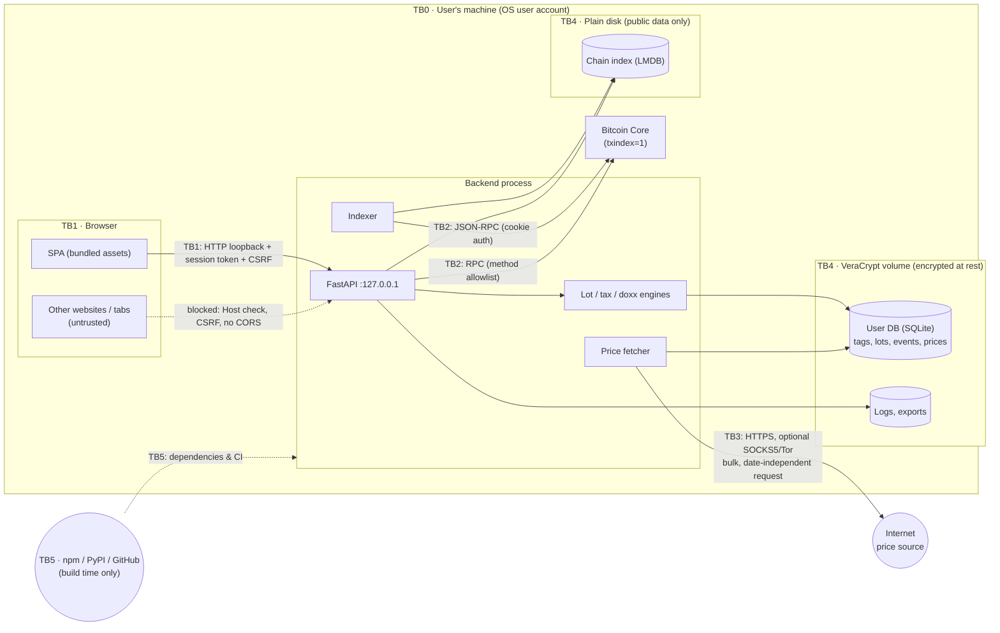

# Threat Model — Coin Accounting

> **Living document.** It describes what is *planned* and, over time, what is *implemented* and *verified*.
> Every change that touches a trust boundary, asset, data store, network flow or dependency must update this file **in the same PR**. Reviewers reject PRs that don't.

| | |
|---|---|
| Version | 0.2 (design stage — no code yet) |
| Last updated | 2026-09-27 |
| Scope | v1: Bitcoin (Bitcoin Core) only — see [`PLAN.md`](../PLAN.md) |
| Method | Data-flow diagram → trust boundaries → STRIDE per boundary, plus privacy (linkability/disclosure) and integrity-of-tax-output threats |

### Status legend
| Status | Meaning |
|---|---|
| **Planned** | Mitigation is designed but not built |
| **Implemented** | Code exists; link to it |
| **Verified** | An automated test proves the mitigation; link to the test |
| **Accepted** | Risk knowingly not mitigated; rationale recorded in §9 |
| **N/A** | No longer applicable (keep the row; say why) |

A threat may only move to **Verified** when a test exists that fails if the mitigation is removed.

---

## 1. System overview

The app is a single-user tool running on the user's own machine. Its parts:
- **Backend:** a FastAPI process bound to loopback.
- **UI:** a React + Cytoscape.js single-page app served by the backend and opened in the user's browser.
- **Chain data:** comes only from the user's Bitcoin Core node over authenticated JSON-RPC (the REST interface is not used), plus a local full-chain index built by the app.
- **Sensitive user data:** stored in a SQLite database kept on a VeraCrypt volume.
- **Outbound internet:** the only allowed flow is a bulk download of historical fiat prices, optionally via Tor/SOCKS5.

### 1.1 Data-flow diagram and trust boundaries

| ID | Boundary | Crosses between |
|---|---|---|
| TB0 | OS account | The user's session ↔ other OS users / remote attackers |
| TB1 | Browser ↔ backend | Our SPA, and any other web origin the browser loads, ↔ the loopback API |
| TB2 | Backend ↔ Bitcoin Core | Our process ↔ node JSON-RPC |
| TB3 | Backend ↔ Internet | Price fetcher ↔ external price/FX source (the **only** outbound flow) |
| TB4 | Process ↔ disk | Encrypted volume (sensitive) vs plain disk (public chain data only) |
| TB5 | Build/supply chain | Third-party packages, build tools, CI, AI coding agents ↔ our code |
| TB6 | User-supplied files | Imported CSV/address lists ↔ parser |

---

## 2. Assets

| ID | Asset | Sensitivity | Where it lives |
|---|---|---|---|
| A1 | **Ownership map**: owned addresses, address↔wallet-client mapping, entity tags (self, exchanges, employer, …) | **Critical** (full deanonymization of the user's holdings and counterparties) | User DB (TB4V) |
| A2 | **Doxx map**: which coins are linked to which exchange/KYC identity | Critical | User DB |
| A3 | **Tax records**: lots, basis, disposals, sell prices, exchange accounts | Critical (financial + identity) | User DB, exports |
| A4 | **Derived tx/UTXO cache** for the user's coins | Critical (equivalent to A1) | User DB |
| A5 | **Report exports** (8949 CSV, summaries, audit trail) | Critical | Export dir (should be TB4V) |
| A6 | **Logs** | High if they contain A1–A4 values | TB4V |
| A7 | **Node RPC credentials** (cookie / rpcauth) | High (node control; wallet RPCs on the node) | Node datadir; app memory only |
| A8 | **Chain index** | Public data. Sensitive **only** if it reveals which scripts the user queried | Plain disk (TB4P) |
| A9 | **Price history cache** | Public data | User DB |
| A10 | **Correctness of tax output** | High: wrong figures mean legal/financial harm | Engines + tests |
| A11 | **Fact of usage**: that this IP / person runs a BTC accounting tool | Medium | Network metadata |
| A12 | **Source code & build integrity** | High (a compromised build exfiltrates A1–A5) | Repo, CI, dependency tree |

## 3. Security & privacy objectives

1. **O1 — No data egress.** A1–A6 never leave the machine through the app. The only outbound connection carries no user-derived data.
2. **O2 — Local-only chain data.** All chain data comes from the user's own node. No block explorers, Electrum servers or third-party APIs.
3. **O3 — Encrypted at rest.** All sensitive data (A1–A6) lives only on the VeraCrypt volume. Nothing sensitive spills to plain disk.
4. **O4 — Loopback isolation.** Only the user, through our UI, can reach the API. Other web origins and other OS users cannot.
5. **O5 — Integrity of records and tax output.** Figures are deterministic, reproducible, auditable, and traceable to their inputs.
6. **O6 — Honest privacy signal.** The doxx view must never overstate how private coins are.
7. **O7 — Trustworthy build.** Dependencies and tooling cannot silently add network access or exfiltration.

## 4. Adversaries

| ID | Adversary | Capabilities | In scope? |
|---|---|---|---|
| AD1 | **Malicious website** visited in the same browser | JS in another origin; DNS rebinding; CSRF; timing | Yes |
| AD2 | **Other local OS user** / other process under another UID | Can connect to loopback ports; read world-readable files | Yes |
| AD3 | **Device thief / cold-disk attacker** (laptop stolen, disk imaged while the volume is dismounted) | Offline access to plain disk, swap, browser profile | Yes |
| AD4 | **Network observer** (ISP, Wi-Fi, state, price-source operator) | Sees outbound connections, DNS, TLS metadata, request timing | Yes |
| AD5 | **Compromised/malicious price source** or MITM | Serves wrong prices | Yes |
| AD6 | **Supply-chain attacker** (typosquat, hijacked maintainer, malicious GitHub Action, tampered release) | Code execution at install/build/runtime | Yes |
| AD7 | **Adversarial on-chain data** (crafted tx/script/OP_RETURN content by any payer) | Controls bytes that our parser and UI render | Yes |
| AD8 | **Chain-analysis firm / exchange** correlating the user's coins | Public blockchain + KYC data | Yes (as a *privacy* adversary the doxx model informs against) |
| AD9 | **The user themself** (mistakes, mis-tagging, wrong paths, accidental export) | Legitimate access | Yes (safety rails) |
| AD10 | **Malware running as the same OS user**, root/kernel compromise, hardware implants | Full access while the volume is mounted | **No** (see §8) |
| AD11 | **Physical coercion** | — | No |

---

## 5. Threat register

Columns: **ID** · **STRIDE/P** (S spoofing, T tampering, R repudiation, I info disclosure, D denial of service, E elevation, P privacy/linkability) · **Threat** · **Mitigation (planned)** · **Status** · **Evidence** (code / test link, filled when implemented).

### 5.1 TB1 — Browser ↔ backend

| ID | STRIDE/P | Threat | Mitigation | Status | Evidence |
|---|---|---|---|---|---|
| T-101 | I, T | **DNS rebinding**: an AD1 page rebinds its hostname to 127.0.0.1 and reads or modifies the API as a same-origin request | Strict `Host` header allowlist (`127.0.0.1:<port>`, `localhost:<port>`); reject every other Host with 421/403 before routing | Planned | |
| T-102 | T | **CSRF**: an AD1 page sends state-changing requests to the API | Per-launch random session token passed via the launch URL and exchanged for an `HttpOnly; SameSite=Strict` cookie; every non-GET request needs a matching `X-CSRF-Token` header; only JSON bodies accepted; **no CORS headers ever** | Planned | |
| T-103 | I, S | **Other local users (AD2)** connect to the loopback port | Bind `127.0.0.1` only (never `0.0.0.0`); every request needs the session token; random port by default | Planned | |
| T-104 | T, E | **XSS via attacker-controlled chain data (AD7)**, e.g. OP_RETURN text or crafted labels rendered in the graph or tables | React escaping only (lint bans `dangerouslySetInnerHTML`); Cytoscape labels as text; strict CSP: `default-src 'self'; script-src 'self'; connect-src 'self'; object-src 'none'; frame-ancestors 'none'; base-uri 'none'` | Planned | |
| T-105 | I | **Browser leaks sensitive data to plain disk (AD3)**: history/URLs containing addresses or txids, HTTP cache, autofill, session restore | No sensitive values in URLs (opaque IDs; queries in POST bodies); `Cache-Control: no-store` on all API responses; autocomplete off on sensitive fields; docs recommend a dedicated browser profile stored **on the VeraCrypt volume** | Planned | |
| T-106 | I, P | **UI pulls third-party resources** (fonts, CDN, analytics), leaking usage (A11) or data | All assets bundled at build time; CSP `connect-src 'self'` blocks external fetches; a CI test fails if the built bundle references external URLs | Planned | |
| T-107 | T | **Clickjacking**: an AD1 page frames the UI | `frame-ancestors 'none'` + `X-Frame-Options: DENY` | Planned | |
| T-108 | I | **Browser downloads of exports go to `~/Downloads`** (plain disk) | Exports are written server-side to an export directory on the volume by default; downloading through the browser needs an explicit confirmation that warns about the destination | Planned | |

### 5.2 TB2 — Backend ↔ Bitcoin Core

| ID | STRIDE/P | Threat | Mitigation | Status | Evidence |
|---|---|---|---|---|---|
| T-201 | I | **RPC credential leakage** (A7) through logs, the DB, error pages or exports | Read the cookie file at startup and keep it in memory only; never persist, log or echo it; the redaction filter covers auth headers | Planned | |
| T-202 | I, P | **Queries sent to a non-local node**: misconfiguration points RPC at a remote host and leaks every lookup (A1) | Default `127.0.0.1`; a non-loopback RPC host is refused unless `--allow-remote-node` is set, and the UI shows a persistent warning | Planned | |
| T-203 | E, T | **App misuses the node**: calls wallet or broadcast RPCs that change node state or leak data (e.g. `sendrawtransaction`, `importdescriptors` storing the user's addresses in a node wallet **outside** the volume) | RPC **method allowlist** (read-only chain methods: `getblockchaininfo`, `getindexinfo`, `getblockhash`, `getblockheader`, `getblock`, `getrawtransaction`, `getbestblockhash`); the node wallet is never used; a unit test asserts the allowlist. The app never uses or requires the unauthenticated REST interface (`rest=1`), and the docs recommend leaving it off | Planned | |
| T-204 | P | **Node logs reveal which txs the user looked up** (e.g. with `debug=rpc`) | Docs: don't run with `debug=rpc`/`debug=http` while using the app. Core does not log RPC parameters by default | Planned | |
| T-205 | D, T | **Malformed or adversarial block/tx data (AD7)** crashes the parser, exhausts memory, or corrupts the index | Bounds-checked parser with size/count limits; varint overflow checks; fuzz tests (Hypothesis/Atheris) on the tx/block parser; the indexer fails closed (no partial writes) | Planned | |
| T-206 | T | **Wrong network**: a testnet/signet/regtest node is used against a mainnet DB, or the reverse | Store `chain` in the user DB and index metadata; refuse to start on mismatch | Planned | |
| T-207 | T | **Reorg leaves the index stale or wrong** | Tip-hash check each sync; undo log for the last N blocks; rollback on mismatch; tax events only become final after a configurable number of confirmations (default 6) | Planned | |
| T-208 | T | **Index prefix collisions** (8-byte keys) give wrong address history or spender | Every candidate is verified against the full tx from `getrawtransaction` before use; test with forced collisions | Planned | |
| T-209 | I, P | **Chain index reveals the user's interests (A8)**: e.g. if it were built only for the user's scripts, or kept a read cache or access log | The index is built **uniformly** for the whole chain with no user-specific keys; nothing about queries is written to TB4P. Any per-user cache lives in the user DB. A test checks that queries never write to the index env | Planned | |

### 5.3 TB3 — Backend ↔ Internet (price data)

| ID | STRIDE/P | Threat | Mitigation | Status | Evidence |
|---|---|---|---|---|---|
| T-301 | P | **Request content reveals acquisition/sale dates** (A1/A3 by inference) | Only bulk, **date-independent** requests (full history, same request for every user); requests are never built from user data. A test asserts the price-fetch request set does not depend on DB contents | Planned | |
| T-302 | P | **Network observer (AD4) learns that this IP runs a BTC accounting tool** (A11) | Optional SOCKS5 proxy (Tor) with remote DNS (`socks5h`); a generic User-Agent; fetches only on manual trigger (no background polling); the first run prompts the user to choose proxy or direct | Planned | |
| T-303 | T | **Tampered or incorrect prices (AD5)**: MITM or compromised source → wrong basis/proceeds (A10) | TLS with certificate verification (no opt-out flag); sanity checks (gaps, non-positive values, day-over-day outlier threshold, cross-check against a second source where available); store source, method and content hash per import; every price can be overridden by the user, and overrides are flagged in reports | Planned | |
| T-304 | D | **Price source disappears or changes format** | The local cache is authoritative once fetched; a CSV import fallback; parser errors fail loudly without partial overwrite | Planned | |
| T-305 | I | **Any other unexpected outbound connection** (a dependency phoning home, telemetry, update checks) | Outbound allowlist enforced in code: only `prices/` may open sockets, and only to configured hosts. Test suite: a socket guard fails any test that opens a non-allowlisted connection. E2E: an egress check during the full flow (see §7) | Planned | |

### 5.4 TB4 — Data at rest

| ID | STRIDE/P | Threat | Mitigation | Status | Evidence |
|---|---|---|---|---|---|
| T-401 | I | **User DB created on plain disk by mistake (AD9 → AD3)** | At startup, check that the DB path lies on a VeraCrypt-mapped filesystem (Linux: `/proc/self/mountinfo` → `/dev/mapper/veracrypt*`; equivalent checks for macOS/Windows later). Otherwise refuse to start unless `--allow-unencrypted-storage` is set, with a persistent UI warning | Planned | |
| T-402 | I | **SQLite side files and temp data spill** (WAL, journal, temp B-trees, sort files) | Side files live next to the DB on the volume; `PRAGMA temp_store=MEMORY`; `SQLITE_TMPDIR`/`TMPDIR` for the process set to a directory on the volume | Planned | |
| T-403 | I | **Logs contain addresses/txids/amounts** (A6) | Logs are written only to the volume; a redaction filter masks addresses, txids, outpoints, amounts and fiat values by default; a debug mode that disables redaction is explicit and writes only to the volume; tests assert that redaction works | Planned | |
| T-404 | I | **Swap, hibernation or core dumps** write memory with A1–A4 to plain disk | Disable core dumps for the process (`RLIMIT_CORE=0`); docs require encrypted swap and hibernation, or none | Planned | |
| T-405 | I | **Data remains accessible after the volume is dismounted**: the process keeps running with the DB and caches in memory | The watchdog detects that the volume or DB path has disappeared and makes the backend exit immediately; the UI shows that it is disconnected | Planned | |
| T-406 | I | **User data accidentally committed to git or synced**, e.g. a data dir inside the repo checkout, or a volume container placed in cloud sync | The default data dir is outside the repo; `.gitignore` covers `*.sqlite*`, `data/`, `exports/`; docs cover backups and cloud sync of the container | Planned | |
| T-407 | I | **Plaintext exports on plain disk** (see T-108) | The export dir defaults to the volume; the warning covers every alternative path | Planned | |
| T-408 | T, R | **Silent tampering or accidental edits of records** | Append-only change log for events, tags and overrides (what, when, old → new); `PRAGMA integrity_check` on startup; a documented backup procedure (copy while the volume is mounted) | Planned | |

### 5.5 Integrity of accounting & privacy signal (A10, O5, O6)

| ID | STRIDE/P | Threat | Mitigation | Status | Evidence |
|---|---|---|---|---|---|
| T-501 | T | **Wrong tax figures from bugs** in lot flow, fees, holding period, or Specific-ID allocation | Pure, deterministic engine recomputed from events; hand-worked expected values in tests; mutation testing on `tax/`; coverage floor ≥95% on `tax/` | Planned | |
| T-502 | T | **Numeric errors** (float rounding, overflow) | Integer satoshis; `Decimal` for fiat with explicit rounding rules; a lint rule bans `float` in `tax/` | Planned | |
| T-503 | R | **Reports can't be reproduced or audited later** | Each report embeds app version, rule settings, and a hash of the input events and price rows; the audit trail export links every figure to its events and txids | Planned | |
| T-504 | T | **Heuristic misattribution**: common-input clustering links wrong addresses (CoinJoin, PayJoin, batched exchange withdrawals) and produces wrong income or entity tags | Heuristics only *suggest*, never auto-apply; detect CoinJoin-like txs (many equal-value outputs) and suppress co-spend clustering for them; every tag records its provenance (manual / suggestion accepted) | Planned | |
| T-505 | P | **False sense of privacy**: the doxx view shows coins as "clean" although chain-analysis firms (AD8) link them through heuristics the app doesn't model (amount/timing correlation, change detection, address reuse, peel chains, dust) | UI wording is "known links", never "private" or "clean"; the docs list the modeled vs unmodeled heuristics; a persistent disclaimer appears in the sell-planner view | Planned | |
| T-506 | T | **Unconfirmed or reorged txs** flow into tax records | Confirmation threshold (T-207); reorg-driven changes invalidate derived events and surface them for review | Planned | |
| T-507 | I | **Not legal/tax advice**: the user relies on the tool's classification (e.g. fee treatment, 8949 box) without review | Report disclaimers; settings that affect tax treatment are shown on every report | Planned | |

### 5.6 TB5 — Supply chain & development process

| ID | STRIDE/P | Threat | Mitigation | Status | Evidence |
|---|---|---|---|---|---|
| T-601 | E, I | **Malicious or compromised package** (npm/PyPI typosquat, hijacked maintainer, freshly published malicious version) | 7-day minimum release age (pnpm `minimumReleaseAge`, uv `exclude-newer`); Socket.dev scan **before** install/execution; lockfiles with integrity hashes; frozen installs in CI; minimal dependency policy with a justification in `docs/DEPENDENCIES.md` (details in `docs/ENGINEERING.md`) | Planned | |
| T-602 | E | **Install-time code execution** (postinstall / build scripts) | pnpm lifecycle scripts disabled (empty `onlyBuiltDependencies`); Python wheels preferred, sdists reviewed by hand | Planned | |
| T-603 | E, T | **Compromised CI / GitHub Actions** | Actions pinned by full commit SHA; `permissions: read-all` by default; no secrets required for build/test; branch protection on `main` | Planned | |
| T-604 | I | **Runtime dependency adds network access** (telemetry, update checks) | Socket guard in tests + E2E egress check (T-305); dependency review checks for network capability | Planned | |
| T-605 | T | **AI coding agent introduces insecure code, weak tests, or unvetted dependencies** | `AGENTS.md` binds agents to this document and `ENGINEERING.md`; human review of every PR; test-slop audits; an agent may not add a dependency without the vetting steps | Planned | |
| T-606 | T | **Tampered release/source** as distributed to the user | Signed commits/tags (later: reproducible build + checksums for releases) | Planned | |

### 5.7 TB6 — User-supplied files

| ID | STRIDE/P | Threat | Mitigation | Status | Evidence |
|---|---|---|---|---|---|
| T-701 | D, T | **Malformed or huge import files** (address lists, future exchange CSVs) | Size/row limits; strict address validation (checksum, network); reject rather than guess; the import preview must be confirmed | Planned | |
| T-702 | T | **CSV/formula injection in exports**: a label or chain-derived text starting with `= + - @` executes when the file is opened in a spreadsheet | Escape leading formula characters in every exported cell; unit test | Planned | |

---

## 6. Allowed network flows (exhaustive)

| Flow | From | To | Content | Notes |
|---|---|---|---|---|
| F1 | Browser | Backend `127.0.0.1:<port>` | UI/API | Session token + CSRF |
| F2 | Backend | Bitcoin Core JSON-RPC (loopback by default) | Read-only chain queries | Method allowlist (T-203) |
| F3 | Backend (`prices/` only) | Configured price/FX hosts, optionally via SOCKS5 | Bulk historical price/FX download | Manual trigger, date-independent (T-301) |

**Any other flow is a bug.** New flows need an ADR and an update to this table.

## 7. Verification plan (how threats become *Verified*)

- **Egress test (T-106, T-305, T-604):** the E2E run performs the whole flow against regtest, from import through the 8949 export. It asserts that the process opened no connections other than F1–F3, e.g. by running in a network namespace with only loopback plus a recorded proxy, and by checking the socket-guard log.
- **HTTP hardening tests (T-101–T-107):** integration tests send a forged Host, a missing or wrong CSRF token, and a cross-origin request, and check the CSP/cache headers.
- **Storage tests (T-401–T-403):** the DB is refused on a non-VeraCrypt path; side files and temp files are asserted to live on the configured volume path; the log redaction corpus is checked.
- **Parser fuzzing (T-205):** runs in CI with a time budget, and longer on a schedule.
- **Engine correctness (T-501–T-503):** hand-worked scenario suite, mutation testing, determinism test (same inputs → byte-identical report).
- **Supply chain (T-601–T-603):** CI checks for the lockfile, cooldown config, disabled scripts, SHA-pinned actions, and the Socket report.

## 8. Assumptions & out of scope

- **In scope for protection, but not app-enforced:** VeraCrypt is correctly configured by the user (strong passphrase, volume dismounted when not in use).
- **Trusted:**
  - the user's Bitcoin Core node, for consensus-valid chain data
  - the OS, kernel, browser engine and hardware (AD10)
- **Out of scope:**
  - malware running as the same OS user, or root, while the volume is mounted (it can read everything the app can)
  - physical coercion (AD11)
  - privacy of the Bitcoin Core node's own P2P behaviour; the app never broadcasts
  - tax-law interpretation; the app implements configurable rules and doesn't give advice

## 9. Accepted risks

| ID | Risk | Rationale |
|---|---|---|
| R-1 | While the volume is mounted, a same-user process can read all data | Mitigating it needs OS-level sandboxing beyond v1 scope; documented |
| R-2 | The price source operator sees one bulk download per refresh from the user's IP (if Tor is not used) | Content reveals nothing user-specific; Tor is offered |
| R-3 | The doxx model is a lower bound on what adversaries know (T-505) | No local tool can model proprietary chain analysis; mitigated by honest UI wording |

## 10. Open questions

1. Non-Linux VeraCrypt detection (macOS/Windows) for T-401: do we support these platforms in v1?
2. Should the app offer an in-app "lock" (drop DB handle, clear UI) short of dismounting the volume?
3. Is a second price source for cross-checking (T-303) worth the extra outbound flow, or is the user-override path enough?

## 11. Changelog

| Date | Version | Change |
|---|---|---|
| 2026-09-26 | 0.1 | Initial design-stage threat model (all mitigations *Planned*) |
| 2026-09-27 | 0.2 | Node access is JSON-RPC only; REST (`rest=1`) is no longer used (T-203, F2, DFD) |
