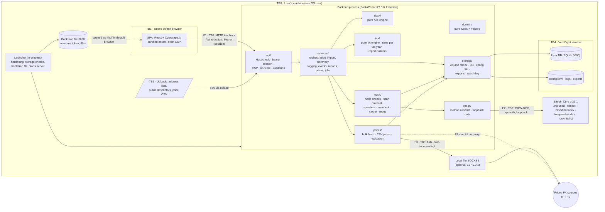
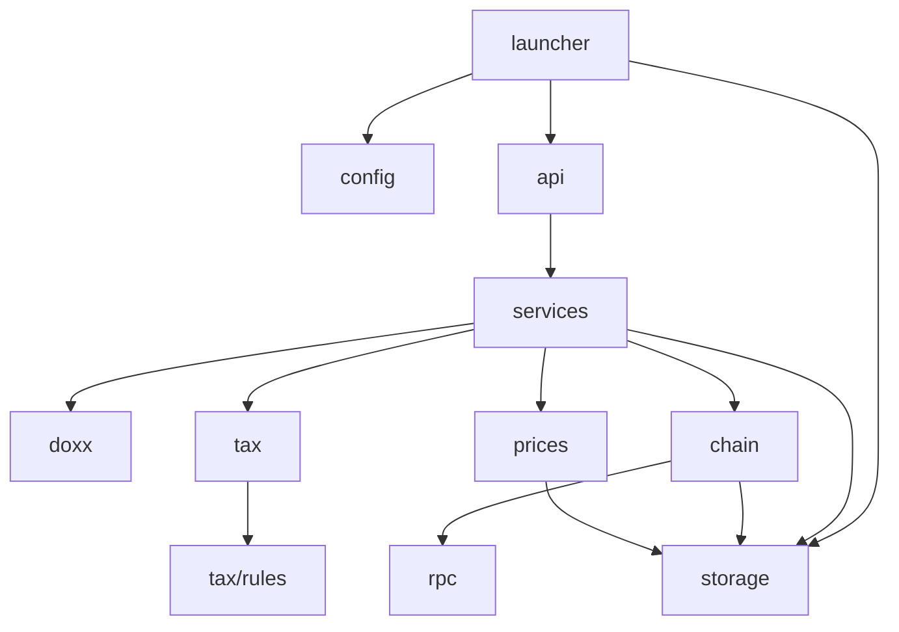
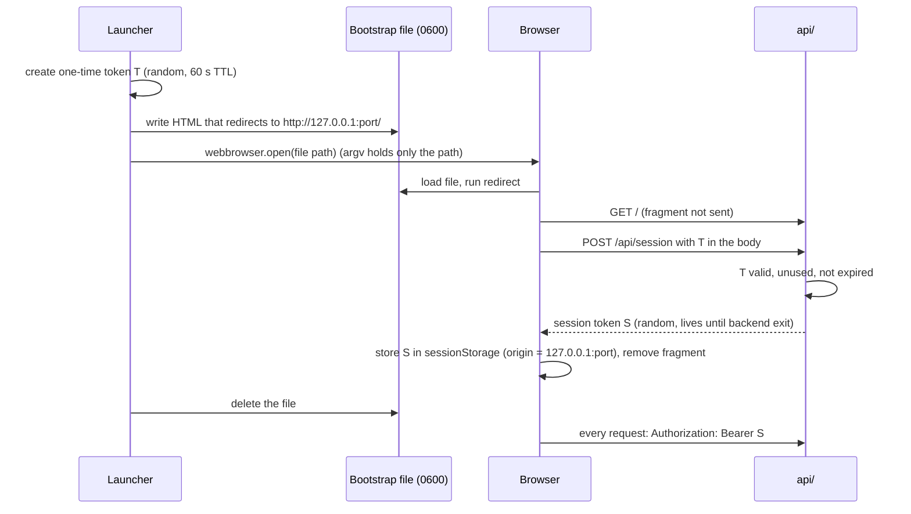
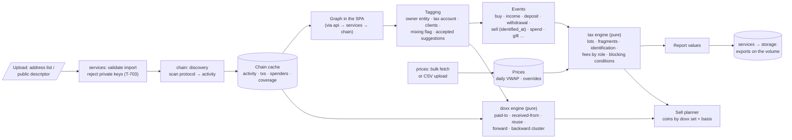
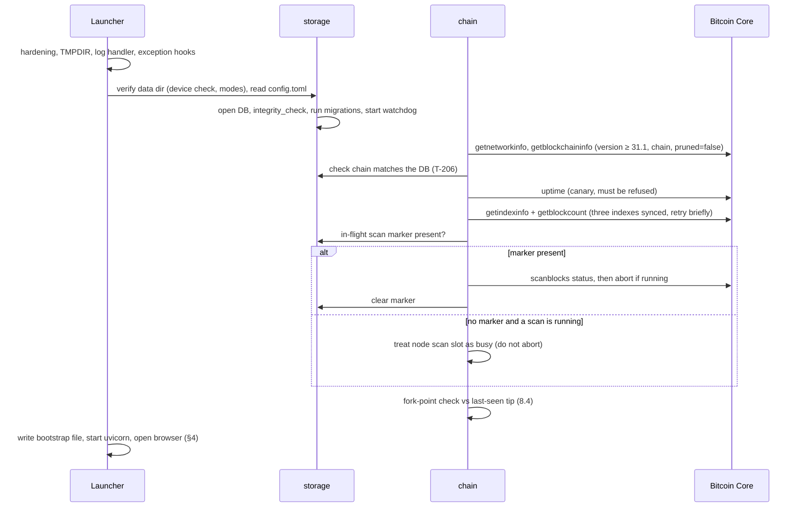
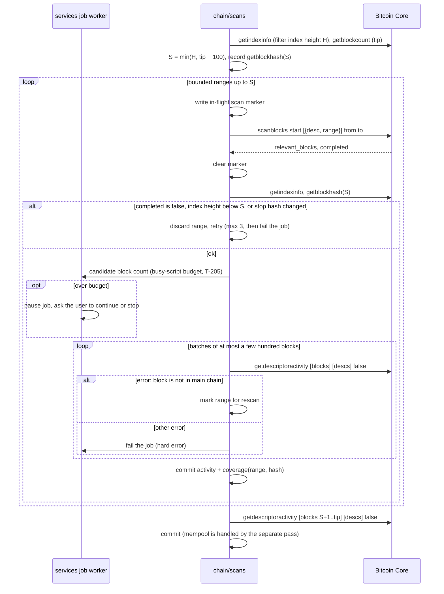
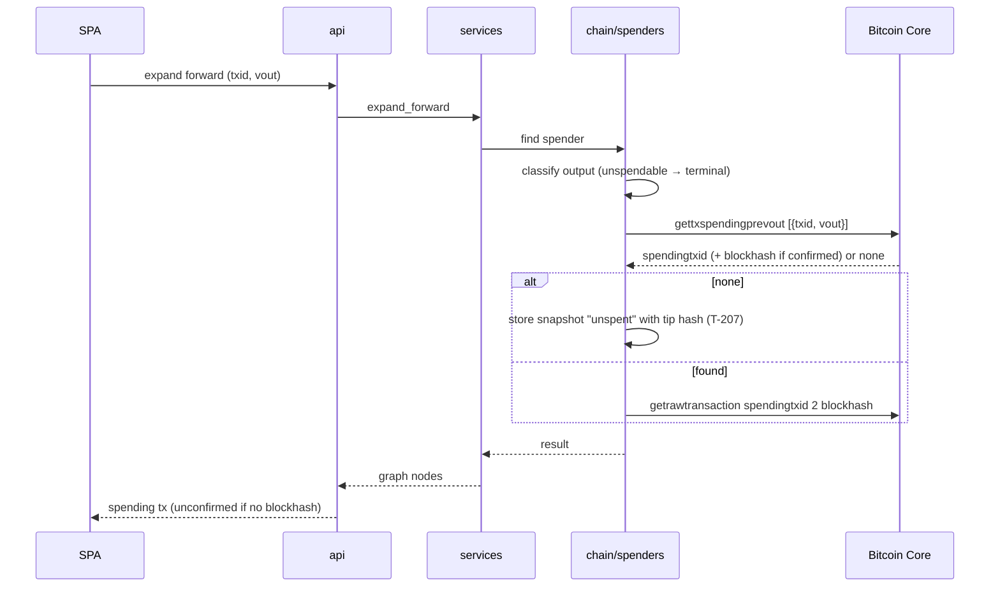
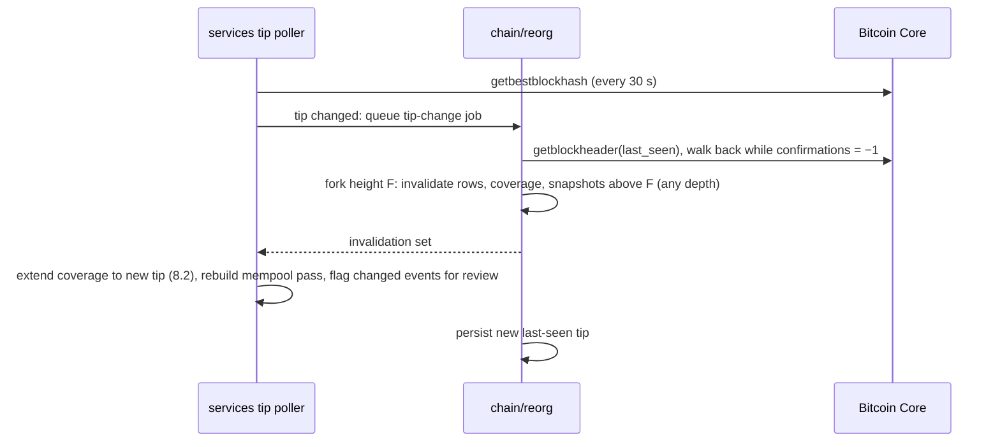
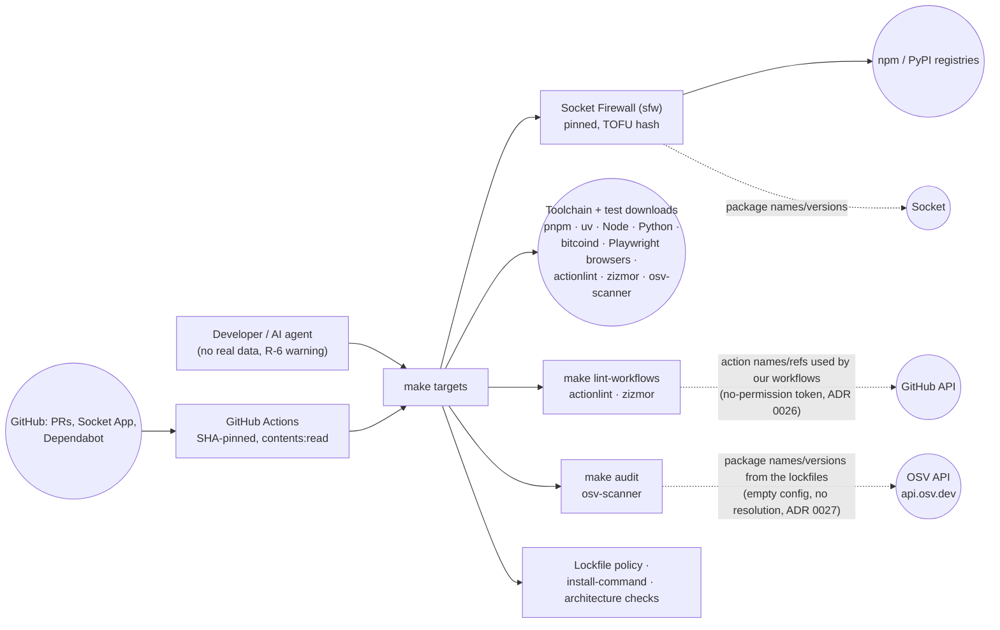

# Architecture — Coin Accounting v1

> **Binding once approved.** Code that contradicts this document is a bug: fix the code, or change this document through an ADR (ENGINEERING §4.2). After approval, the SHA-256 of this file is recorded in the front matter of the accepted ADR that adopts it, and a CI check fails if the two differ.

| | |
|---|---|
| Version | 0.2.5 (status: see ADR 0014, ADR 0029, ADR 0034) |
| Last updated | 2026-10-06 |
| Scope | v1: Bitcoin (Bitcoin Core), single user, Linux + macOS |
| Related | [`PLAN.md`](../PLAN.md) · [`THREAT_MODEL.md`](THREAT_MODEL.md) (IDs such as TB1, T-203, F2 refer to it) · [`ENGINEERING.md`](ENGINEERING.md) |

The document has nine sections:
1. Components and trust boundaries
2. Module structure, dependency rules and capability rules
3. Runtime model: process, threads, shutdown
4. Local authentication: launch and session
5. Runtime network flows
6. Data at rest and file locations
7. Main data flow
8. Chain-access sequences
9. Build and development flows

---

## 1. Components and trust boundaries



`domain/` is imported by every backend module, so its edges are not drawn.

| Component | Responsibility | Must not |
|---|---|---|
| **Launcher** (`launcher.py`) | Runs **in the same process** as the server (§3). First, before any other import: sets `RLIMIT_CORE=0`, `PR_SET_DUMPABLE=0` (Linux), `TMPDIR`, `SQLITE_TMPDIR` and `tempfile.tempdir` to the volume. Then it installs the redacting log handler and exception hooks, runs the storage checks (T-401), reads the config through `storage/`, reads the built frontend (`frontend/dist`) into memory once, read-only (ADR 0034), writes the bootstrap file (§4), starts uvicorn, and opens the bootstrap file in the default browser (`webbrowser`) | Start a child process; pass any secret in argv or the environment of another process; start if the storage checks fail on mainnet (T-401) |
| **SPA** | UI: graph, tagging, events, sells, reports. Talks only to the API, with a bearer session token held in `sessionStorage` | Contact any other origin; embed remote assets; put sensitive values in URLs; use cookies |
| **`api/`** | HTTP boundary: Host allowlist, bearer session check, security headers (CSP, `no-store`, `Referrer-Policy`, frame denial), request and upload validation (size limits). Calls `services/` only | Contain business logic, or import anything except `services/` and `domain/` |
| **`services/`** | Orchestration: import and discovery, tagging and suggestions, events, report generation and export, price refresh and CSV import, settings, the background job worker and the tip poller (§3) | Talk to the node except through `chain/`, or to the internet except through `prices/` |
| **`doxx/`** | Pure doxx rule engine: graph and tag values in, doxx tags out | Do I/O; read the clock |
| **`tax/`** | Pure, deterministic lot engine; rule sets per tax year; report builders that return report **values** (rows) | Do I/O; use floats; read the clock (dates are inputs) |
| **`domain/`** | Pure shared types (Sats, Outpoint, ScriptHash, Descriptor, Event, Lot, errors) and helpers (address and script parsing, private-key detection for T-703) | Do I/O; import any other project module |
| **`chain/`** | Node requirement checks, including the canary (through `rpc.py`); the scan protocol; spender lookups; the mempool pass; the chain cache; coverage and snapshots; fork-point reorg handling (PLAN §1). Returns invalidation sets to `services/` | Call RPC methods outside the allowlist; import `services/` |
| **`rpc.py`** | The only JSON-RPC client: loopback-only endpoint check, client-side method allowlist, counter request ids, concurrency cap | Accept a non-loopback endpoint; retry non-idempotent calls blindly |
| **`prices/`** | The only internet-facing code. Fetches full price/FX histories on a manual trigger, optionally via a local SOCKS5 proxy; parses and validates downloaded files and uploaded CSVs | Build requests from user records (T-301) |
| **`storage/`** | All user-data filesystem access: DB and migrations, `config.toml` reading, export writing (type-aware CSV), log file handler, dismount watchdog. Every path must resolve under the verified data directory | Write outside the data directory (§6) |
| **Bitcoin Core** | The user's own node; trusted for chain data and its indexes (THREAT_MODEL §8) | — |

## 2. Module structure, dependency rules and capability rules

```
backend/coinacct/
  launcher.py      # entry point; hardening, bootstrap, in-process uvicorn
  config.py        # pure: parses config text into values (no file access)
  domain/          # pure types and helpers
  api/             # FastAPI routers + security middleware
  services/        # orchestration, job worker, tip poller
  doxx/            # pure doxx rules
  tax/             # engine.py, rules/<year>.py, reports.py (pure)
  chain/           # node_checks.py, scans.py, spenders.py, mempool.py, cache.py, reorg.py
  rpc.py
  prices/          # fetch.py, bitstamp.py, fx.py, csv_import.py
  storage/         # volume.py (VeraCrypt detection; macOS via diskutil), db.py, models.py,
                   # migrations/, config_file.py, exports.py, logfile.py, watchdog.py
backend/tests/
  unit/<module>/   # e.g. unit/tax/, unit/doxx/, unit/chain/
  integration/<module>/
e2e/               # @playwright/test specs (TypeScript)
e2e/harness/       # Python: starts regtest bitcoind + backend, reads the bootstrap file
frontend/src/{views/, graph/, api/client.ts}
```

**Allowed imports.** An arrow means "may import". **Every edge not shown is forbidden.** Every module may also import `domain/`, which imports no other project module.



- **Configuration is passed as values.** The launcher reads the config through `storage/`, parses it with `config.py`, and passes the resulting values to the modules that need them. No module reads configuration by itself.
- **Logging:** modules use the standard `logging.getLogger(__name__)`. The launcher installs the redacting handler once; no module imports the log handler.

**Capability rules** (enforced per path with ruff `banned-api` and a custom AST check; see ENGINEERING §5.2):

| Capability | Allowed only in |
|---|---|
| Network (`socket`, `ssl`, `http.client`, `urllib.request`, `httpx`, `asyncio` streams) | `rpc.py`, `prices/`, `launcher.py` (server bind), `tests/`, `e2e/harness/` |
| `webbrowser` | `launcher.py` |
| `subprocess` | `storage/volume.py` (macOS `diskutil`), `tests/`, `e2e/harness/` |
| Filesystem (`open`, `pathlib` writes, `os` file functions, `tempfile`, `shutil`, `sqlite3`) | `storage/`, `launcher.py` (bootstrap file, hardening, reading the built frontend once at start-up: ADR 0034), `tests/`, `e2e/harness/` |
| Clock (`time.time`, `datetime.now`, `date.today`) | Everywhere **except** `tax/`, `doxx/`, `domain/` |
| Floats | Nowhere in `tax/` (ENGINEERING §5.2) |

**Enforcement:** a small custom AST script (`scripts/check-architecture`) checks both the import edges and the capability rules. It needs no new dependency. Static checks don't see `importlib`/`__import__`, so these are also banned. The check is **hygiene**, not a security boundary.

## 3. Runtime model: process, threads, shutdown

- **One process.** The launcher runs uvicorn in-process. There are no child processes, so the hardening from §1 applies to everything.
- **Threads:**

  | Thread | Job |
  |---|---|
  | Event loop (uvicorn) | Serves the API. Long work is handed to the job worker, never run in a request |
  | **Job worker** (1 thread) | Runs queued jobs one at a time: scan ranges, activity batches, price refreshes, report generation. Sequential, because Core allows one `scanblocks` at a time. Jobs have ids, progress and cancel |
  | **Tip poller** | Calls `getbestblockhash` every 30 s. A change queues a tip-change job (§8.4). No ZMQ, because that would be a new flow |
  | **Watchdog** | Checks every 2 s that the data directory still exists on the verified device. If not, it starts shutdown |

- **Database:** SQLite in WAL mode. **One writer connection**, used only by the job worker and by short API writes through a lock. Readers use separate connections.
- **Progress:** the SPA polls `GET /api/jobs/<id>` (authenticated).
- **Offline mode:** if the node is unreachable or fails its checks, the app still starts, read-only for chain data. Tags, events, lots and reports work from the cache, and chain actions are disabled with a clear message.
- **Shutdown** (SIGINT/SIGTERM, watchdog, or quit from the UI):
  1. Stop accepting requests.
  2. Cancel the current job. If an in-flight scan marker exists (§8.2), call `scanblocks abort`.
  3. Finish or roll back the open transaction, checkpoint WAL, close the DB.
  4. Flush and close logs. Exit with code 0. This also lets coverage data be written (ENGINEERING §3.3).

## 4. Local authentication: launch and session

The session credential must not be readable by other local users, by other web apps on `127.0.0.1`, or from browser history.



- **Bootstrap file location:** Linux uses `$XDG_RUNTIME_DIR` (per-user, mode 0700, in RAM). macOS, and Linux without it, use the data directory on the volume. The file is deleted when T is claimed or expires.
- **Why not argv:** on Linux and macOS, other users can read command-line arguments (`/proc/<pid>/cmdline`, `ps`). The argv holds only the file path.
- **Why no cookie:** cookies are scoped to the host, not the port. Every other web app on `127.0.0.1` would receive a cookie. `sessionStorage` is scoped to the full origin, including the port.
- **CSRF:** there is no ambient credential, so a cross-site request carries no session. The bearer header is the protection. The Host allowlist stops DNS rebinding.
- **T already claimed:** the page shows "Session already claimed. Restart the app." A reused T is refused and logged (T-110).
- **E2E:** the harness reads the bootstrap file. There is no production test bypass.

## 5. Runtime network flows

This is the exhaustive list; it mirrors THREAT_MODEL §6. Any other runtime connection is a bug.

| Flow | From → To | Protocol | Content | Controls |
|---|---|---|---|---|
| **F1** | Browser → backend `127.0.0.1:<random port>` | HTTP (loopback) | UI and API | Host allowlist; bearer session from the bootstrap (§4); strict CSP; `no-store` (T-101–T-111) |
| **F2** | `rpc.py` → Bitcoin Core `127.0.0.1:<rpcport>` | JSON-RPC over HTTP (loopback) | Read-only chain queries | Loopback-only (no override); `rpcauth` user; server-side `rpcwhitelist` + canary; client allowlist (T-201–T-203) |
| **F3** | `prices/` → price/FX hosts, optionally via a local Tor SOCKS5 proxy on `127.0.0.1` | HTTPS (via SOCKS5 with remote DNS if configured) | Bulk historical price/FX files | Manual trigger; requests independent of user records; all fiat pairs; TLS verified; common User-Agent (T-301–T-303) |

## 6. Data at rest and file locations

- **The data directory** (`<data>`) is given each time by `--data-dir` or `COINACCT_DATA_DIR`. It is **never saved on plain disk**, because the path would reveal the volume. There is no default path.
- **The app writes only under `<data>`**, plus the short-lived bootstrap file (§4). `storage/` refuses any path that does not resolve under the verified `<data>`.
- **Unencrypted storage** (`--allow-unencrypted-storage`) is accepted **only for regtest, signet and testnet**, for development and CI. On mainnet the app refuses to start unless `<data>` is on an encrypted volume (T-401).
- **Exports** are written only to `<data>/exports/`. A browser download is the only other destination. It needs a confirmation that warns about the destination, and it uses a POST request with the bearer header, returning a blob. The browser, not the app, writes that file (R-5).

| Store | Location | Contents | Notes |
|---|---|---|---|
| User DB | `<data>/db.sqlite` (+ WAL/journal alongside) | Entities, tax accounts, wallet clients, addresses, public descriptors, events, lots, identifications, doxx tags, prices, **settings** (time zone, fee treatment, proxy, thresholds), chain cache (txs, activity, spenders, coverage, snapshots, chain state, in-flight scan marker), change log | Mode 0600; `temp_store=MEMORY`; `TMPDIR` and `SQLITE_TMPDIR` in `<data>/tmp` (T-401, T-402). Tax-affecting settings are part of each report's input hash (T-503) |
| App config | `<data>/config.toml` | **Only** the RPC endpoint and `rpcauth` credentials | Mode 0600; credentials never logged (T-201) |
| Logs | `<data>/logs/` | Redacted operational logs, including uvicorn logs and tracebacks | All loggers and exception hooks go through the redacting handler; access log off (T-403) |
| Exports | `<data>/exports/` | 8949 CSV, income, summaries, audit trail | Type-aware CSV escaping (T-702) |
| Temp | `<data>/tmp/` | Upload spooling, SQLite temp files | Cleared at start and at shutdown |
| Bootstrap | `$XDG_RUNTIME_DIR` or `<data>` | One-time launch token | Deleted after claim or 60 s (§4) |
| **Not ours** | Bitcoin Core datadir | Chain, indexes, `debug.log` | Contains the canary warning line (T-209); managed by the user |
| **Not ours** | The user's browser profile (plain disk) | Whatever the browser keeps despite `no-store` | Accepted risk R-5. Browser extensions can read the app's pages (R-7) |

## 7. Main data flow



- The engines recompute everything from events and cached chain data. Nothing derived is edited by hand. Manual changes are events or overrides, recorded in the change log (T-408).
- Reports are blocked while there is unknown basis or an unconfirmed tx that hasn't been resolved. A late lot identification only produces a warning (PLAN §7).

## 8. Chain-access sequences

### 8.1 Startup



If any node step fails, the app starts in offline mode (§3).

### 8.2 Script/descriptor history: the scan protocol



Progress for the user comes from the job's range counter. `scanblocks status` needs a second connection, and is used only for diagnostics.

### 8.3 Forward expansion (click on an output)



`gettxspendingprevout` waits for `txospenderindex` to catch up with the chain before it answers.

### 8.4 Tip change or reorg



## 9. Build and development flows (never at runtime)



- Dependencies are resolved lockfile-only, vetted, and approved by the human before anything is installed (ENGINEERING §2.4).
- Every non-package download is verified per ENGINEERING §2.3.
- zizmor's online audits (impostor-commit and others) query the GitHub API during `make lint-workflows`, with a dedicated no-permission token and an otherwise empty environment (ADR 0026). This is a development-time flow only.
- `make audit` sends the lockfiles' package names and versions to the OSV API, with an empty config from outside the repository, no transitive resolution and an empty environment (ADR 0027). This is a development-time flow only.

## 10. Changelog

| Date | Version | Change |
|---|---|---|
| 2026-09-27 | 0.1 | Initial architecture (P0.3) |
| 2026-09-27 | 0.1.1 | v1 opens the user's default browser; there is no managed browser profile (user decision, R-5) |
| 2026-09-27 | 0.2 | Opus 5.5 + Codex review fixes: bootstrap-file launch and bearer session without cookies (§4); in-process runtime model with job worker, tip poller, watchdog, offline mode and shutdown (§3); `domain/` and a pure `doxx/`; `api/` → `services/` only; capability rules and a dependency-free architecture check (§2); data directory never saved, unencrypted storage only off mainnet, exports and downloads specified (§6); price CSV upload; scan sequence checks `completed`, retries, budget, errors and the in-flight marker (§8.2); local Tor hop in F3 |
| 2026-09-27 | 0.2.1 | A late lot identification warns and doesn't block reports (user decision) |
| 2026-10-01 | 0.2.2 | §9: the pinned workflow linters, and zizmor's online audits as a development-time flow to the GitHub API (ADR 0026) |
| 2026-10-01 | 0.2.3 | §9: the pinned osv-scanner, and `make audit` as a development-time flow to the OSV API (ADR 0027) |
| 2026-10-02 | 0.2.4 | §1, §8.1: the minimum Bitcoin Core version is 31.1 (ADR 0029) |
| 2026-10-06 | 0.2.5 | §1, §2: the launcher reads the built frontend into memory at start-up; `api/` serves it from memory (ADR 0034) |
