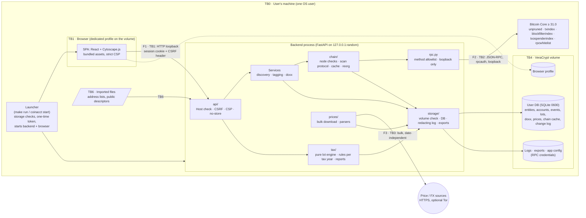
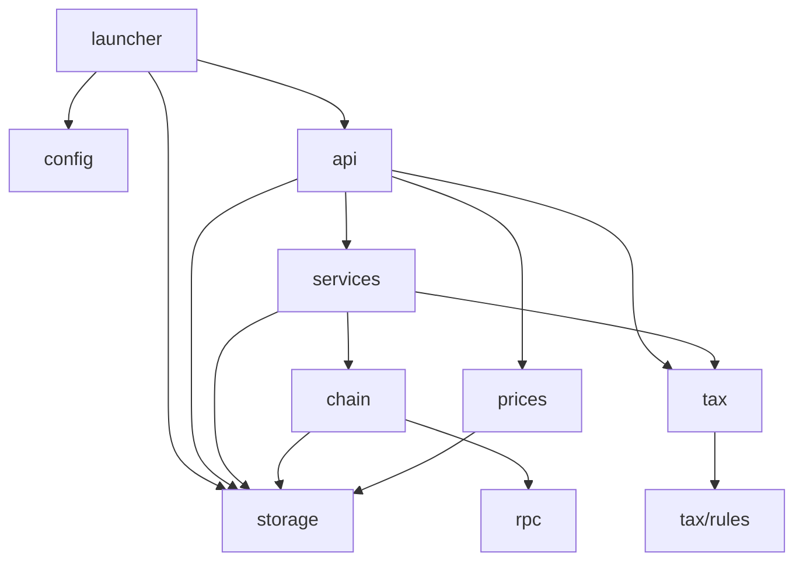
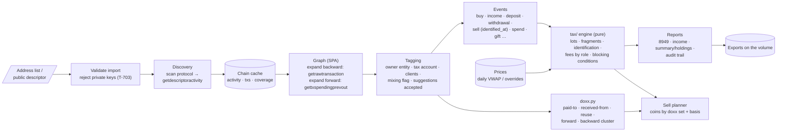
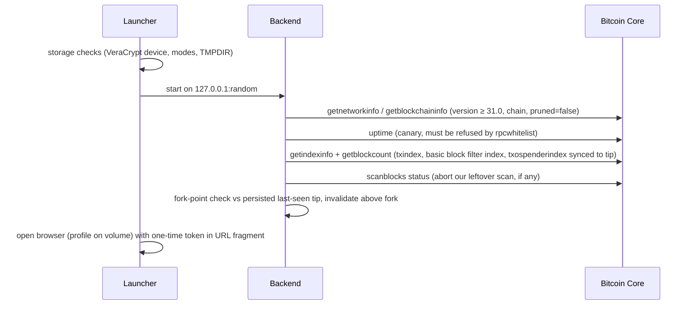
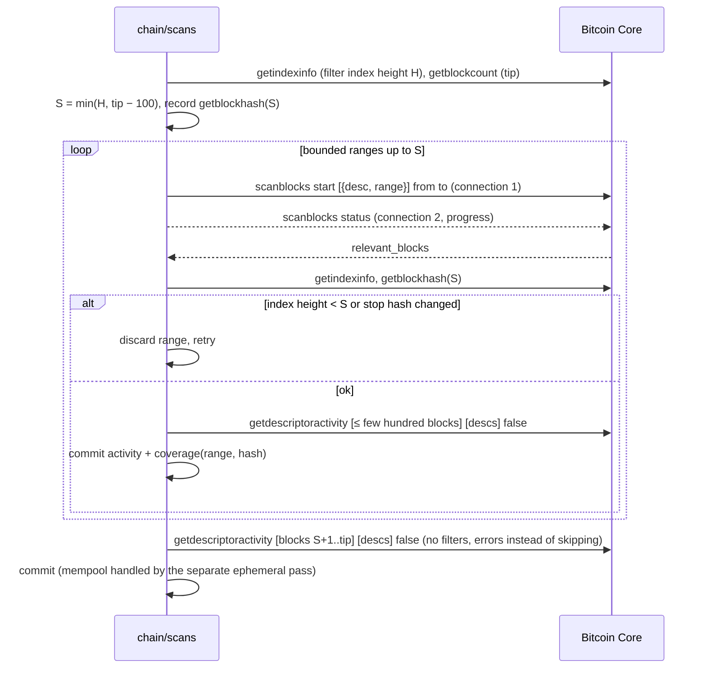
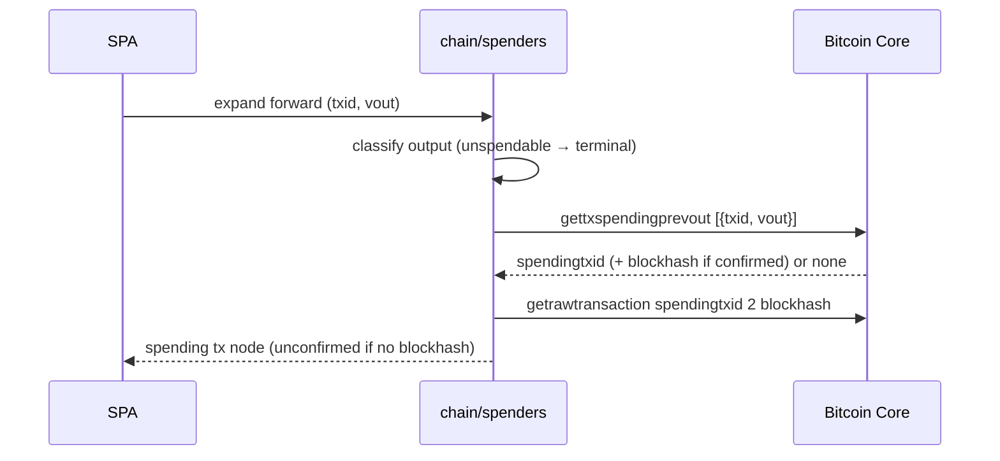
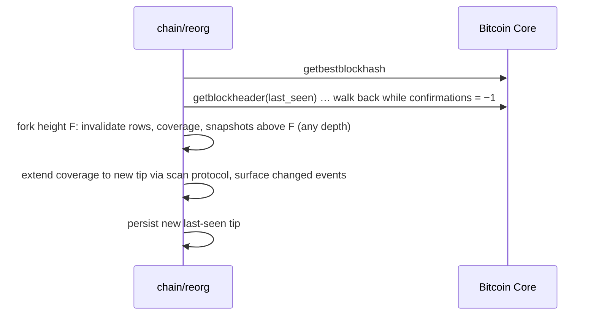
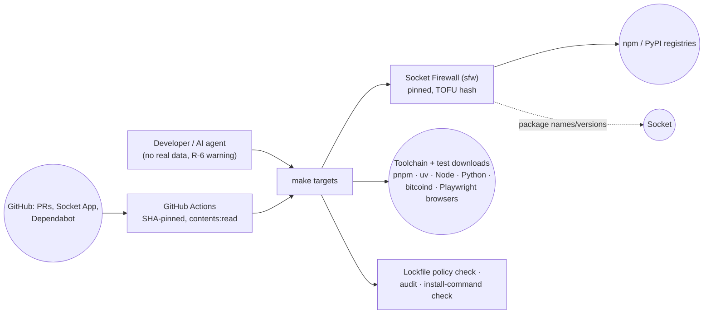

# Architecture — Coin Accounting v1

> **Binding once approved.** Code that contradicts this document is a bug: fix the code, or change this document through an ADR (ENGINEERING §4.2). After approval, the SHA-256 of this file is recorded in the front matter of the accepted ADR that adopts it, and a CI check fails if the two differ.

| | |
|---|---|
| Version | 0.1 (proposed, awaiting approval) |
| Last updated | 2026-09-27 |
| Scope | v1: Bitcoin (Bitcoin Core), single user, Linux + macOS |
| Related | [`PLAN.md`](../PLAN.md) · [`THREAT_MODEL.md`](THREAT_MODEL.md) (IDs such as TB1, T-203, F2 refer to it) · [`ENGINEERING.md`](ENGINEERING.md) |

The document has seven views:
1. Components and trust boundaries
2. Module structure and dependency rules
3. Runtime network flows
4. Data at rest
5. Main data flow: import → discover → tag → lots → reports
6. Chain-access sequences: startup, scan protocol, forward expansion, tip changes
7. Build and development flows

---

## 1. Components and trust boundaries



**Components**

| Component | Responsibility | Must not |
|---|---|---|
| **Launcher** | Resolves the data directory and runs the storage checks (VeraCrypt detection, file modes; T-401). Loads config, starts the backend on a random loopback port, and opens a supported browser with a profile on the volume, passing the one-time token in the URL fragment (T-110). Sets `RLIMIT_CORE=0` / `PR_SET_DUMPABLE` and points `TMPDIR` at the volume | Start if the storage checks fail (unless explicitly overridden, T-401) |
| **SPA** | UI: graph, tagging, events, sells, reports. Talks only to the API | Contact any other origin, embed remote assets, or put sensitive values in URLs |
| **`api/`** | HTTP boundary: Host allowlist, session cookie, CSRF header, CSP and other security headers, request validation, `no-store` | Contain business logic |
| **Services** (`discovery.py`, `tagging.py`, `doxx.py`) | Import and discovery; entity, account and client tagging; clustering suggestions; doxx propagation | Talk to the node except through `chain/` |
| **`tax/`** | Pure, deterministic lot engine, rule sets per tax year, report generation | Do I/O, use floats, or read the clock (dates are inputs) |
| **`chain/`** | Node requirement checks, the scan protocol and job queue, spender lookups, the mempool pass, the chain-data cache, coverage/snapshot bookkeeping, fork-point reorg handling (PLAN §1) | Call RPC methods outside the allowlist, or write anything outside the user DB |
| **`rpc.py`** | Only JSON-RPC client: loopback-only endpoint check, client-side method allowlist, counter request ids, concurrency cap, the startup canary | Accept a non-loopback endpoint; retry non-idempotent calls blindly |
| **`prices/`** | Only internet-facing code: fetches full price/FX histories on a manual trigger, optionally via SOCKS5, validates and stores them | Build requests from user records (T-301) |
| **`storage/`** | DB access and migrations, redacting logger, export writer (type-aware CSV), dismount watchdog | Write outside the volume |
| **Bitcoin Core** | The user's own node; trusted for chain data and its indexes (THREAT_MODEL §8) | — |

## 2. Module structure and dependency rules

```
backend/coinacct/
  launcher.py          # process start-up (may use webbrowser; subprocess only here, in storage/volume.py and in tests)
  config.py
  api/                 # FastAPI routers + security middleware
  services/            # discovery.py, tagging.py, doxx.py
  tax/                 # engine.py, rules/<year>.py, reports.py (pure)
  chain/               # node_checks.py, scans.py, spenders.py, mempool.py, cache.py, reorg.py
  rpc.py
  prices/              # fetch.py, bitstamp.py, fx.py
  storage/             # volume.py (VeraCrypt detection; macOS via diskutil), db.py, models.py, migrations/,
                       # logging.py, exports.py, watchdog.py
backend/tests/{unit/, integration/, e2e/}
frontend/src/{views/, graph/, api/client.ts}
```

**Allowed imports** (an arrow means "may import"). A CI import-linter check enforces these; anything not listed is forbidden.



Key rules:
- **`tax/` imports nothing with I/O.** It receives events, prices and settings as values and returns results. Only `api/` and `services/` call it.
- **Only `rpc.py` opens connections to the node, and only `prices/` opens connections to the internet.** The launcher binds the loopback server and opens the browser. `tests/` holds the socket guard and test clients. These are the only network-capable modules (ENGINEERING §5.2).
- **Only `storage/` touches the filesystem** for user data (DB, logs, exports, config).
- **Frontend:** only `api/client.ts` may call `fetch`. No other network sinks, and no navigation to external origins.

## 3. Runtime network flows

This is the exhaustive list; it mirrors THREAT_MODEL §6. Any other runtime connection is a bug.

| Flow | From → To | Protocol | Content | Controls |
|---|---|---|---|---|
| **F1** | Browser → backend `127.0.0.1:<random port>` | HTTP (loopback) | UI and API | Host allowlist, one-time launch token → `HttpOnly` cookie, CSRF header, strict CSP, `no-store` (T-101–T-110) |
| **F2** | `rpc.py` → Bitcoin Core `127.0.0.1:<rpcport>` | JSON-RPC over HTTP (loopback) | Read-only chain queries | Loopback-only (no override), `rpcauth` user, server-side `rpcwhitelist` + canary, client allowlist (T-201–T-203) |
| **F3** | `prices/` → price/FX hosts, optionally via local Tor SOCKS5 | HTTPS | Bulk historical price/FX files | Manual trigger, requests independent of user records, all fiat pairs fetched, TLS verified, common User-Agent (T-301–T-303) |

## 4. Data at rest

Everything the app writes lives on the VeraCrypt volume. The app writes nothing to plain disk.

| Store | Location | Contents | Notes |
|---|---|---|---|
| User DB | `<volume>/coinacct/db.sqlite` (+ WAL/journal alongside) | Entities, tax accounts, wallet clients, addresses, public descriptors, events, lots, identifications, doxx tags, prices, chain cache (txs, activity, spenders, coverage, snapshots, chain state), change log, settings | Mode 0600; `temp_store=MEMORY`; `TMPDIR` on the volume (T-401, T-402) |
| App config | `<volume>/coinacct/config.toml` | RPC endpoint and `rpcauth` credentials, proxy, time zone | Mode 0600; the credentials are never logged (T-201) |
| Logs | `<volume>/coinacct/logs/` | Redacted operational logs | Redaction on by default (T-403) |
| Exports | `<volume>/coinacct/exports/` | 8949 CSV, income, summaries, audit trail | Type-aware CSV escaping (T-702); a warning if saved elsewhere (T-108) |
| Browser profile | `<volume>/coinacct/browser-profile/` | The dedicated browser profile | Best effort (T-105, R-5) |
| **Not ours** | Bitcoin Core datadir | Chain, indexes, `debug.log` | Contains the canary warning line (T-209); managed by the user |

## 5. Main data flow: import → discover → tag → lots → reports



- The engine recomputes everything from events; nothing derived is edited by hand. Manual changes are events or overrides, recorded in the change log (T-408).
- Reports are blocked while there is unknown basis, an unconfirmed tx or a late identification that hasn't been resolved (PLAN §7).

## 6. Chain-access sequences

### 6.1 Startup



### 6.2 Script/descriptor history: the scan protocol



### 6.3 Forward expansion (click on an output)



### 6.4 Tip change or reorg



## 7. Build and development flows (never at runtime)



- Dependencies are resolved lockfile-only, vetted, and approved by the human before anything is installed (ENGINEERING §2.4).
- Every non-package download is verified per ENGINEERING §2.3.

## 8. Changelog

| Date | Version | Change |
|---|---|---|
| 2026-09-27 | 0.1 | Initial architecture (P0.3) |
